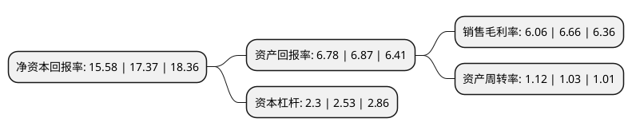

> 本页面由自动化程序生成于 2022年5月20日 01:23
> 内容可能存在错误，如有bug请提交issue至：https://github.com/Eroleice/doc-pi/issues
{.is-warning}

# 上市公司基本情况

## 基本资料

广东瑞德智能科技股份有限公司（以下简称“瑞德智能”）成立于1997年02月04日，佛山市。于2022年04月12日在深交所创业板上市。

瑞德智能注册资本7,646.4万元，公司主营业务为智能控制器的研发，生产与销售，以及少量终端产品的生产和销售，主要产品包括厨房电器，生活电器，环境电器等各类小家电智能控制器，并逐步向大家电，医疗健康，电动工具，智能家居等领域进行渗透和拓展。以下是详细信息：

- 公司名称: 广东瑞德智能科技股份有限公司
- 股票代码: 301135.SZ
- 所在地: 广东 - 佛山市
- 成立日期: 1997年02月04日
- 注册资本: 7,646.4万元
- 法定代表人: 汪军
- 主营业务: 公司主营业务为智能控制器的研发，生产与销售，以及少量终端产品的生产和销售，主要产品包括厨房电器，生活电器，环境电器等各类小家电智能控制器，并逐步向大家电，医疗健康，电动工具，智能家居等领域进行渗透和拓展
- 公司官网: www.realdesign.com.cn
- 公司介绍: 公司于1997年2月创建于佛山市顺德区，企业前身为佛山市顺德区瑞德电子实业有限公司，是国内最早从事家用电器控制器研发、制造和销售的企业之一。经过十多年的发展，瑞德智能现已成为主营产品覆盖家电控制器、设备控制器、家居智能控制器、高效照明产品、新能源产品等各类电子产品领域的大型综合性研发制造企业，主要业务遍及长三角、珠三角以及欧美和东南亚地区，并成为九阳、苏泊尔、美的、格力、TCL、格兰仕、德豪润达、韩国IBC等众多国内外知名家电企业的战略合作伙伴。广东瑞德智能科技股份有限公司总部位于广东省佛山市顺德区大良凤翔工业园。目前，拥有浙江瑞德智能科技有限公司、安徽瑞德智能科技有限公司、瑞德发展(中国香港)有限公司、佛山市瑞尔电子科技有限公司、佛山市瑞德软件科技有限公司、佛山市瑞沃电子有限公司共六家全资子公司。在企业规模方面，瑞德智能及子公司共有员工约2000人，总厂房面积约11万平方米，拥有74条各类产品生产线和4个产品性能测试实验室，企业产能规模超过10亿元。

## 股东及高管情况

上市公司第一大股东为汪军，持股20,905,400股，占比20.51%，**疑似为**上市公司实际控制人。

截至2022年04月12日，上市公司的前十大股东中，共有5名自然人股东，4名机构股东，1个产品账户，其中5%以上大股东共有3名。上市公司前十大股东明细如下：

> 未能通过持股比例判定出上市公司实际控制人（持股30%以上）
> 可能存在通过间接持股、联合持股、协议控制等方式拥有实际控制权的主体，具体请参考上市公司定期公告！
{.is-warning}

> 截至2022年04月12日，上市公司前十大股东信息如下：

| 股东名称 | 持股数量（股） | 持股比例 |
| --- | --- | --- |
| 汪军 | 20,905,400 | 20.51% |
| 佛山市瑞翔投资有限公司 | 13,700,000 | 13.44% |
| 黄祖好 | 8,423,600 | 8.26% |
| 上海君石资产管理有限公司 | 3,680,000 | 3.61% |
| 潘卫明 | 3,334,000 | 3.27% |
| 北京富春投资管理有限公司 | 3,300,000 | 3.24% |
| 广东美的智能科技产业投资基金管理中心(有限合伙) | 2,832,000 | 2.78% |
| 广东弘德恒顺新材料创业投资合伙企业(有限合伙) | 2,832,000 | 2.78% |
| 尤枝辉 | 1,980,000 | 1.94% |
| 何翰腾 | 1,980,000 | 1.94% |

## 利润表分析

上市公司2021年总收入为13.24亿元，净利润为0.8亿元，实现盈利。

## 杜邦分析

> 数据列示周期：2021年 | 2020年 | 2019年
{.is-info}

上市公司的净资产收益率在近一年有所下降，下降幅度为-10.31%，其变化情况分解如下：
- 上市公司的销售毛利率在近一年下降了-9.01%，可能是生产效率的下降、商品原材料价格上涨或商品价格的下跌所致。
- 上市公司的资产周转率在近一年上升了8.74%，可能是源自于更快的销售回款或库存管理效果提升。
- 上市公司的财务杠杆比率在近一年下降了-9.09%，可能是减少负债降低财务费用。

