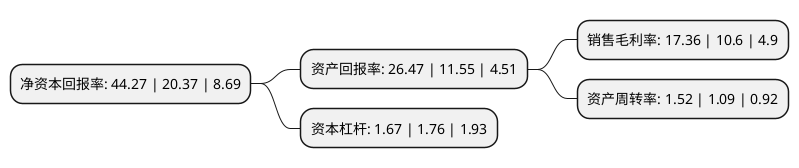

> 本页面由自动化程序生成于 2022年5月20日 01:23
> 内容可能存在错误，如有bug请提交issue至：https://github.com/Eroleice/doc-pi/issues
{.is-warning}

## 股东及高管情况

上市公司第一大股东为汪立，持股28,480,000股，占比42.29%，为上市公司实际控制人。

截至2022年04月21日，上市公司的前十大股东中，共有3名自然人股东，5名机构股东，2个产品账户，其中5%以上大股东共有3名。上市公司前十大股东明细如下：

> 截至2022年04月21日，上市公司前十大股东信息如下：

| 股东名称 | 持股数量（股） | 持股比例 |
| --- | --- | --- |
| 汪立 | 28,480,000 | 42.29% |
| 云梦中一科技投资中心(有限合伙) | 4,000,000 | 5.94% |
| 汪晓霞 | 4,000,000 | 5.94% |
| 宁波众坤股权投资基金合伙企业(有限合伙) | 2,320,000 | 3.44% |
| 宁波梅山保税港区鸿能股权投资合伙企业(有限合伙) | 2,310,000 | 3.43% |
| 湖北新能源创业投资基金有限公司 | 2,080,000 | 3.09% |
| 中国国际金融股份有限公司 | 1,987,637 | 2.95% |
| 湖北锋顺创业投资中心(有限合伙) | 1,765,283 | 2.62% |
| 黄晓艳 | 1,471,179 | 2.18% |
| 长江证券创新投资(湖北)有限公司 | 1,380,000 | 2.05% |

## 利润表分析

上市公司2021年总收入为21.96亿元，净利润为3.81亿元，实现盈利。

## 杜邦分析

> 数据列示周期：2021年 | 2020年 | 2019年
{.is-info}

上市公司的净资产收益率在近一年有所上升，上升幅度为117.33%，其变化情况分解如下：
- 上市公司的销售毛利率在近一年上升了63.77%，可能是生产效率的提升、商品原材料价格下跌或商品价格的上涨所致。
- 上市公司的资产周转率在近一年上升了39.45%，可能是源自于更快的销售回款或库存管理效果提升。
- 上市公司的财务杠杆比率在近一年下降了-5.11%，可能是减少负债降低财务费用。

