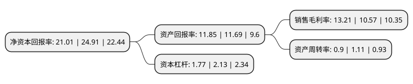

> 本页面由自动化程序生成于 2022年5月20日 01:23
> 内容可能存在错误，如有bug请提交issue至：https://github.com/Eroleice/doc-pi/issues
{.is-warning}

# 上市公司基本情况

## 基本资料

苏州万祥科技股份有限公司（以下简称“万祥科技”）成立于1994年04月15日，苏州市。于2021年11月16日在深交所创业板上市。

万祥科技注册资本40,001万元，公司主营业务为消费电子精密零组件产品相关的研发，生产与销售。公司主要产品包括热敏保护组件，数电传控集成组件，精密结构件和柔性功能零组件等各类结构性，功能性和辅助性精密零组件。以下是详细信息：

- 公司名称: 苏州万祥科技股份有限公司
- 股票代码: 301180.SZ
- 所在地: 江苏 - 苏州市
- 成立日期: 1994年04月15日
- 注册资本: 40,001万元
- 法定代表人: 黄军
- 主营业务: 公司主营业务为消费电子精密零组件产品相关的研发，生产与销售公司主要产品包括热敏保护组件，数电传控集成组件，精密结构件和柔性功能零组件等各类结构性，功能性和辅助性精密零组件
- 公司官网: www.wxtech.com
- 公司介绍: 公司主营业务为消费电子精密零组件产品相关的研发、生产与销售。公司在消费电子精密零组件加工制造领域持续技术创新，不断积累经验，逐步延伸制造链条，掌握了模具开发、冲压、焊接、模切等各生产环节的核心技术，并基于对整体工艺的深刻理解自主进行生产流程自动化开发，构建了兼具完备性、协同性和通用性的制造体系，实现了产品的高质量、精益化生产。公司主要产品包括热敏保护组件、数电传控集成组件、精密结构件和柔性功能零组件等各类结构性、功能性和辅助性精密零组件。依托完整的制造体系、快速的客户响应、稳定的产品品质等综合优势，公司积累了良好的客户资源，直接客户包括新普科技、惠州德赛、宁德新能源、欣旺达、三洋集团、瑞声光电等国内外消费电子产业制造商，产品最终应用于苹果、惠普、戴尔、华为、微软、三星、联想、华硕等知名消费电子终端品牌。公司凭借优秀的研发及生产实力，被评定为“高新技术企业”、“江苏省工程技术研究中心”、“江苏省信息化与工业化融合试点企业”和“苏州市市级企业技术中心”，并被纳入苏州市“瞪羚计划”企业名录。

## 股东及高管情况

上市公司第一大股东为黄军，持股149,299,199股，占比37.32%，为上市公司实际控制人。

截至2022年03月31日，上市公司的前十大股东中，共有7名自然人股东，3名机构股东，其中5%以上大股东共有3名。上市公司前十大股东明细如下：

> 截至2022年03月31日，上市公司前十大股东信息如下：

| 股东名称 | 持股数量（股） | 持股比例 |
| --- | --- | --- |
| 黄军 | 149,299,199 | 37.32% |
| 张志刚 | 115,430,399 | 28.86% |
| 吴国忠 | 49,766,400 | 12.44% |
| 高清 | 7,200,001 | 1.8% |
| 苏州市吴中创业投资有限公司 | 7,200,001 | 1.8% |
| 苏州市万事祥企业管理咨询合伙企业(有限合伙) | 6,912,000 | 1.73% |
| 苏州市万谦祥企业咨询管理合伙企业(有限合伙) | 6,912,000 | 1.73% |
| 陈国 | 6,912,000 | 1.73% |
| 周金龙 | 6,912,000 | 1.73% |
| 陈贤德 | 3,456,000 | 0.86% |

## 利润表分析

上市公司2021年总收入为13.31亿元，净利润为1.75亿元，实现盈利。

## 杜邦分析

> 数据列示周期：2021年 | 2020年 | 2019年
{.is-info}

上市公司的净资产收益率在近一年有所下降，下降幅度为-15.66%，其变化情况分解如下：
- 上市公司的销售毛利率在近一年上升了24.98%，可能是生产效率的提升、商品原材料价格下跌或商品价格的上涨所致。
- 上市公司的资产周转率在近一年下降了-18.92%，可能是源自于更慢的销售回款或库存管理效果下降。
- 上市公司的财务杠杆比率在近一年下降了-16.9%，可能是减少负债降低财务费用。

