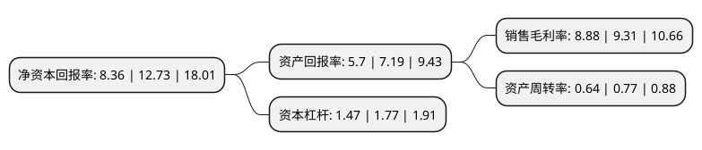

> 本页面由自动化程序生成于 2022年5月20日 01:23
> 内容可能存在错误，如有bug请提交issue至：https://github.com/Eroleice/doc-pi/issues
{.is-warning}

# 上市公司基本情况

## 基本资料

河南凯旺电子科技股份有限公司（以下简称“凯旺科技”）成立于2009年11月04日，周口市。于2021年12月23日在深交所创业板上市。

凯旺科技注册资本9,582.17万元，专注于电子精密线缆连接组件的研发，生产和销售，公司主要产品的加工工艺分为三部分:线缆生产，连接器生产，精密线缆连接组件生产。其中线缆和连接器的生产为电子精密线缆连接组件的上游半成品工序。以下是详细信息：

- 公司名称: 河南凯旺电子科技股份有限公司
- 股票代码: 301182.SZ
- 所在地: 河南 - 周口市
- 成立日期: 2009年11月04日
- 注册资本: 9,582.17万元
- 法定代表人: 陈海刚
- 主营业务: 专注于电子精密线缆连接组件的研发，生产和销售，公司主要产品的加工工艺分为三部分:线缆生产，连接器生产，精密线缆连接组件生产其中线缆和连接器的生产为电子精密线缆连接组件的上游半成品工序
- 公司官网: www.carve.com.cn
- 公司介绍: 公司是一家专注于电子精密线缆连接组件的研发、生产和销售的高新技术企业，目前产品主要应用于安防设备和通讯设备等领域。公司致力于为安防、通讯等领域客户提供电子精密线缆连接组件的连接解决方案，并逐步向军工装备、轨道交通、医疗器械、新能源等领域积极拓展。公司的技术中心研发实力较强、先后被认定为“河南省企业技术中心”、“河南省精密连接组件工程技术研究中心”和“河南省精密线缆连接组件工业公共技术研发设计中心”，自主研发的IP67等级防水技术、阻断式防水技术、信号完整性处理技术等多项核心技术已形成规模化生产，有效解决了客户对安防类精密线缆连接组件的气密性要求。公司始终坚持以客户需求为导向，严把产品质量关，在产品技术创新及生产经营方面持续稳健发展。公司先后通过ISO9001质量管理体系认证、IATF16949:2016、医疗器械质量管理体系认证和武器装备质量管理体系认证，具有较强的市场竞争力。公司是“2016-2017年度河南省省长质量奖”获得者，获得中国电子企业协会“2019全国电子信息行业优秀企业”称号。

## 股东及高管情况

上市公司第一大股东为深圳市凯鑫投资有限公司，持股38,750,000股，占比40.44%，为上市公司实际控制人。

截至2022年03月31日，上市公司的前十大股东中，共有3名自然人股东，5名机构股东，2个产品账户，其中5%以上大股东共有4名。上市公司前十大股东明细如下：

> 截至2022年03月31日，上市公司前十大股东信息如下：

| 股东名称 | 持股数量（股） | 持股比例 |
| --- | --- | --- |
| 深圳市凯鑫投资有限公司 | 38,750,000 | 40.44% |
| 陈海刚 | 7,875,000 | 8.22% |
| 周口市定邦管理咨询合伙企业(有限合伙) | 7,570,000 | 7.9% |
| 周口市产业集聚区发展投资有限责任公司 | 5,085,000 | 5.31% |
| 柳中义 | 3,375,000 | 3.52% |
| 宁波华绫创业投资合伙企业(有限合伙) | 3,316,800 | 3.46% |
| 河南鸿博资本管理有限公司-河南省返乡创业股权投资基金(有限合伙) | 2,762,400 | 2.88% |
| 周口市聚邦管理咨询合伙企业(有限合伙) | 2,280,000 | 2.38% |
| 河南鸿博资本管理有限公司-河南省农民工返乡创业投资基金(有限合伙) | 847,500 | 0.88% |
| 张扬 | 365,067 | 0.38% |

## 利润表分析

上市公司2021年总收入为6.15亿元，净利润为0.54亿元，实现盈利。

## 杜邦分析

> 数据列示周期：2021年 | 2020年 | 2019年
{.is-info}

上市公司的净资产收益率在近一年有所下降，下降幅度为-34.33%，其变化情况分解如下：
- 上市公司的销售毛利率在近一年下降了-4.62%，可能是生产效率的下降、商品原材料价格上涨或商品价格的下跌所致。
- 上市公司的资产周转率在近一年下降了-16.88%，可能是源自于更慢的销售回款或库存管理效果下降。
- 上市公司的财务杠杆比率在近一年下降了-16.95%，可能是减少负债降低财务费用。

