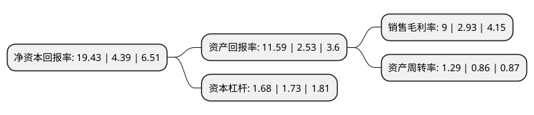

> 本页面由自动化程序生成于 2022年5月20日 01:23
> 内容可能存在错误，如有bug请提交issue至：https://github.com/Eroleice/doc-pi/issues
{.is-warning}

# 上市公司基本情况

## 基本资料

安徽铜冠铜箔集团股份有限公司（以下简称“铜冠铜箔”）成立于2010年10月18日，池州市。于2022年01月27日在深交所创业板上市。

铜冠铜箔注册资本82,901.554万元，主要从事各类高精度电子铜箔的研发，制造和销售。主要产品按应用领域分类包括PCB铜箔和锂电池铜箔。以下是详细信息：

- 公司名称: 安徽铜冠铜箔集团股份有限公司
- 股票代码: 301217.SZ
- 所在地: 安徽 - 池州市
- 成立日期: 2010年10月18日
- 注册资本: 82,901.554万元
- 法定代表人: 丁士启
- 主营业务: 主要从事各类高精度电子铜箔的研发，制造和销售主要产品按应用领域分类包括PCB铜箔和锂电池铜箔
- 公司官网: null
- 公司介绍: 公司主要从事各类高精度电子铜箔的研发、制造和销售等，主要产品按应用领域分类包括PCB铜箔和锂电池铜箔。自公司设立以来，主营业务未发生重大变化。发行人是国内电子铜箔行业领军企业之一。发行人拥有电子铜箔产品总产能为4.5万吨/年，其中，PCB铜箔产能2.5万吨/年，锂电池铜箔产能2万吨/年，形成了“PCB铜箔+锂电池铜箔”双核驱动的业务发展模式。发行人在PCB铜箔和锂电池铜箔领域均与业内知名企业建立了长期合作关系，取得了该等企业的供应商认证，发行人在PCB铜箔领域的客户包括生益科技、台燿科技、台光电子、华正新材、金安国纪、沪电股份、南亚新材等，在锂电池铜箔领域客户包括比亚迪、宁德时代、国轩高科、星恒股份等。

## 股东及高管情况

上市公司第一大股东为铜陵有色金属集团股份有限公司，持股600,000,000股，占比72.38%，为上市公司实际控制人。

截至2022年03月31日，上市公司的前十大股东中，共有5名自然人股东，2名机构股东，3个产品账户，其中5%以上大股东共有1名。上市公司前十大股东明细如下：

> 截至2022年03月31日，上市公司前十大股东信息如下：

| 股东名称 | 持股数量（股） | 持股比例 |
| --- | --- | --- |
| 铜陵有色金属集团股份有限公司 | 600,000,000 | 72.38% |
| 合肥国轩高科动力能源有限公司 | 21,761,658 | 2.62% |
| 国泰君安证券资管-招商银行-国泰君安君享创业板铜冠铜箔1号战略配售集合资产管理计划 | 4,124,145 | 0.5% |
| 深圳前海千惠资产管理有限公司-千惠朗坤稳健1号私募证券投资基金 | 2,477,765 | 0.3% |
| 深圳前海千惠资产管理有限公司-千惠茉莉8号私募证券投资基金 | 2,457,000 | 0.3% |
| 郑建平 | 1,566,194 | 0.19% |
| 舒志兵 | 1,379,340 | 0.17% |
| 关艳春 | 1,113,300 | 0.13% |
| 林瑜 | 965,900 | 0.12% |
| 陈国星 | 855,220 | 0.1% |

## 利润表分析

上市公司2021年总收入为40.81亿元，净利润为3.67亿元，实现盈利。

## 杜邦分析

> 数据列示周期：2021年 | 2020年 | 2019年
{.is-info}

上市公司的净资产收益率在近一年有所上升，上升幅度为342.6%，其变化情况分解如下：
- 上市公司的销售毛利率在近一年上升了207.17%，可能是生产效率的提升、商品原材料价格下跌或商品价格的上涨所致。
- 上市公司的资产周转率在近一年上升了50%，可能是源自于更快的销售回款或库存管理效果提升。
- 上市公司的财务杠杆比率在近一年下降了-2.89%，可能是减少负债降低财务费用。

