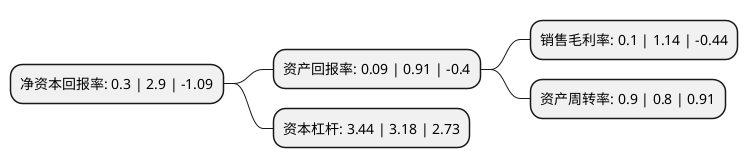

> 本页面由自动化程序生成于 2022年5月20日 01:24
> 内容可能存在错误，如有bug请提交issue至：https://github.com/Eroleice/doc-pi/issues
{.is-warning}

# 上市公司基本情况

## 基本资料

凤凰光学股份有限公司（以下简称“凤凰光学”）成立于1997年05月23日，上饶市。于1997年05月28日在上交所主板上市。

凤凰光学注册资本28,157.389万元，主要产品:光学镜片，光学镜头，照相器材，望远镜，钢片快门，水晶饰品，电子产品及通信设备，光学原材料，仪器零配件等。主营业务:光学镜片，光学镜头，金属加工，显微镜等产品的生产和销售。以下是详细信息：

- 公司名称: 凤凰光学股份有限公司
- 股票代码: 600071.SH
- 所在地: 江西 - 上饶市
- 成立日期: 1997年05月23日
- 注册资本: 28,157.389万元
- 法定代表人: 陈宗年
- 主营业务: 主要产品:光学镜片，光学镜头，照相器材，望远镜，钢片快门，水晶饰品，电子产品及通信设备，光学原材料，仪器零配件等主营业务:光学镜片，光学镜头，金属加工，显微镜等产品的生产和销售
- 公司官网: www.phenixoptics.com.cn
- 公司介绍: 凤凰光学股份有限公司系凤凰光学集团有限公司下属公司。2015年7月1日，凤凰光学集团有限公司将其持有的凤凰控股100%的股权整体无偿划转给中电海康集团，凤凰光学控股有限公司就本次国有股划转完成了工商变更登记手续，并取得了上饶市工商行政管理局颁发的《营业执照》。本次国有股划转完成后，中电海康集团通过凤凰光学控股有限公司成为凤凰光学股份有限公司的间接控股股东。凤凰光学成为中国电子科技集团有限公司旗下产业，标志着凤凰光学进入中电海康新时代。凤凰光学是我国民族光学行业知名品牌和第一家光学行业上市公司，主要从事光学镜片、光学镜头、光电模组、电池、科学仪器等五大业务板块，具有数码相机、安防、机器视觉、车载等各行业丰富的光学/机构设计经验；专利持有水平业内领先；镜头研发部致力于可见光及红外光学镜头研发。其中光学部品加工，金属部品加工具备了业内顶尖水平，是行业能力的标杆；组装检测和研发设计能力并已经取得了众多跨国公司和行业顶尖公司的认可。公司主要设计人员包括国外引进的资深光学博士及超过10年镜头研发经历的资深人员。对各类光学镜头的研发、制造、测试有着丰富的行业经验。尤其在镜头品质的稳定性、高低温信赖性、Ghost/Flare预防控制等方面积累了丰富的经验。

## 股东及高管情况

上市公司第一大股东为中电海康集团有限公司，持股132,790,648股，占比47.16%，为上市公司实际控制人。

截至2022年03月31日，上市公司的前十大股东中，共有3名自然人股东，3名机构股东，4个产品账户，其中5%以上大股东共有1名。上市公司前十大股东明细如下：

> 截至2022年03月31日，上市公司前十大股东信息如下：

| 股东名称 | 持股数量（股） | 持股比例 |
| --- | --- | --- |
| 中电海康集团有限公司 | 132,790,648 | 47.16% |
| 中电科投资控股有限公司 | 6,012,480 | 2.14% |
| 魏巍 | 5,507,227 | 1.96% |
| 招商银行股份有限公司-易方达丰华债券型证券投资基金 | 3,152,002 | 1.12% |
| 交通银行股份有限公司-汇丰晋信智造先锋股票型证券投资基金 | 2,704,800 | 0.96% |
| 交通银行-汇丰晋信动态策略混合型证券投资基金 | 2,679,941 | 0.95% |
| 徐铭 | 2,638,600 | 0.94% |
| 全国社保基金一一四组合 | 2,631,172 | 0.93% |
| 毛幼聪 | 2,569,900 | 0.91% |
| 深圳市柏霖资产管理有限公司 | 2,414,893 | 0.86% |

## 利润表分析

上市公司2021年总收入为15.92亿元，净利润为0.01亿元，实现盈利。

## 杜邦分析

> 数据列示周期：2021年 | 2020年 | 2019年
{.is-info}

上市公司的净资产收益率在近一年有所下降，下降幅度为-89.66%，其变化情况分解如下：
- 上市公司的销售毛利率在近一年下降了-91.23%，可能是生产效率的下降、商品原材料价格上涨或商品价格的下跌所致。
- 上市公司的资产周转率在近一年上升了12.5%，可能是源自于更快的销售回款或库存管理效果提升。
- 上市公司的财务杠杆比率在近一年上升了8.18%，可能是增加负债扩大生产规模。

