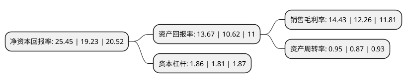

> 本页面由自动化程序生成于 2022年5月20日 01:24
> 内容可能存在错误，如有bug请提交issue至：https://github.com/Eroleice/doc-pi/issues
{.is-warning}

# 上市公司基本情况

## 基本资料

广东生益科技股份有限公司（以下简称“生益科技”）成立于1985年06月27日，东莞市。于1998年10月28日在上交所主板上市。

生益科技注册资本231,159.568万元，主要产品:覆铜板和粘结片，印制线路板。主营业务:设计，生产和销售覆铜板和粘结片，印制线路板。以下是详细信息：

- 公司名称: 广东生益科技股份有限公司
- 股票代码: 600183.SH
- 所在地: 广东 - 东莞市
- 成立日期: 1985年06月27日
- 注册资本: 231,159.568万元
- 法定代表人: 刘述峰
- 主营业务: 主要产品:覆铜板和粘结片，印制线路板主营业务:设计，生产和销售覆铜板和粘结片，印制线路板
- 公司官网: www.syst.com.cn
- 公司介绍: 公司始终立足于高标准、高品质、高性能、高可靠性，自主生产覆铜板、半固化片、绝缘层压板、金属基覆铜箔板、涂树脂铜箔、覆盖膜类等高端电子材料。产品主要供制作单、双面线路板及高多层线路板，广泛用于家电、手机、汽车、电脑、航空航天工业、通讯设备以及各种中高档电子产品中。公司的主导产品已获得华为、中兴、诺基亚、博世、联想、索尼、三星、飞利浦等国际知名企业的认证，拥有较大的竞争优势，产品销美洲、欧洲、韩国、日本、东南亚等世界多个国家和地区。

## 股东及高管情况

上市公司第一大股东为广东省广新控股集团有限公司，持股572,304,117股，占比24.72%，**疑似为**上市公司实际控制人。

截至2022年03月31日，上市公司的前十大股东中，共有4名机构股东，3个产品账户，1个海外主体，2名其他股东，其中5%以上大股东共有3名。上市公司前十大股东明细如下：

> 未能通过持股比例判定出上市公司实际控制人（持股30%以上）
> 可能存在通过间接持股、联合持股、协议控制等方式拥有实际控制权的主体，具体请参考上市公司定期公告！
{.is-warning}

> 截至2022年03月31日，上市公司前十大股东信息如下：

| 股东名称 | 持股数量（股） | 持股比例 |
| --- | --- | --- |
| 广东省广新控股集团有限公司 | 572,304,117 | 24.72% |
| 东莞市国弘投资有限公司 | 320,997,139 | 13.87% |
| 伟华电子有限公司 | 295,010,353 | 12.74% |
| 香港中央结算有限公司(陆股通) | 65,457,714 | 2.83% |
| 全国社保基金一一三组合 | 10,014,701 | 0.43% |
| 加拿大年金计划投资委员会-自有资金 | 9,152,100 | 0.4% |
| 东莞市科创资本产业发展投资有限公司 | 8,692,132 | 0.38% |
| 中国银行股份有限公司-华夏中证5G通信主题交易型开放式指数证券投资基金 | 8,668,970 | 0.37% |
| 挪威中央银行-自有资金 | 8,529,927 | 0.37% |
| 阿布达比投资局 | 7,438,838 | 0.32% |

## 利润表分析

上市公司2021年总收入为202.74亿元，净利润为29.24亿元，实现盈利。

## 杜邦分析

> 数据列示周期：2021年 | 2020年 | 2019年
{.is-info}

上市公司的净资产收益率在近一年有所上升，上升幅度为32.35%，其变化情况分解如下：
- 上市公司的销售毛利率在近一年上升了17.7%，可能是生产效率的提升、商品原材料价格下跌或商品价格的上涨所致。
- 上市公司的资产周转率在近一年上升了9.2%，可能是源自于更快的销售回款或库存管理效果提升。
- 上市公司的财务杠杆比率在近一年上升了2.76%，可能是增加负债扩大生产规模。

