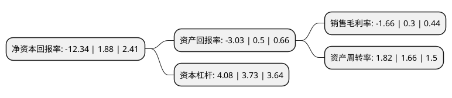

> 本页面由自动化程序生成于 2022年5月20日 01:25
> 内容可能存在错误，如有bug请提交issue至：https://github.com/Eroleice/doc-pi/issues
{.is-warning}

# 上市公司基本情况

## 基本资料

福建福日电子股份有限公司（以下简称“福日电子”）成立于1999年05月07日，福州市。于1999年05月14日在上交所主板上市。

福日电子注册资本59,298.808万元，主营业务:LED及工业节能，节能家电及通讯产品，内外贸及其他。以下是详细信息：

- 公司名称: 福建福日电子股份有限公司
- 股票代码: 600203.SH
- 所在地: 福建 - 福州市
- 成立日期: 1999年05月07日
- 注册资本: 59,298.808万元
- 法定代表人: 卞志航
- 主营业务: 主营业务:LED及工业节能，节能家电及通讯产品，内外贸及其他
- 公司官网: www.furielec.com
- 公司介绍: 公司的前身是全国电子行业第一家中外合资企业，是福建省改革开放的一面旗帜，“福日”牌电视机产品曾享誉全国。上市多年来，通过资源整合、资产重组、结构调整，公司已从传统电视机生产企业成功实现战略转型，形成了通信及智慧家电、LED光电及绿能环保、内外贸供应链等主营产业。公司为福建省首批创新型企业、福建省战略性新兴产业骨干企业，拥有福建省首批省级企业技术中心和五家国家级高新技术企业，是国家863计划课题及国家电子发展基金项目承担单位，具有较强的科研和技术开发能力。产品及服务包括：LED外延芯片及封装产品、应用产品及工程；工业、建筑综合节能技术服务；智能手机及彩电、空气净化器等家电产品；IC器件、集成电路和基板加工等。

## 股东及高管情况

上市公司第一大股东为福建福日集团有限公司，持股94,234,189股，占比15.89%，**疑似为**上市公司实际控制人。

截至2022年03月31日，上市公司的前十大股东中，共有6名自然人股东，2名机构股东，2个产品账户，其中5%以上大股东共有2名。上市公司前十大股东明细如下：

> 未能通过持股比例判定出上市公司实际控制人（持股30%以上）
> 可能存在通过间接持股、联合持股、协议控制等方式拥有实际控制权的主体，具体请参考上市公司定期公告！
{.is-warning}

> 截至2022年03月31日，上市公司前十大股东信息如下：

| 股东名称 | 持股数量（股） | 持股比例 |
| --- | --- | --- |
| 福建福日集团有限公司 | 94,234,189 | 15.89% |
| 福建省电子信息(集团)有限责任公司 | 70,985,213 | 11.97% |
| 吕强 | 26,007,802 | 4.39% |
| 于承芳 | 9,673,300 | 1.63% |
| 陈景庚 | 9,250,470 | 1.56% |
| 刘芳 | 8,434,700 | 1.42% |
| 财通基金-湖南轻盐创业投资管理有限公司-财通基金安吉87号单一资产管理计划 | 6,501,951 | 1.1% |
| 霍保庄 | 6,284,804 | 1.06% |
| 蔡晓盼 | 6,027,594 | 1.02% |
| 中国工商银行股份有限公司-华夏磐利一年定期开放混合型证券投资基金 | 5,851,755 | 0.99% |

## 利润表分析

上市公司2021年总收入为186.33亿元，净利润为-3.1亿元，**未实现盈利**。

## 杜邦分析

> 数据列示周期：2021年 | 2020年 | 2019年
{.is-info}

上市公司的净资产收益率在近一年有所下降，下降幅度为-756.38%，其变化情况分解如下：
- 上市公司的销售毛利率在近一年下降了-653.33%，可能是生产效率的下降、商品原材料价格上涨或商品价格的下跌所致。
- 上市公司的资产周转率在近一年上升了9.64%，可能是源自于更快的销售回款或库存管理效果提升。
- 上市公司的财务杠杆比率在近一年上升了9.38%，可能是增加负债扩大生产规模。

