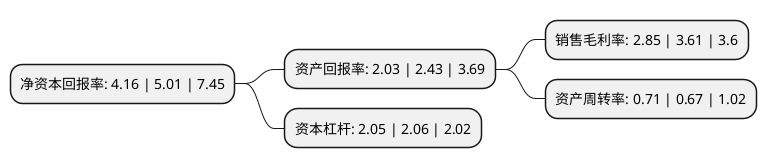

> 本页面由自动化程序生成于 2022年5月20日 01:25
> 内容可能存在错误，如有bug请提交issue至：https://github.com/Eroleice/doc-pi/issues
{.is-warning}

# 上市公司基本情况

## 基本资料

大恒新纪元科技股份有限公司（以下简称“大恒科技”）成立于1998年12月14日，北京市。于2000年11月29日在上交所主板上市。

大恒科技注册资本43,680万元，主营业务:光机电一体化产品，信息技术及办公自动化产品，数字电视网络编辑及播放系统，半导体元器件。以下是详细信息：

- 公司名称: 大恒新纪元科技股份有限公司
- 股票代码: 600288.SH
- 所在地: 北京 - 北京市
- 成立日期: 1998年12月14日
- 注册资本: 43,680万元
- 法定代表人: 鲁勇志
- 主营业务: 主营业务:光机电一体化产品，信息技术及办公自动化产品，数字电视网络编辑及播放系统，半导体元器件
- 公司官网: www.dhxjy.com.cn
- 公司介绍: 公司主营业务为光机电一体化产品、信息技术及办公自动化产品、数字电视网络编辑及播放系统、半导体元器件。公司主要采用“自主研发+生产+配套服务+代理”的经营模式，在光机电产品、图像采集处理产品、数字电视网络编辑及播放系统等方面都拥有自主研发产品，同时在机器视觉、系统集成、数字电视网络编辑及播放系统方面支持为客户提供系统的解决方案、二次开发、技术支持和服务等。公司目前仍保留了飞利浦照明产品及部分IT产品代理销售业务。

## 股东及高管情况

上市公司第一大股东为郑素贞，持股129,960,000股，占比29.75%，**疑似为**上市公司实际控制人。

截至2022年03月31日，上市公司的前十大股东中，共有8名自然人股东，1名机构股东，1个产品账户，其中5%以上大股东共有1名。上市公司前十大股东明细如下：

> 未能通过持股比例判定出上市公司实际控制人（持股30%以上）
> 可能存在通过间接持股、联合持股、协议控制等方式拥有实际控制权的主体，具体请参考上市公司定期公告！
{.is-warning}

> 截至2022年03月31日，上市公司前十大股东信息如下：

| 股东名称 | 持股数量（股） | 持股比例 |
| --- | --- | --- |
| 郑素贞 | 129,960,000 | 29.75% |
| 任奇峰 | 19,736,811 | 4.52% |
| 吴立新 | 16,247,000 | 3.72% |
| 陈定华 | 5,232,700 | 1.2% |
| 上海宽投资产管理有限公司-宽投新机遇1号私募证券投资基金 | 5,134,500 | 1.18% |
| 张金伟 | 4,912,700 | 1.12% |
| 台州华茂文体发展有限公司 | 4,015,500 | 0.92% |
| 陈肖静 | 2,949,000 | 0.68% |
| 靳帅 | 2,491,422 | 0.57% |
| 石淑云 | 2,459,500 | 0.56% |

## 利润表分析

上市公司2021年总收入为25.37亿元，净利润为0.72亿元，实现盈利。

## 杜邦分析

> 数据列示周期：2021年 | 2020年 | 2019年
{.is-info}

上市公司的净资产收益率在近一年有所下降，下降幅度为-16.97%，其变化情况分解如下：
- 上市公司的销售毛利率在近一年下降了-21.05%，可能是生产效率的下降、商品原材料价格上涨或商品价格的下跌所致。
- 上市公司的资产周转率在近一年上升了5.97%，可能是源自于更快的销售回款或库存管理效果提升。
- 上市公司的财务杠杆比率在近一年下降了-0.49%，可能是减少负债降低财务费用。

