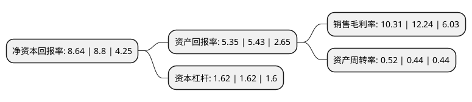

> 本页面由自动化程序生成于 2022年5月20日 01:25
> 内容可能存在错误，如有bug请提交issue至：https://github.com/Eroleice/doc-pi/issues
{.is-warning}

# 上市公司基本情况

## 基本资料

天通控股股份有限公司（以下简称“天通股份”）成立于1999年02月10日，嘉兴市。于2001年01月18日在上交所主板上市。

天通股份注册资本99,656.573万元，主要产品:从事的的产品为:磁性材料，电子表面贴装产品，ONU，EOC等。主营业务:从事的的业务为:磁性材料，磁电子器件，通信设备终端等的生产和销售，电子制造服务(EMS)。以下是详细信息：

- 公司名称: 天通控股股份有限公司
- 股票代码: 600330.SH
- 所在地: 浙江 - 嘉兴市
- 成立日期: 1999年02月10日
- 注册资本: 99,656.573万元
- 法定代表人: 潘正强
- 主营业务: 主要产品:从事的的产品为:磁性材料，电子表面贴装产品，ONU，EOC等主营业务:从事的的业务为:磁性材料，磁电子器件，通信设备终端等的生产和销售，电子制造服务(EMS)
- 公司官网: www.tdgcore.com
- 公司介绍: 公司主要从事电子材料(包含磁性材料、蓝宝石材料、压电晶体材料和电子部品)研发、生产和销售，专用装备的研发、制造和销售。公司拥有多家控股公司和参股公司，是国内首家由自然人控股的上市公司，是集科研、制造、销售于一体的国家高新技术企业。

## 股东及高管情况

上市公司第一大股东为天通高新集团有限公司，持股129,561,810股，占比13%，**疑似为**上市公司实际控制人。

截至2022年03月31日，上市公司的前十大股东中，共有4名自然人股东，3名机构股东，3个产品账户，其中5%以上大股东共有2名。上市公司前十大股东明细如下：

> 未能通过持股比例判定出上市公司实际控制人（持股30%以上）
> 可能存在通过间接持股、联合持股、协议控制等方式拥有实际控制权的主体，具体请参考上市公司定期公告！
{.is-warning}

> 截至2022年03月31日，上市公司前十大股东信息如下：

| 股东名称 | 持股数量（股） | 持股比例 |
| --- | --- | --- |
| 天通高新集团有限公司 | 129,561,810 | 13% |
| 潘建清 | 57,306,180 | 5.75% |
| 中国工商银行股份有限公司-中欧价值智选回报混合型证券投资基金 | 24,555,309 | 2.46% |
| 潘建忠 | 19,920,000 | 2% |
| 潘娟美 | 19,056,000 | 1.91% |
| 中欧基金-中国人寿保险股份有限公司-分红险-中欧基金国寿股份均衡股票型组合单一资产管理计划(可供出售) | 14,918,508 | 1.5% |
| 天通控股股份有限公司-第二期员工持股计划 | 13,768,519 | 1.38% |
| 薛静琦 | 10,225,400 | 1.03% |
| 海宁市经济发展投资公司 | 9,153,552 | 0.92% |
| 中国国际金融香港资产管理有限公司-客户资金 | 8,693,091 | 0.87% |

## 利润表分析

上市公司2021年总收入为40.84亿元，净利润为4.21亿元，实现盈利。

## 杜邦分析

> 数据列示周期：2021年 | 2020年 | 2019年
{.is-info}

上市公司的净资产收益率在近一年有所下降，下降幅度为-1.82%，其变化情况分解如下：
- 上市公司的销售毛利率在近一年下降了-15.77%，可能是生产效率的下降、商品原材料价格上涨或商品价格的下跌所致。
- 上市公司的资产周转率在近一年上升了18.18%，可能是源自于更快的销售回款或库存管理效果提升。
- 上市公司的财务杠杆比率在近一年下降了0%，可能是减少负债降低财务费用。

