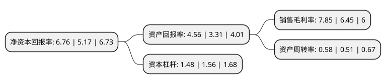

> 本页面由自动化程序生成于 2022年5月20日 01:26
> 内容可能存在错误，如有bug请提交issue至：https://github.com/Eroleice/doc-pi/issues
{.is-warning}

# 上市公司基本情况

## 基本资料

成都旭光电子股份有限公司（以下简称“旭光电子”）成立于1994年02月28日，成都市。于2002年11月20日在上交所主板上市。

旭光电子注册资本54,372万元，主要产品:电子管，开关管(真空灭弧室)和固封极柱，高低压配电成套装置及电器元件(开关柜和断路器)，光电器件。主营业务:金属陶瓷电真空器件，高低压配电成套装置，光电器件等产品研发，生产，销售。以下是详细信息：

- 公司名称: 成都旭光电子股份有限公司
- 股票代码: 600353.SH
- 所在地: 四川 - 成都市
- 成立日期: 1994年02月28日
- 注册资本: 54,372万元
- 法定代表人: 刘卫东
- 主营业务: 主要产品:电子管，开关管(真空灭弧室)和固封极柱，高低压配电成套装置及电器元件(开关柜和断路器)，光电器件主营业务:金属陶瓷电真空器件，高低压配电成套装置，光电器件等产品研发，生产，销售
- 公司官网: www.xuguang.com.cn
- 公司介绍: 公司是一家专业从事金属陶瓷电真空器件、高低压配电成套装置、光电器件等产品研发、生产、销售的重点高新技术企业，其主要产品包括：电子管,开关管(真空灭弧室)和固封极柱,高低压配电成套装置及电器元件(开关柜和断路器),光电器件。公司拥有独立、完整的发射管研发、生产体系，在关键材料、零部件制造的工艺技术和装备方面形成了竞争优势，已具备与国外知名品牌相抗衡能力。未来电子管发展的重点是开发大功率、高性能产品，进一步拓展国际市场。公司通过了ISO9001质量体系、ISO14001环境管理体系、ISO18001职业健康安全管理体系认证并取得相关军工、保密等资质，是国内唯一一家拥有从陶瓷制造到成套电气全产业链的企业，是经国家科技部、中国科学院认定的高新技术企业。

## 股东及高管情况

上市公司第一大股东为新的集团有限公司，持股151,771,568股，占比27.91%，**疑似为**上市公司实际控制人。

截至2022年03月31日，上市公司的前十大股东中，共有4名自然人股东，2名机构股东，4个产品账户，其中5%以上大股东共有2名。上市公司前十大股东明细如下：

> 未能通过持股比例判定出上市公司实际控制人（持股30%以上）
> 可能存在通过间接持股、联合持股、协议控制等方式拥有实际控制权的主体，具体请参考上市公司定期公告！
{.is-warning}

> 截至2022年03月31日，上市公司前十大股东信息如下：

| 股东名称 | 持股数量（股） | 持股比例 |
| --- | --- | --- |
| 新的集团有限公司 | 151,771,568 | 27.91% |
| 成都欣天颐投资有限责任公司 | 82,079,300 | 15.1% |
| 陆威 | 22,188,600 | 4.08% |
| 成都旭光电子股份有限公司-第一期员工持股计划 | 12,281,000 | 2.26% |
| 上海韫然投资管理有限公司-韫然新兴成长十期私募证券投资基金 | 4,300,000 | 0.79% |
| 成都旭光电子股份有限公司-第二期员工持股计划 | 3,512,267 | 0.65% |
| 卢晓斌 | 2,253,600 | 0.41% |
| 陈鑫 | 1,786,600 | 0.33% |
| 冯云浩 | 1,713,100 | 0.32% |
| 中国建设银行股份有限公司-博时数字经济18个月封闭运作混合型证券投资基金 | 1,659,200 | 0.31% |

## 利润表分析

上市公司2021年总收入为10.06亿元，净利润为0.78亿元，实现盈利。

## 杜邦分析

> 数据列示周期：2021年 | 2020年 | 2019年
{.is-info}

上市公司的净资产收益率在近一年有所上升，上升幅度为30.75%，其变化情况分解如下：
- 上市公司的销售毛利率在近一年上升了21.71%，可能是生产效率的提升、商品原材料价格下跌或商品价格的上涨所致。
- 上市公司的资产周转率在近一年上升了13.73%，可能是源自于更快的销售回款或库存管理效果提升。
- 上市公司的财务杠杆比率在近一年下降了-5.13%，可能是减少负债降低财务费用。

