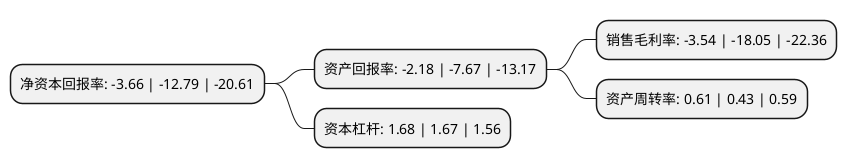

> 本页面由自动化程序生成于 2022年5月20日 01:26
> 内容可能存在错误，如有bug请提交issue至：https://github.com/Eroleice/doc-pi/issues
{.is-warning}

# 上市公司基本情况

## 基本资料

精伦电子股份有限公司（以下简称“精伦电子”）成立于1994年12月14日，武汉市。于2002年06月13日在上交所主板上市。

精伦电子注册资本49,208.92万元，主要产品:智能控制产品，商用终端产品和智能互联产品。主营业务:智能控制产品，商用终端产品和智能互联产品的开发，销售和运营。以下是详细信息：

- 公司名称: 精伦电子股份有限公司
- 股票代码: 600355.SH
- 所在地: 湖北 - 武汉市
- 成立日期: 1994年12月14日
- 注册资本: 49,208.92万元
- 法定代表人: 张学阳
- 主营业务: 主要产品:智能控制产品，商用终端产品和智能互联产品主营业务:智能控制产品，商用终端产品和智能互联产品的开发，销售和运营
- 公司官网: www.routon.com
- 公司介绍: 公司是扎根武汉中国光谷的全自然人民营上市公司，二十多年来，在各类智能终端技术和互联网技术方面有很多的技术积累，先后获得了近百项发明专利、实用新型专利、外观专利和软件著作权，这些技术应用于公司的各代不同形态的产品，取得了良好的经济效益和社会效益。公司的主营业务为智能控制产品、商用终端产品和智能互联产品的开发、销售和运营。

## 股东及高管情况

上市公司第一大股东为张学阳，持股60,000,000股，占比12.19%，**疑似为**上市公司实际控制人。

截至2022年03月31日，上市公司的前十大股东中，共有7名自然人股东，2名机构股东，1个产品账户，其中5%以上大股东共有1名。上市公司前十大股东明细如下：

> 未能通过持股比例判定出上市公司实际控制人（持股30%以上）
> 可能存在通过间接持股、联合持股、协议控制等方式拥有实际控制权的主体，具体请参考上市公司定期公告！
{.is-warning}

> 截至2022年03月31日，上市公司前十大股东信息如下：

| 股东名称 | 持股数量（股） | 持股比例 |
| --- | --- | --- |
| 张学阳 | 60,000,000 | 12.19% |
| 罗剑峰 | 18,350,000 | 3.73% |
| 蔡远宏 | 6,003,874 | 1.22% |
| 精伦电子股份有限公司-第一期员工持股计划 | 4,430,000 | 0.9% |
| 深圳市九博投资有限公司 | 2,371,200 | 0.48% |
| 华泰证券股份有限公司 | 2,084,035 | 0.42% |
| 王金奎 | 1,700,000 | 0.35% |
| 马洪玲 | 1,540,000 | 0.31% |
| 张谊闻 | 1,372,455 | 0.28% |
| 黄仁娟 | 1,359,300 | 0.28% |

## 利润表分析

上市公司2021年总收入为2.63亿元，净利润为-0.1亿元，**未实现盈利**。

## 杜邦分析

> 数据列示周期：2021年 | 2020年 | 2019年
{.is-info}

上市公司的净资产收益率在近一年有所下降，下降幅度为-71.38%，其变化情况分解如下：
- 上市公司的销售毛利率在近一年下降了-80.39%，可能是生产效率的下降、商品原材料价格上涨或商品价格的下跌所致。
- 上市公司的资产周转率在近一年上升了41.86%，可能是源自于更快的销售回款或库存管理效果提升。
- 上市公司的财务杠杆比率在近一年上升了0.6%，可能是增加负债扩大生产规模。

