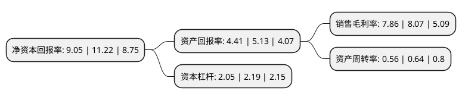

> 本页面由自动化程序生成于 2022年5月20日 01:26
> 内容可能存在错误，如有bug请提交issue至：https://github.com/Eroleice/doc-pi/issues
{.is-warning}

# 上市公司基本情况

## 基本资料

江西联创光电科技股份有限公司（以下简称“联创光电”）成立于1999年06月30日，南昌市。于2001年03月29日在上交所主板上市。

联创光电注册资本45,547.675万元，主要产品:LED芯片，显示及照明用LED器件及组件，背光源及组件，智能控制器及模块。主营业务:光电子器件及应用产品，电线电缆产品的研发，生产和销售。以下是详细信息：

- 公司名称: 江西联创光电科技股份有限公司
- 股票代码: 600363.SH
- 所在地: 江西 - 南昌市
- 成立日期: 1999年06月30日
- 注册资本: 45,547.675万元
- 法定代表人: 曾智斌
- 主营业务: 主要产品:LED芯片，显示及照明用LED器件及组件，背光源及组件，智能控制器及模块主营业务:光电子器件及应用产品，电线电缆产品的研发，生产和销售
- 公司官网: www.lianovation.com.cn
- 公司介绍: 公司主营业务为光电子器件及应用产品、电线电缆产品的研发、生产和销售，其中光电子器件及应用产品主要包括LED芯片、显示及照明用LED器件及组件、背光源及组件、智能控制器及模块，广泛应用于家电智能控制、手机、平板、车载及电脑等背光源显示、照明用LED灯具、军工应用等领域；电线电缆产品主要包括有线电视电缆、移动通信用同轴电缆、光纤光缆、电力电缆等，广泛应用于通讯产品及相关设备、计算机网络、电子消费品、电力等领域。公司是集研发、生产、销售于一体的多元化经营性企业。公司通过了ISO9001、ISO14001、OHSAS18001、GJB/Z9001、TS16949等认证，产品通过了3C、UL和CQC等认证，获“江西省著名商标”、“江西省名牌产品”、“厦门市著名商标”等称号，在用户中建立了良好声誉，获得了市场的高度认可。

## 股东及高管情况

上市公司第一大股东为江西省电子集团有限公司，持股94,736,092股，占比20.7993%，**疑似为**上市公司实际控制人。

截至2022年04月28日，上市公司的前十大股东中，共有6名自然人股东，4名机构股东，其中5%以上大股东共有2名。上市公司前十大股东明细如下：

> 未能通过持股比例判定出上市公司实际控制人（持股30%以上）
> 可能存在通过间接持股、联合持股、协议控制等方式拥有实际控制权的主体，具体请参考上市公司定期公告！
{.is-warning}

> 截至2022年04月28日，上市公司前十大股东信息如下：

| 股东名称 | 持股数量（股） | 持股比例 |
| --- | --- | --- |
| 江西省电子集团有限公司 | 94,736,092 | 20.7993% |
| 江西省电子集团有限公司 | 94,262,092 | 20.7% |
| 吉安鑫石阳实业有限公司 | 13,360,085 | 2.93% |
| 王建春 | 7,189,373 | 1.58% |
| 陈路 | 6,820,000 | 1.5% |
| 金洁儒 | 5,669,748 | 1.24% |
| 郭幼全 | 5,340,942 | 1.17% |
| 曾智斌 | 4,238,800 | 0.93% |
| 东台昂山恒泰投资合伙企业(有限合伙) | 4,224,800 | 0.93% |
| 李中煜 | 4,010,300 | 0.88% |

## 利润表分析

上市公司2021年总收入为35.85亿元，净利润为2.81亿元，实现盈利。

## 杜邦分析

> 数据列示周期：2021年 | 2020年 | 2019年
{.is-info}

上市公司的净资产收益率在近一年有所下降，下降幅度为-19.34%，其变化情况分解如下：
- 上市公司的销售毛利率在近一年下降了-2.6%，可能是生产效率的下降、商品原材料价格上涨或商品价格的下跌所致。
- 上市公司的资产周转率在近一年下降了-12.5%，可能是源自于更慢的销售回款或库存管理效果下降。
- 上市公司的财务杠杆比率在近一年下降了-6.39%，可能是减少负债降低财务费用。

