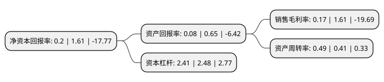

> 本页面由自动化程序生成于 2022年5月20日 01:26
> 内容可能存在错误，如有bug请提交issue至：https://github.com/Eroleice/doc-pi/issues
{.is-warning}

# 上市公司基本情况

## 基本资料

湖南科力远新能源股份有限公司（以下简称“科力远”）成立于1998年01月24日，长沙市。于2003年09月18日在上交所主板上市。

科力远注册资本165,328.139万元，主要产品:泡沫镍。以下是详细信息：

- 公司名称: 湖南科力远新能源股份有限公司
- 股票代码: 600478.SH
- 所在地: 湖南 - 长沙市
- 成立日期: 1998年01月24日
- 注册资本: 165,328.139万元
- 法定代表人: 钟发平
- 主营业务: 主要产品:泡沫镍
- 公司官网: www.corun.com
- 公司介绍: 公司是一家从事新能源材料领域研发生产的上市公司，主营连续化带状泡沫镍(电池材料)及系列产品的研制、开发、生产、销售并提供相关技术咨询服务。公司主导产品连续化带状泡沫镍系国家级重点新产品，被列入国家“863”重大攻关项目，公司自主开发的高强度超强结合力型泡沫镍已被被国家计委列入“国家高技术产业化示范工程”。公司打破单一品种的格局，开发新型绿色电池基板材料和与之相关的材料，并以电动车用电池材料市场为突破口。公司还增发收购了其控股股东科力远公司所拥有的电池类资产。

## 股东及高管情况

上市公司第一大股东为湖南科力远高技术集团有限公司，持股204,298,803股，占比12.36%，**疑似为**上市公司实际控制人。

截至2022年03月31日，上市公司的前十大股东中，共有5名自然人股东，4名机构股东，1个产品账户，其中5%以上大股东共有3名。上市公司前十大股东明细如下：

> 未能通过持股比例判定出上市公司实际控制人（持股30%以上）
> 可能存在通过间接持股、联合持股、协议控制等方式拥有实际控制权的主体，具体请参考上市公司定期公告！
{.is-warning}

> 截至2022年03月31日，上市公司前十大股东信息如下：

| 股东名称 | 持股数量（股） | 持股比例 |
| --- | --- | --- |
| 湖南科力远高技术集团有限公司 | 204,298,803 | 12.36% |
| 吉利科技集团有限公司 | 183,594,706 | 11.1% |
| 钟发平 | 101,643,428 | 6.15% |
| 高雅萍 | 37,161,410 | 2.25% |
| 沈祥龙 | 36,230,000 | 2.19% |
| 华融国际信托有限责任公司-华融·汇盈32号证券投资单一资金信托 | 29,660,000 | 1.79% |
| 季爱琴 | 25,040,180 | 1.51% |
| 民生证券投资有限公司 | 15,723,270 | 0.95% |
| 蒋水良 | 14,044,000 | 0.85% |
| 华创证券-君煦申港2号私募证券投资基金-华创证券科创启明1号单一资产管理计划 | 13,744,065 | 0.83% |

## 杜邦分析

> 数据列示周期：2021年 | 2020年 | 2019年
{.is-info}

上市公司的净资产收益率在近一年有所下降，下降幅度为-87.58%，其变化情况分解如下：
- 上市公司的销售毛利率在近一年下降了-89.44%，可能是生产效率的下降、商品原材料价格上涨或商品价格的下跌所致。
- 上市公司的资产周转率在近一年上升了19.51%，可能是源自于更快的销售回款或库存管理效果提升。
- 上市公司的财务杠杆比率在近一年下降了-2.82%，可能是减少负债降低财务费用。

