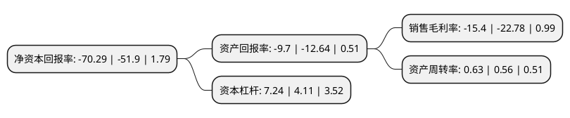

> 本页面由自动化程序生成于 2022年5月20日 01:27
> 内容可能存在错误，如有bug请提交issue至：https://github.com/Eroleice/doc-pi/issues
{.is-warning}

# 上市公司基本情况

## 基本资料

方正科技集团股份有限公司（以下简称“*ST方科”）成立于1993年11月15日，上海市。于1990年12月19日在上交所主板上市。

*ST方科注册资本219,489.12万元，主营业务为电子计算机及配件，系统集成，办公设备及消耗材料，PCB产品等的生产与销售。以下是详细信息：

- 公司名称: 方正科技集团股份有限公司
- 股票代码: 600601.SH
- 所在地: 上海 - 上海市
- 成立日期: 1993年11月15日
- 注册资本: 219,489.12万元
- 法定代表人: 刘建
- 主营业务: 主营业务为电子计算机及配件，系统集成，办公设备及消耗材料，PCB产品等的生产与销售
- 公司官网: www.foundertech.com
- 公司介绍: 公司是北大方正信息产业集团旗下的内地上市企业，也是国内最有影响力的高科技上市企业之一。公司目前致力于成为“智慧城市的真实贡献者”，紧密围绕智慧城市建设和运营，利用云计算、大数据分析等前沿技术，为智慧城市建设提供从顶层设计到垂直行业软硬件解决方案，业务涵盖PCB元器件—高速宽带接入—多垂直行业解决方案，覆盖智慧城市信息化建设各层次。公司已成为国内首屈一指的集PCB产品研发、生产、制造和销售的龙头企业。公司PCB产品客户主要集中在通信设备、通讯终端、IT产品、工业医疗、汽车电子、消费电子等领域。作为首批获得宽带驻地网试验许可证、国家工信部增值电信业务许可证以及文化部网络文化经营许可证的宽带接入商，方正科技的宽带业务已在全国众多城市建立了分支机构，辐射范围不断扩大。同时方正科技积极打造智能家居及智能社区，将物联网融入生活，构建智慧社区生活圈。

## 股东及高管情况

上市公司第一大股东为北大方正信息产业集团有限公司，持股276,333,368股，占比12.59%，**疑似为**上市公司实际控制人。

截至2022年03月31日，上市公司的前十大股东中，共有8名自然人股东，1名机构股东，1个产品账户，其中5%以上大股东共有1名。上市公司前十大股东明细如下：

> 未能通过持股比例判定出上市公司实际控制人（持股30%以上）
> 可能存在通过间接持股、联合持股、协议控制等方式拥有实际控制权的主体，具体请参考上市公司定期公告！
{.is-warning}

> 截至2022年03月31日，上市公司前十大股东信息如下：

| 股东名称 | 持股数量（股） | 持股比例 |
| --- | --- | --- |
| 北大方正信息产业集团有限公司 | 276,333,368 | 12.59% |
| 曾远彬 | 77,958,903 | 3.55% |
| 杨创和 | 19,321,700 | 0.88% |
| 张佳华 | 14,766,900 | 0.67% |
| 赖法卫 | 9,999,920 | 0.46% |
| 广发基金-农业银行-广发中证金融资产管理计划 | 9,285,450 | 0.42% |
| 詹忆源 | 9,166,800 | 0.42% |
| 彭士学 | 8,898,700 | 0.41% |
| 尼怀贵 | 7,921,800 | 0.36% |
| 宋江珂 | 7,346,900 | 0.33% |

## 利润表分析

上市公司2021年总收入为54.31亿元，净利润为-12.14亿元，**未实现盈利**。

## 杜邦分析

> 数据列示周期：2020年 | 2019年 | 2018年
{.is-info}

上市公司的净资产收益率在近一年有所上升，上升幅度为35.43%，其变化情况分解如下：
- 上市公司的销售毛利率在近一年下降了-32.4%，可能是生产效率的下降、商品原材料价格上涨或商品价格的下跌所致。
- 上市公司的资产周转率在近一年上升了12.5%，可能是源自于更快的销售回款或库存管理效果提升。
- 上市公司的财务杠杆比率在近一年上升了76.16%，可能是增加负债扩大生产规模。

