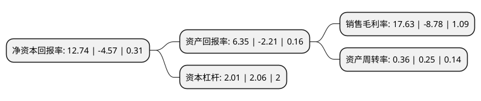

> 本页面由自动化程序生成于 2022年5月20日 01:28
> 内容可能存在错误，如有bug请提交issue至：https://github.com/Eroleice/doc-pi/issues
{.is-warning}

# 上市公司基本情况

## 基本资料

彩虹显示器件股份有限公司（以下简称“彩虹股份”）成立于1992年07月29日，咸阳市。于1996年05月20日在上交所主板上市。

彩虹股份注册资本358,838.973万元，主营业务:液晶基板玻璃的研发，生产与销售。以下是详细信息：

- 公司名称: 彩虹显示器件股份有限公司
- 股票代码: 600707.SH
- 所在地: 陕西 - 咸阳市
- 成立日期: 1992年07月29日
- 注册资本: 358,838.973万元
- 法定代表人: 李淼
- 主营业务: 主营业务:液晶基板玻璃的研发，生产与销售
- 公司官网: www.chgf.com.cn
- 公司介绍: 公司是我国显示器件领域中最具竞争力的企业之一，主要业务为液晶基板玻璃的研发、生产与销售，是全球唯一的“面板+基板”上下游产业联动企业。公司是中国第一家、全球第五家拥有液晶玻璃基板生产技术和生产能力的液晶玻璃基板制造企业，填补了国内在该领域的空白，打破了国际垄断。为顺应平板显示产业向高世代发展的趋势，公司不断进行产品结构调整和产业升级，公司主要产品G5、G6、G7.5、G8.5液晶玻璃基板产品销往中国内地和中国台湾面板厂商，用于液晶面板的制造。公司控股子公司彩虹光电公司主要从事液晶面板的研发、生产和销售，产品为32“-100”超高清TFT-LCD面板，在高端平板电脑、笔记本电脑、大尺寸电视以及超高分辨率等高端显示产品中拥有广泛的应用领域和市场前景。

## 股东及高管情况

上市公司第一大股东为咸阳金融控股集团有限公司，持股1,112,759,643股，占比31.01%，为上市公司实际控制人。

截至2022年03月31日，上市公司的前十大股东中，共有7名机构股东，3个产品账户，其中5%以上大股东共有3名。上市公司前十大股东明细如下：

> 截至2022年03月31日，上市公司前十大股东信息如下：

| 股东名称 | 持股数量（股） | 持股比例 |
| --- | --- | --- |
| 咸阳金融控股集团有限公司 | 1,112,759,643 | 31.01% |
| 咸阳中电彩虹集团控股有限公司 | 720,098,538 | 20.07% |
| 咸阳市城市建设投资控股集团有限公司 | 314,336,098 | 8.76% |
| 合肥芯屏产业投资基金(有限合伙) | 165,621,059 | 4.62% |
| 陕西电子信息集团有限公司 | 112,489,952 | 3.13% |
| 陕西如意广电科技有限公司 | 108,884,454 | 3.03% |
| 彩虹集团新能源股份有限公司 | 35,375,673 | 0.99% |
| 佛山市顺德区诚顺资产管理有限公司 | 14,821,958 | 0.41% |
| 保宁资本有限公司-保宁新兴市场基金(美国) | 10,620,800 | 0.3% |
| 中国农业银行股份有限公司-中证500交易型开放式指数证券投资基金 | 7,088,107 | 0.2% |

## 利润表分析

上市公司2021年总收入为151.73亿元，净利润为26.74亿元，实现盈利。

## 杜邦分析

> 数据列示周期：2021年 | 2020年 | 2019年
{.is-info}

上市公司的净资产收益率在近一年有所下降，下降幅度为-378.77%，其变化情况分解如下：
- 上市公司的销售毛利率在近一年下降了-300.8%，可能是生产效率的下降、商品原材料价格上涨或商品价格的下跌所致。
- 上市公司的资产周转率在近一年上升了44%，可能是源自于更快的销售回款或库存管理效果提升。
- 上市公司的财务杠杆比率在近一年下降了-2.43%，可能是减少负债降低财务费用。

