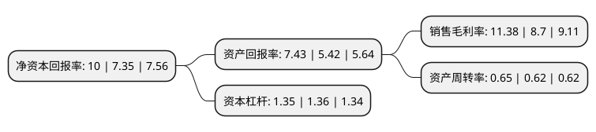

> 本页面由自动化程序生成于 2022年5月20日 01:30
> 内容可能存在错误，如有bug请提交issue至：https://github.com/Eroleice/doc-pi/issues
{.is-warning}

# 上市公司基本情况

## 基本资料

北矿科技股份有限公司（以下简称“北矿科技”）成立于2000年09月06日，北京市。于2004年05月12日在上交所主板上市。

北矿科技注册资本17,384.579万元，烧结铁氧体，粘结铁氧体，烧结磁器件，粘结磁器件以下是详细信息：

- 公司名称: 北矿科技股份有限公司
- 股票代码: 600980.SH
- 所在地: 北京 - 北京市
- 成立日期: 2000年09月06日
- 注册资本: 17,384.579万元
- 法定代表人: 韩龙
- 主营业务: 烧结铁氧体，粘结铁氧体，烧结磁器件，粘结磁器件
- 公司官网: www.bgrimmtec.com
- 公司介绍: 公司的业务范围主要包括矿山装备和磁性材料。公司目前拥有北矿机电科技有限责任公司和北矿磁材科技有限公司2个全资子公司。公司近年在大力维护国内市场的同时积极布局国际化经营战略，利用“一带一路”带来的机遇大力开拓国际市场。公司是“国家磁性材料工程技术研究中心”、“国家金属矿产资源综合利用工程技术研究中心”的主体研究单位，下设北京市高效节能矿冶装备工程技术研究中心。

## 股东及高管情况

上市公司第一大股东为矿冶科技集团有限公司，持股80,586,916股，占比46.36%，为上市公司实际控制人。

截至2022年03月31日，上市公司的前十大股东中，共有6名自然人股东，2名机构股东，2个产品账户，其中5%以上大股东共有1名。上市公司前十大股东明细如下：

> 截至2022年03月31日，上市公司前十大股东信息如下：

| 股东名称 | 持股数量（股） | 持股比例 |
| --- | --- | --- |
| 矿冶科技集团有限公司 | 80,586,916 | 46.36% |
| 柴长茂 | 2,600,000 | 1.5% |
| 李泽 | 1,739,000 | 1% |
| 吴林 | 816,600 | 0.47% |
| 中国建设银行股份有限公司-嘉实中证稀土产业交易型开放式指数证券投资基金 | 597,400 | 0.34% |
| 申万宏源证券有限公司 | 581,700 | 0.33% |
| 胡月英 | 408,000 | 0.23% |
| 常铁成 | 369,200 | 0.21% |
| 许国珍 | 361,600 | 0.21% |
| 青岛宝信德投资管理有限公司-宝盈一号私募证券投资基金 | 360,000 | 0.21% |

## 利润表分析

上市公司2021年总收入为7.04亿元，净利润为0.8亿元，实现盈利。

## 杜邦分析

> 数据列示周期：2021年 | 2020年 | 2019年
{.is-info}

上市公司的净资产收益率在近一年有所上升，上升幅度为36.05%，其变化情况分解如下：
- 上市公司的销售毛利率在近一年上升了30.8%，可能是生产效率的提升、商品原材料价格下跌或商品价格的上涨所致。
- 上市公司的资产周转率在近一年上升了4.84%，可能是源自于更快的销售回款或库存管理效果提升。
- 上市公司的财务杠杆比率在近一年下降了-0.74%，可能是减少负债降低财务费用。

