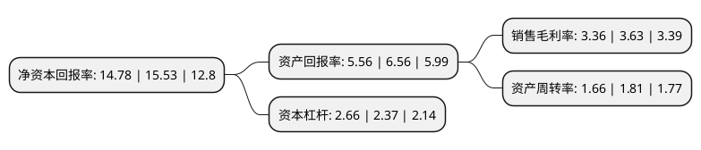

> 本页面由自动化程序生成于 2022年5月20日 01:30
> 内容可能存在错误，如有bug请提交issue至：https://github.com/Eroleice/doc-pi/issues
{.is-warning}

# 上市公司基本情况

## 基本资料

环旭电子股份有限公司（以下简称“环旭电子”）成立于2003年01月02日，上海市。于2012年02月20日在上交所主板上市。

环旭电子注册资本221,038.848万元，公司的主要业务是为国内外的品牌厂商提供各类电子产品的开发设计，物料采购，生产制造，物流，维修等专业服务。公司的主要产品包括通讯类，电脑及存储类，消费电子类，工业类，其他类等五大类。以下是详细信息：

- 公司名称: 环旭电子股份有限公司
- 股票代码: 601231.SH
- 所在地: 上海 - 上海市
- 成立日期: 2003年01月02日
- 注册资本: 221,038.848万元
- 法定代表人: 陈昌益
- 主营业务: 公司的主要业务是为国内外的品牌厂商提供各类电子产品的开发设计，物料采购，生产制造，物流，维修等专业服务公司的主要产品包括通讯类，电脑及存储类，消费电子类，工业类，其他类等五大类
- 公司官网: www.usiglobal.com
- 公司介绍: 公司是电子产品领域提供专业设计制造服务及解决方案的大型设计制造服务商。公司主要为国内外的品牌厂商提供各类电子产品的开发设计、物料采购、生产制造、物流、维修等专业服务，产品涵盖通讯类产品、电脑及存储类产品、消费电子类产品、工业类产品及其他类产品等。公司以资讯、通讯、消费电子及汽车电子等高端电子产品ODM、JDM、EMS为主，与许多国际电子产品品牌商，如苹果、友达光电、联想、英特尔、IBM等，建立了长期稳定的供应链合作关系。

## 股东及高管情况

上市公司第一大股东为环诚科技有限公司，持股1,683,749,126股，占比76.17%，为上市公司实际控制人。

截至2022年03月31日，上市公司的前十大股东中，共有2名自然人股东，4名机构股东，1个产品账户，3个海外主体，其中5%以上大股东共有1名。上市公司前十大股东明细如下：

> 截至2022年03月31日，上市公司前十大股东信息如下：

| 股东名称 | 持股数量（股） | 持股比例 |
| --- | --- | --- |
| 环诚科技有限公司 | 1,683,749,126 | 76.17% |
| 香港中央结算有限公司(陆股通) | 58,981,876 | 2.67% |
| 中国证券金融股份有限公司 | 36,750,069 | 1.66% |
| ASDI ASSISTANCE DIRECTION | 25,939,972 | 1.17% |
| ASDIASSISTANCE DIRECTION | 25,939,972 | 1.17% |
| 日月光半导体(上海)有限公司 | 18,098,476 | 0.82% |
| 中联润世(北京)投资有限公司 | 5,997,965 | 0.27% |
| 中国银行股份有限公司-华夏中证5G通信主题交易型开放式指数证券投资基金 | 4,832,669 | 0.22% |
| 吴磊 | 4,180,084 | 0.19% |
| 李亚莲 | 3,644,294 | 0.16% |

## 利润表分析

上市公司2021年总收入为552.99亿元，净利润为18.56亿元，实现盈利。

## 杜邦分析

> 数据列示周期：2021年 | 2020年 | 2019年
{.is-info}

上市公司的净资产收益率在近一年有所下降，下降幅度为-4.83%，其变化情况分解如下：
- 上市公司的销售毛利率在近一年下降了-7.44%，可能是生产效率的下降、商品原材料价格上涨或商品价格的下跌所致。
- 上市公司的资产周转率在近一年下降了-8.29%，可能是源自于更慢的销售回款或库存管理效果下降。
- 上市公司的财务杠杆比率在近一年上升了12.24%，可能是增加负债扩大生产规模。

