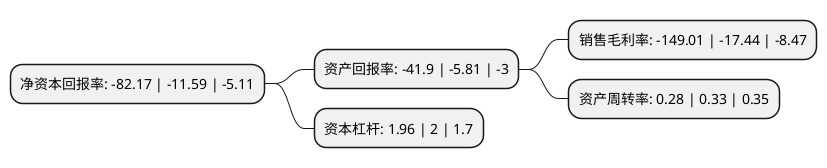

> 本页面由自动化程序生成于 2022年5月20日 01:32
> 内容可能存在错误，如有bug请提交issue至：https://github.com/Eroleice/doc-pi/issues
{.is-warning}

# 上市公司基本情况

## 基本资料

碳元科技股份有限公司（以下简称“碳元科技”）成立于2010年08月13日，常州市。于2017年03月20日在上交所主板上市。

碳元科技注册资本20,918.52万元，主营业务为高导热石墨散热材料开发，制造与销售。主要产品为高导热石墨膜。以下是详细信息：

- 公司名称: 碳元科技股份有限公司
- 股票代码: 603133.SH
- 所在地: 江苏 - 常州市
- 成立日期: 2010年08月13日
- 注册资本: 20,918.52万元
- 法定代表人: 徐世中
- 主营业务: 主营业务为高导热石墨散热材料开发，制造与销售主要产品为高导热石墨膜
- 公司官网: www.tanyuantech.com
- 公司介绍: 公司是一家专注于高散热石墨膜等相关产品的技术研发与生产的高新技术企业。碳元科技是江苏省优秀民营企业、江苏省科技小巨人以及常州市明星企业。公司建有江苏省高导热石墨膜工程技术研究中心，拥有完全自主知识产权及完备生产工艺。公司先后通过ISO14001环境管理体系认证、ISO9001质量管理体系认证，OHSAS18001职业健康安全管理体系认证等。公司以世界领先的石墨散热技术，服务于国内外多家手机及平板电脑厂家。目前与三星、华为、OPPO、Vivo等智能终端厂商建立了良好和长期的合作关系。

## 股东及高管情况

上市公司第一大股东为徐世中，持股61,859,353股，占比29.57%，**疑似为**上市公司实际控制人。

截至2022年03月31日，上市公司的前十大股东中，共有8名自然人股东，2名机构股东，其中5%以上大股东共有3名。上市公司前十大股东明细如下：

> 未能通过持股比例判定出上市公司实际控制人（持股30%以上）
> 可能存在通过间接持股、联合持股、协议控制等方式拥有实际控制权的主体，具体请参考上市公司定期公告！
{.is-warning}

> 截至2022年03月31日，上市公司前十大股东信息如下：

| 股东名称 | 持股数量（股） | 持股比例 |
| --- | --- | --- |
| 徐世中 | 61,859,353 | 29.57% |
| 珠海金福源企业管理合伙企业(有限合伙) | 16,102,652 | 7.7% |
| 杨军 | 10,520,000 | 5.03% |
| 梁新民 | 2,596,698 | 1.24% |
| 钱文德 | 1,994,100 | 0.95% |
| 中鼎博文(北京)科技有限公司 | 1,563,000 | 0.75% |
| 孙锡林 | 1,493,000 | 0.71% |
| 胡国防 | 1,100,000 | 0.53% |
| 陈瑞华 | 1,036,400 | 0.5% |
| 段军有 | 982,600 | 0.47% |

## 利润表分析

上市公司2021年总收入为3.23亿元，净利润为-4.82亿元，**未实现盈利**。

## 杜邦分析

> 数据列示周期：2021年 | 2020年 | 2019年
{.is-info}

上市公司的净资产收益率在近一年有所上升，上升幅度为608.97%，其变化情况分解如下：
- 上市公司的销售毛利率在近一年上升了754.42%，可能是生产效率的提升、商品原材料价格下跌或商品价格的上涨所致。
- 上市公司的资产周转率在近一年下降了-15.15%，可能是源自于更慢的销售回款或库存管理效果下降。
- 上市公司的财务杠杆比率在近一年下降了-2%，可能是减少负债降低财务费用。

