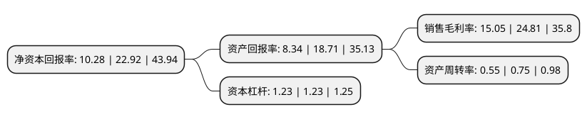

> 本页面由自动化程序生成于 2022年5月20日 01:33
> 内容可能存在错误，如有bug请提交issue至：https://github.com/Eroleice/doc-pi/issues
{.is-warning}

# 上市公司基本情况

## 基本资料

深圳市汇顶科技股份有限公司（以下简称“汇顶科技”）成立于2002年05月31日，深圳市。于2016年10月17日在上交所主板上市。

汇顶科技注册资本45,856.207万元，主营业务:从事智能人机交互技术的研究与开发，主要向市场提供面向手机，平板电脑等智能终端的电容屏触控芯片。;主要产品为电容触控芯片，固定电话芯片产品。以下是详细信息：

- 公司名称: 深圳市汇顶科技股份有限公司
- 股票代码: 603160.SH
- 所在地: 广东 - 深圳市
- 成立日期: 2002年05月31日
- 注册资本: 45,856.207万元
- 法定代表人: 张帆
- 主营业务: 主营业务:从事智能人机交互技术的研究与开发，主要向市场提供面向手机，平板电脑等智能终端的电容屏触控芯片;主要产品为电容触控芯片，固定电话芯片产品
- 公司官网: www.goodix.com
- 公司介绍: 公司是一家基于芯片设计和软件开发的整体应用解决方案提供商，目前主要面向智能移动终端市场提供领先的人机交互和生物识别解决方案，并已成为安卓阵营全球指纹识别方案第一供应商。产品和解决方案主要应用于华为、OPPO、vivo、小米、中兴、一加、魅族、Amazon、Samsung、Nokia、Dell、HP、LG、ASUS、acer、TOSHIBA、Panasonic等国际国内知名品牌，服务全球数亿人群。公司正努力扩展技术研究领域和产品应用市场，将在移动终端、IoT和汽车电子领域为全球更多用户提供应用覆盖面更广的领先技术、产品及应用解决方案，打造世界级的中国“芯”。

## 股东及高管情况

上市公司第一大股东为张帆，持股206,296,376股，占比44.98%，为上市公司实际控制人。

截至2022年05月13日，上市公司的前十大股东中，共有3名自然人股东，3名机构股东，3个产品账户，1个海外主体，其中5%以上大股东共有3名。上市公司前十大股东明细如下：

> 截至2022年05月13日，上市公司前十大股东信息如下：

| 股东名称 | 持股数量（股） | 持股比例 |
| --- | --- | --- |
| 张帆 | 206,296,376 | 44.98% |
| 张帆 | 206,296,376 | 44.98% |
| 汇发国际(香港)有限公司 | 27,370,760 | 5.97% |
| 国家集成电路产业投资基金股份有限公司 | 16,492,194 | 3.6% |
| 香港中央结算有限公司(陆股通) | 11,581,896 | 2.53% |
| 朱星火 | 11,000,000 | 2.4% |
| 云南聚为企业管理中心(有限合伙) | 7,061,784 | 1.54% |
| 国泰君安证券股份有限公司约定购回式证券交易专用证券账户 | 5,000,000 | 1.09% |
| 中国建设银行股份有限公司-华夏国证半导体芯片交易型开放式指数证券投资基金 | 4,156,677 | 0.91% |
| 四川宣邦科技有限公司 | 4,021,823 | 0.88% |

## 利润表分析

上市公司2021年总收入为57.12亿元，净利润为8.59亿元，实现盈利。

## 杜邦分析

> 数据列示周期：2021年 | 2020年 | 2019年
{.is-info}

上市公司的净资产收益率在近一年有所下降，下降幅度为-55.15%，其变化情况分解如下：
- 上市公司的销售毛利率在近一年下降了-39.34%，可能是生产效率的下降、商品原材料价格上涨或商品价格的下跌所致。
- 上市公司的资产周转率在近一年下降了-26.67%，可能是源自于更慢的销售回款或库存管理效果下降。
- 上市公司的财务杠杆比率在近一年下降了0%，可能是减少负债降低财务费用。

