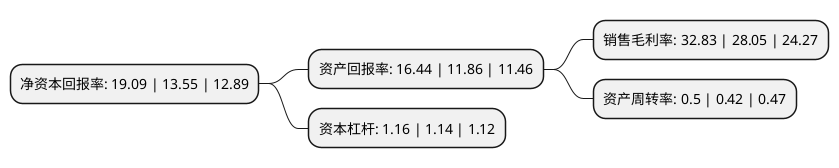

> 本页面由自动化程序生成于 2022年5月20日 01:33
> 内容可能存在错误，如有bug请提交issue至：https://github.com/Eroleice/doc-pi/issues
{.is-warning}

# 上市公司基本情况

## 基本资料

宁波永新光学股份有限公司（以下简称“永新光学”）成立于1997年02月21日，宁波市。于2018年09月10日在上交所主板上市。

永新光学注册资本11,047.75万元，主要产品:生物显微镜及工业显微镜，条码扫描仪镜头，平面光学元件，专业成像光学部组件。主营业务:光学显微镜，光学元件组件和其他光学产品的研发，生产和销售，以下是详细信息：

- 公司名称: 宁波永新光学股份有限公司
- 股票代码: 603297.SH
- 所在地: 浙江 - 宁波市
- 成立日期: 1997年02月21日
- 注册资本: 11,047.75万元
- 法定代表人: 毛磊
- 主营业务: 主要产品:生物显微镜及工业显微镜，条码扫描仪镜头，平面光学元件，专业成像光学部组件主营业务:光学显微镜，光学元件组件和其他光学产品的研发，生产和销售，
- 公司官网: www.yxopt.com
- 公司介绍: 公司是中国光学精密仪器及核心部件制造商、国家级高新技术企业、中国仪器仪表行业协会副理事长单位、光学仪器分会理事长单位和光学显微镜国家标准制订单位，主导ISO显微镜国际标准制定，拥有“NOVEL”、“江南”和“NEXCOPE”等自主品牌。2016年承接国家重点研发计划重点专项“高分辨荧光显微成像仪研究及产业化”，2017年荣膺工信部制造业单项冠军培育企业。产品销往美日德俄等一百多个国家和地区，是国际知名企业的核心供应商。公司具有数十年光学仪器产品设计和专业生产历史，并与浙江大学、宁波大学等高校建立了稳定的产学研合作关系。

## 股东及高管情况

上市公司第一大股东为永新光电实业有限公司，持股32,217,250股，占比29.16%，**疑似为**上市公司实际控制人。

截至2022年03月31日，上市公司的前十大股东中，共有1名自然人股东，7名机构股东，2个产品账户，其中5%以上大股东共有5名。上市公司前十大股东明细如下：

> 未能通过持股比例判定出上市公司实际控制人（持股30%以上）
> 可能存在通过间接持股、联合持股、协议控制等方式拥有实际控制权的主体，具体请参考上市公司定期公告！
{.is-warning}

> 截至2022年03月31日，上市公司前十大股东信息如下：

| 股东名称 | 持股数量（股） | 持股比例 |
| --- | --- | --- |
| 永新光电实业有限公司 | 32,217,250 | 29.16% |
| 共青城波通投资合伙企业(有限合伙) | 12,122,500 | 10.97% |
| 宁兴(宁波)资产管理有限公司 | 11,797,500 | 10.68% |
| 宁波电子信息集团有限公司 | 8,258,250 | 7.48% |
| 安高国际资源有限公司 | 6,434,077 | 5.82% |
| 厦门新颢投资合伙企业(有限合伙) | 3,911,600 | 3.54% |
| 毛磊 | 3,250,000 | 2.94% |
| 中国银行股份有限公司-信诚新兴产业混合型证券投资基金 | 1,602,561 | 1.45% |
| 加茂资讯技术有限公司 | 1,367,523 | 1.24% |
| 招商银行股份有限公司-民生加银成长优选股票型证券投资基金 | 880,000 | 0.8% |

## 杜邦分析

> 数据列示周期：2021年 | 2020年 | 2019年
{.is-info}

上市公司的净资产收益率在近一年有所上升，上升幅度为40.89%，其变化情况分解如下：
- 上市公司的销售毛利率在近一年上升了17.04%，可能是生产效率的提升、商品原材料价格下跌或商品价格的上涨所致。
- 上市公司的资产周转率在近一年上升了19.05%，可能是源自于更快的销售回款或库存管理效果提升。
- 上市公司的财务杠杆比率在近一年上升了1.75%，可能是增加负债扩大生产规模。

