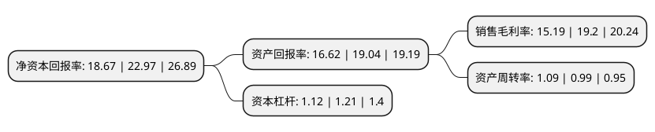

> 本页面由自动化程序生成于 2022年5月20日 01:33
> 内容可能存在错误，如有bug请提交issue至：https://github.com/Eroleice/doc-pi/issues
{.is-warning}

# 上市公司基本情况

## 基本资料

四川福蓉科技股份公司（以下简称“福蓉科技”）成立于2011年04月26日，成都市。于2019年05月23日在上交所主板上市。

福蓉科技注册资本40,100万元，从事消费电子产品铝制结构件材料的研发，生产及销售。公司产品包括智能手机外壳和中框材料，平板电脑外壳材料，笔记本电脑外壳材料等，主要是智能手机外壳和中框的精锯件。以下是详细信息：

- 公司名称: 四川福蓉科技股份公司
- 股票代码: 603327.SH
- 所在地: 四川 - 成都市
- 成立日期: 2011年04月26日
- 注册资本: 40,100万元
- 法定代表人: 张景忠
- 主营业务: 从事消费电子产品铝制结构件材料的研发，生产及销售公司产品包括智能手机外壳和中框材料，平板电脑外壳材料，笔记本电脑外壳材料等，主要是智能手机外壳和中框的精锯件
- 公司官网: www.scfrkj.cn
- 公司介绍: 公司自成立以来始终坚持深耕消费电子产品铝制结构件材料市场，不断进行技术创新和市场开拓，掌握了消费电子产品铝制结构件基础材料的制备技术和加工工艺，并形成了内在组织、外观质量、物理性质、机械性能、加工性能、尺寸精度等方面行业领先的高精度产品规模化生产能力，公司主要产品为智能手机、平板电脑、笔记本电脑等消费电子产品的铝制结构件材料，产品进一步加工后应用于三星、华为、OPPO、VIVO等多款品牌智能手机和苹果等品牌的平板电脑、笔记本电脑，以智能手机为主。公司通过了ISO9001质量管理体系认证、ISO14001环境管理体系认证，拥有IECQ QC080000:2012有害物质过程管理体系认证证书，被成都市经济和信息化委员会认定为成都市企业技术中心，为成都制造业100强单位。

## 股东及高管情况

上市公司第一大股东为福建省南平铝业股份有限公司，持股226,471,000股，占比56.48%，为上市公司实际控制人。

截至2022年05月23日，上市公司的前十大股东中，共有8名机构股东，1个产品账户，1个海外主体，其中5%以上大股东共有5名。上市公司前十大股东明细如下：

> 截至2022年05月23日，上市公司前十大股东信息如下：

| 股东名称 | 持股数量（股） | 持股比例 |
| --- | --- | --- |
| 福建省南平铝业股份有限公司 | 226,471,000 | 56.48% |
| 福建冶控股权投资管理有限公司 | 44,779,350 | 11.17% |
| 福建冶控股权投资管理有限公司 | 44,779,350 | 11.17% |
| 成都兴蜀投资开发有限责任公司 | 33,970,650 | 8.47% |
| 成都兴蜀投资开发有限责任公司 | 33,970,650 | 8.47% |
| 惠州市嘉骏华股权投资合伙企业(有限合伙) | 10,191,300 | 2.54% |
| 福建省国企改革重组投资基金(有限合伙) | 9,959,900 | 2.48% |
| 安吉志盈企业管理咨询合伙企业(有限合伙) | 8,632,400 | 2.15% |
| 安吉和盈企业管理咨询合伙企业(有限合伙) | 8,455,300 | 2.11% |
| 香港中央结算有限公司(陆股通) | 338,973 | 0.08% |

## 利润表分析

上市公司2021年总收入为19.3亿元，净利润为2.93亿元，实现盈利。

## 杜邦分析

> 数据列示周期：2021年 | 2020年 | 2019年
{.is-info}

上市公司的净资产收益率在近一年有所下降，下降幅度为-18.72%，其变化情况分解如下：
- 上市公司的销售毛利率在近一年下降了-20.89%，可能是生产效率的下降、商品原材料价格上涨或商品价格的下跌所致。
- 上市公司的资产周转率在近一年上升了10.1%，可能是源自于更快的销售回款或库存管理效果提升。
- 上市公司的财务杠杆比率在近一年下降了-7.44%，可能是减少负债降低财务费用。

