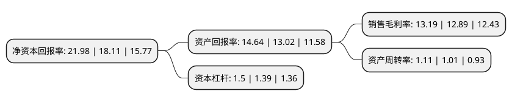

> 本页面由自动化程序生成于 2022年5月20日 01:34
> 内容可能存在错误，如有bug请提交issue至：https://github.com/Eroleice/doc-pi/issues
{.is-warning}

# 上市公司基本情况

## 基本资料

苏州易德龙科技股份有限公司（以下简称“易德龙”）成立于2001年05月31日，苏州市。于2017年06月22日在上交所主板上市。

易德龙注册资本16,128.9万元，主营业务:提供全方位的电子制造服务，包括制造及测试，供应链管理，定制化研发和工程技术支持的整体解决方案。主要产品:通讯类产品，工业控制类产品，消费电子产品，医疗电子产品，汽车电子产品。以下是详细信息：

- 公司名称: 苏州易德龙科技股份有限公司
- 股票代码: 603380.SH
- 所在地: 江苏 - 苏州市
- 成立日期: 2001年05月31日
- 注册资本: 16,128.9万元
- 法定代表人: 钱新栋
- 主营业务: 主营业务:提供全方位的电子制造服务，包括制造及测试，供应链管理，定制化研发和工程技术支持的整体解决方案主要产品:通讯类产品，工业控制类产品，消费电子产品，医疗电子产品，汽车电子产品
- 公司官网: www.etron.cn
- 公司介绍: 公司是一家主要面向全球高端客户的电子制造服务商，专注于通讯、工业控制、消费电子、医疗电子、汽车电子等领域。公司为高品质要求、需求多样化的客户提供全方位的电子制造服务，包括制造及测试、供应链管理、定制化研发和工程技术支持的整体解决方案。公司立足于差异化的市场战略，以透明的质量管理、高效灵活的生产管理、定制化研发服务、精细化供应链管理为基石，通过平台化的资源整合、全流程的成本管控、先进的信息化管理，促使公司长期、健康、可持续发展。公司积极践行工业4.0和中国制造2025战略，致力于推进智能制造，加快企业转型升级。公司是江苏省高新技术企业、江苏省首批智能车间示范企业、江苏省企业技术中心挂牌企业和江苏省管理创新优秀企业。

## 股东及高管情况

上市公司第一大股东为钱新栋，持股59,560,680股，占比36.86%，为上市公司实际控制人。

截至2022年03月31日，上市公司的前十大股东中，共有3名自然人股东，1名机构股东，6个产品账户，其中5%以上大股东共有3名。上市公司前十大股东明细如下：

> 截至2022年03月31日，上市公司前十大股东信息如下：

| 股东名称 | 持股数量（股） | 持股比例 |
| --- | --- | --- |
| 钱新栋 | 59,560,680 | 36.86% |
| 王明 | 30,107,160 | 18.63% |
| 苏州詹姆士贝拉投资管理中心(有限合伙) | 12,837,360 | 7.94% |
| 中国工商银行股份有限公司-交银施罗德趋势优先混合型证券投资基金 | 7,887,800 | 4.88% |
| 招商银行股份有限公司-交银施罗德启诚混合型证券投资基金 | 2,539,831 | 1.57% |
| 东方证券股份有限公司-中庚价值先锋股票型证券投资基金 | 2,455,900 | 1.52% |
| 苏州易德龙科技股份有限公司回购专用证券账户 | 2,280,100 | 1.41% |
| 深圳通和私募证券投资基金管理有限公司-通和富享一期投资基金 | 1,609,900 | 1% |
| 王静文 | 803,340 | 0.5% |
| 光大永明资管-兴业银行-光大永明资产聚财121号定向资产管理产品 | 793,033 | 0.49% |

## 利润表分析

上市公司2021年总收入为17.51亿元，净利润为2.3亿元，实现盈利。

## 杜邦分析

> 数据列示周期：2021年 | 2020年 | 2019年
{.is-info}

上市公司的净资产收益率在近一年有所上升，上升幅度为21.37%，其变化情况分解如下：
- 上市公司的销售毛利率在近一年上升了2.33%，可能是生产效率的提升、商品原材料价格下跌或商品价格的上涨所致。
- 上市公司的资产周转率在近一年上升了9.9%，可能是源自于更快的销售回款或库存管理效果提升。
- 上市公司的财务杠杆比率在近一年上升了7.91%，可能是增加负债扩大生产规模。

