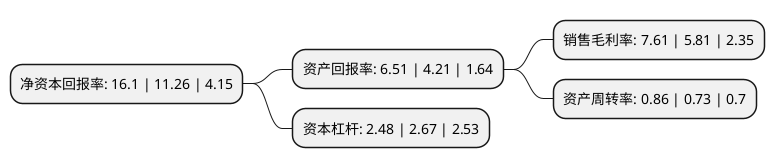

> 本页面由自动化程序生成于 2022年5月20日 01:34
> 内容可能存在错误，如有bug请提交issue至：https://github.com/Eroleice/doc-pi/issues
{.is-warning}

# 上市公司基本情况

## 基本资料

广东骏亚电子科技股份有限公司（以下简称“广东骏亚”）成立于2005年11月22日，惠州市。于2017年09月12日在上交所主板上市。

广东骏亚注册资本23,431.606万元，主营业务:专注于印制电路板行业，主要从事印制电路板的研发，生产和销售，及印制电路板的表面贴装(SMT)。公司主要产品种类包括双面及多层刚性电路板(含SMT)。公司的主要产品包括双面板，多层板等，产品主要应用于消费电子，工业控制及医疗，计算机及网络设备，汽车电子等领域。以下是详细信息：

- 公司名称: 广东骏亚电子科技股份有限公司
- 股票代码: 603386.SH
- 所在地: 广东 - 惠州市
- 成立日期: 2005年11月22日
- 注册资本: 23,431.606万元
- 法定代表人: 叶晓彬
- 主营业务: 主营业务:专注于印制电路板行业，主要从事印制电路板的研发，生产和销售，及印制电路板的表面贴装(SMT)公司主要产品种类包括双面及多层刚性电路板(含SMT)公司的主要产品包括双面板，多层板等，产品主要应用于消费电子，工业控制及医疗，计算机及网络设备，汽车电子等领域
- 公司官网: www.championasia.hk
- 公司介绍: 公司专注于印制电路板行业，主要从事印制电路板的研发、生产和销售，及印制电路板的表面贴装(SMT)。公司主要产品种类包括双面及多层刚性电路板(含SMT)。产品主要应用于消费电子、工业控制及医疗、计算机及网络设备、汽车电子等领域。公司拥有行业一流水准的PCB生产设备和高精度检测设备，包括全新德国进口schmoll高精度钻机，中国台湾活全自动压合回流线，中国台湾竟铭电镀线、全自动低压喷涂线、宇宙成套表面外理设备，川宝自动曝光机，明信全自动测试机、设施齐全的物理和化学实验室等等专业配套设备以及废水处理量达1200m3/日的专业环保废水处理系统。公司在2010年分别通过CQC、ISO14001:2004、ISO9001:2008ISO/TS16949:2009等认证，产品符合欧盟RoHS指令，并引入其他各类认证等一系列国际先进质量管理标准。公司秉承“以人为本、诚信为实、卓越创新、永续经营”的经营理念，“顾客至上、品质第一”的质量方针，长期以来与创维、长虹、冠捷、TCL、比亚迪等国内主要上市知名企业以及Flextronics、Emerson、Honeywell、Whirlpool、LG等国外知名企业稳定合作。

## 股东及高管情况

上市公司第一大股东为骏亚企业有限公司，持股145,125,000股，占比61.94%，为上市公司实际控制人。

截至2022年03月31日，上市公司的前十大股东中，共有7名自然人股东，2名机构股东，1个产品账户，其中5%以上大股东共有1名。上市公司前十大股东明细如下：

> 截至2022年03月31日，上市公司前十大股东信息如下：

| 股东名称 | 持股数量（股） | 持股比例 |
| --- | --- | --- |
| 骏亚企业有限公司 | 145,125,000 | 61.94% |
| 陈兴农 | 7,082,521 | 3.02% |
| 董友全 | 3,512,880 | 1.5% |
| 惠州市创新投资有限公司 | 2,640,515 | 1.13% |
| 谢湘 | 1,871,296 | 0.8% |
| 高荣顺 | 1,740,152 | 0.74% |
| 陈绍德 | 1,384,269 | 0.59% |
| 颜更生 | 1,334,369 | 0.57% |
| 财通基金-华贵人寿保险股份有限公司-分红险资金-财通基金增值1号单一资产管理计划 | 1,170,960 | 0.5% |
| 彭湘 | 1,000,000 | 0.43% |

## 利润表分析

上市公司2021年总收入为27.26亿元，净利润为2.07亿元，实现盈利。

## 杜邦分析

> 数据列示周期：2021年 | 2020年 | 2019年
{.is-info}

上市公司的净资产收益率在近一年有所上升，上升幅度为42.98%，其变化情况分解如下：
- 上市公司的销售毛利率在近一年上升了30.98%，可能是生产效率的提升、商品原材料价格下跌或商品价格的上涨所致。
- 上市公司的资产周转率在近一年上升了17.81%，可能是源自于更快的销售回款或库存管理效果提升。
- 上市公司的财务杠杆比率在近一年下降了-7.12%，可能是减少负债降低财务费用。

