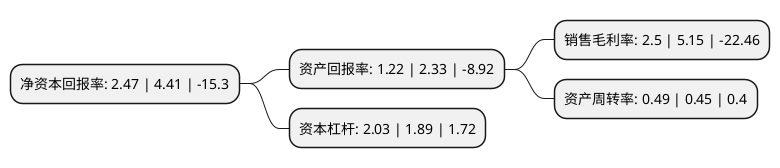

> 本页面由自动化程序生成于 2022年5月20日 01:34
> 内容可能存在错误，如有bug请提交issue至：https://github.com/Eroleice/doc-pi/issues
{.is-warning}

# 上市公司基本情况

## 基本资料

浙江东尼电子股份有限公司（以下简称“东尼电子”）成立于2008年01月25日，湖州市。于2017年07月12日在上交所主板上市。

东尼电子注册资本23,244.233万元，主营业务:公司专注于超微细合金线材及其他金属基复合材料的应用研发，生产与销售。主要产品:公司的主要产品为超微细导体，复膜线等电子线材，并在传统切割钢线的基础上实现了超细金刚石切割线的应用研发，产品类型不断丰富并逐步向高附加值的新兴领域扩展。公司超微细导体，复膜线广泛应用于消费电子，新能源汽车，医疗器械以及智能机器人等领域;金刚石切割线则主要应用于硅和蓝宝石等硬脆材料切割领域。以下是详细信息：

- 公司名称: 浙江东尼电子股份有限公司
- 股票代码: 603595.SH
- 所在地: 浙江 - 湖州市
- 成立日期: 2008年01月25日
- 注册资本: 23,244.233万元
- 法定代表人: 沈晓宇
- 主营业务: 主营业务:公司专注于超微细合金线材及其他金属基复合材料的应用研发，生产与销售主要产品:公司的主要产品为超微细导体，复膜线等电子线材，并在传统切割钢线的基础上实现了超细金刚石切割线的应用研发，产品类型不断丰富并逐步向高附加值的新兴领域扩展公司超微细导体，复膜线广泛应用于消费电子，新能源汽车，医疗器械以及智能机器人等领域;金刚石切割线则主要应用于硅和蓝宝石等硬脆材料切割领域
- 公司官网: www.tonytech.com
- 公司介绍: 公司专注于超微细合金线材及其他金属基复合材料的应用研发、生产与销售。公司的主要产品为超微细导体、复膜线等电子线材，并在传统切割钢线的基础上实现了超细金刚石切割线的应用研发，产品类型不断丰富并逐步向高附加值的新兴领域扩展。公司超微细导体、复膜线目前主要应用于消费类电子产品，并逐步向新能源汽车、医疗器械、智能机器人等领域拓展；金刚石切割线则主要应用于硅和蓝宝石等硬脆材料切割领域。公司在快速发展过程中，一方面借助对各类金属基材的深刻理解，不断开发新产品并将产品线延伸至不同的应用领域；另一方面，公司基于现有客户需求，不断为其配套研发、升级产品类型，使其满足客户对产品性能及应用方面不断升级的需求，提升客户黏性，与客户共同发展。

## 股东及高管情况

上市公司第一大股东为沈新芳，持股74,970,000股，占比32.25%，为上市公司实际控制人。

截至2022年03月31日，上市公司的前十大股东中，共有6名自然人股东，3名机构股东，1个产品账户，其中5%以上大股东共有3名。上市公司前十大股东明细如下：

> 截至2022年03月31日，上市公司前十大股东信息如下：

| 股东名称 | 持股数量（股） | 持股比例 |
| --- | --- | --- |
| 沈新芳 | 74,970,000 | 32.25% |
| 沈晓宇 | 38,704,602 | 16.65% |
| 张英 | 12,901,533 | 5.55% |
| 何雪萍 | 7,100,418 | 3.05% |
| 湖州新型城市投资发展集团有限公司 | 6,637,168 | 2.86% |
| 立讯精密工业股份有限公司 | 5,693,984 | 2.45% |
| 柳正丽 | 4,258,000 | 1.83% |
| 湖州吴兴卓融管理咨询有限公司 | 3,750,000 | 1.61% |
| 杜四明 | 3,193,504 | 1.37% |
| 中国工商银行股份有限公司-华夏磐利一年定期开放混合型证券投资基金 | 2,500,000 | 1.08% |

## 利润表分析

上市公司2021年总收入为13.39亿元，净利润为0.33亿元，实现盈利。

## 杜邦分析

> 数据列示周期：2021年 | 2020年 | 2019年
{.is-info}

上市公司的净资产收益率在近一年有所下降，下降幅度为-43.99%，其变化情况分解如下：
- 上市公司的销售毛利率在近一年下降了-51.46%，可能是生产效率的下降、商品原材料价格上涨或商品价格的下跌所致。
- 上市公司的资产周转率在近一年上升了8.89%，可能是源自于更快的销售回款或库存管理效果提升。
- 上市公司的财务杠杆比率在近一年上升了7.41%，可能是增加负债扩大生产规模。

