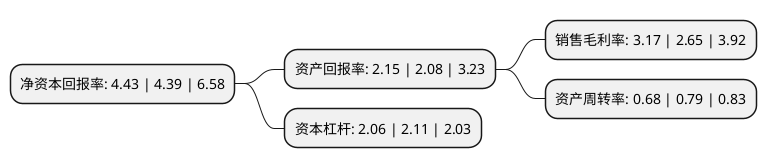

> 本页面由自动化程序生成于 2022年5月20日 01:34
> 内容可能存在错误，如有bug请提交issue至：https://github.com/Eroleice/doc-pi/issues
{.is-warning}

# 上市公司基本情况

## 基本资料

江苏利通电子股份有限公司（以下简称“利通电子”）成立于1980年11月25日，无锡市。于2018年12月24日在上交所主板上市。

利通电子注册资本13,000万元，主营业务为应用于液晶电视等液晶显示领域的精密金属结构件，电子元器件的设计，生产，销售，主要产品包括液晶电视精密金属冲压结构件，底座，模具及电子元器件等。以下是详细信息：

- 公司名称: 江苏利通电子股份有限公司
- 股票代码: 603629.SH
- 所在地: 江苏 - 无锡市
- 成立日期: 1980年11月25日
- 注册资本: 13,000万元
- 法定代表人: 邵树伟
- 主营业务: 主营业务为应用于液晶电视等液晶显示领域的精密金属结构件，电子元器件的设计，生产，销售，主要产品包括液晶电视精密金属冲压结构件，底座，模具及电子元器件等
- 公司官网: www.lettall.com
- 公司介绍: 公司主营业务为应用于液晶电视和液晶显示器等平板显示领域的精密金属结构件、电子元器件的设计、生产、销售，主要产品包括液晶电视精密金属冲压结构件、精密金属面框、底座、模具及电子元器件等。公司作为液晶电视精密金属结构件生产的骨干企业，是国内知名液晶电视品牌企业如海信、TCL、康佳、夏普、高创、纬创、黑田等的重要供应商，此外，公司还与宝山钢铁股份有限公司结成稳定的战略合作关系。公司是江苏省高新技术企业，拥有江苏省科学技术厅、江苏省财政厅联合认定的工程技术研究中心，江苏省经济和信息化委员会认定的“江苏省认定企业技术中心”两个省级研究技术平台。

## 股东及高管情况

上市公司第一大股东为邵树伟，持股48,414,000股，占比37.24%，为上市公司实际控制人。

截至2022年03月31日，上市公司的前十大股东中，共有5名自然人股东，4名机构股东，1个产品账户，其中5%以上大股东共有3名。上市公司前十大股东明细如下：

> 截至2022年03月31日，上市公司前十大股东信息如下：

| 股东名称 | 持股数量（股） | 持股比例 |
| --- | --- | --- |
| 邵树伟 | 48,414,000 | 37.24% |
| 邵秋萍 | 12,000,000 | 9.23% |
| 北京泰德圣投资有限公司-泰德圣投资泰来1号私募证券投资基金 | 8,087,810 | 6.22% |
| 邵培生 | 4,586,000 | 3.53% |
| 邬勤波 | 3,466,204 | 2.67% |
| 张德峰 | 3,037,000 | 2.34% |
| 无锡市国发资本运营有限公司 | 2,888,503 | 2.22% |
| 共青城卓瑜恒信投资合伙企业(有限合伙) | 2,842,296 | 2.19% |
| 宜兴利通智巧投资企业(有限合伙) | 2,790,000 | 2.15% |
| 共青城银潞投资合伙企业(有限合伙) | 1,444,251 | 1.11% |

## 利润表分析

上市公司2021年总收入为18.04亿元，净利润为0.57亿元，实现盈利。

## 杜邦分析

> 数据列示周期：2021年 | 2020年 | 2019年
{.is-info}

上市公司的净资产收益率在近一年有所上升，上升幅度为0.91%，其变化情况分解如下：
- 上市公司的销售毛利率在近一年上升了19.62%，可能是生产效率的提升、商品原材料价格下跌或商品价格的上涨所致。
- 上市公司的资产周转率在近一年下降了-13.92%，可能是源自于更慢的销售回款或库存管理效果下降。
- 上市公司的财务杠杆比率在近一年下降了-2.37%，可能是减少负债降低财务费用。

