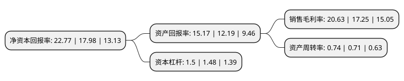

> 本页面由自动化程序生成于 2022年5月20日 01:35
> 内容可能存在错误，如有bug请提交issue至：https://github.com/Eroleice/doc-pi/issues
{.is-warning}

# 上市公司基本情况

## 基本资料

福建火炬电子科技股份有限公司（以下简称“火炬电子”）成立于2007年12月20日，泉州市。于2015年01月26日在上交所主板上市。

火炬电子注册资本45,985.777万元，公司主要从事电容器及相关产品的研发，生产，销售，检测及服务业务，其主营业务包括自产业务和代理业务。主要产品包括片式多层陶瓷电容器(业界常指MLCC)，引线式多层陶瓷电容器以及多芯组陶瓷电容器。以下是详细信息：

- 公司名称: 福建火炬电子科技股份有限公司
- 股票代码: 603678.SH
- 所在地: 福建 - 泉州市
- 成立日期: 2007年12月20日
- 注册资本: 45,985.777万元
- 法定代表人: 蔡明通
- 主营业务: 公司主要从事电容器及相关产品的研发，生产，销售，检测及服务业务，其主营业务包括自产业务和代理业务主要产品包括片式多层陶瓷电容器(业界常指MLCC)，引线式多层陶瓷电容器以及多芯组陶瓷电容器
- 公司官网: www.torch.cn
- 公司介绍: 公司是中国主要专业从事陶瓷电容器研发、生产、销售和技术支持的企业。公司拥有多项具有知识产权的核心技术，是国家高新技术企业，福建省“十一五”规划电子元器件发展支柱企业，福建省第二批创新型试点企业。目前已通过ISO9001质量管理体系认证、GJB9001军工产品质量体系认证、ISO14001环境管理质量体系认证以及OHSAS18001职业健康安全管理体系认证。公司生产的“火炬牌”陶瓷电容器产品主要包括多层片式陶瓷电容器和引线式电容器，以其高可靠性、高质量等级、高技术含量附加值先后获得国家重点新产品、福建名牌产品、福建自主创新产品称号，在航空航天、通讯、电力、汽车等高端领域广泛应用，并与国内外知名高科技企业建立了良好的战略合作伙伴关系和共赢模式。公司是国内首家将“湿法淋幕工艺”产业化应用，国内首家能生产宇航级电容器的企业，目前已建立省级企业技术中心和市级工程研究中心。公司参与起草修订的几项国家标准已先后获得批准并颁布。

## 股东及高管情况

上市公司第一大股东为蔡明通，持股166,485,440股，占比36.2%，为上市公司实际控制人。

截至2022年03月31日，上市公司的前十大股东中，共有2名自然人股东，1名机构股东，7个产品账户，其中5%以上大股东共有2名。上市公司前十大股东明细如下：

> 截至2022年03月31日，上市公司前十大股东信息如下：

| 股东名称 | 持股数量（股） | 持股比例 |
| --- | --- | --- |
| 蔡明通 | 166,485,440 | 36.2% |
| 蔡劲军 | 24,983,455 | 5.43% |
| 中国工商银行股份有限公司-中欧价值智选回报混合型证券投资基金 | 22,497,739 | 4.89% |
| 兴业银行股份有限公司-博时汇兴回报一年持有期灵活配置混合型证券投资基金 | 9,127,427 | 1.98% |
| 平安银行股份有限公司-中欧新兴价值一年持有期混合型证券投资基金 | 6,630,192 | 1.44% |
| 全国社保基金四一三组合 | 3,945,855 | 0.86% |
| 中国农业银行股份有限公司-交银施罗德先进制造混合型证券投资基金 | 3,805,207 | 0.83% |
| 信泰人寿保险股份有限公司-分红产品 | 3,704,280 | 0.81% |
| 招商银行股份有限公司-交银施罗德均衡成长一年持有期混合型证券投资基金 | 2,824,171 | 0.61% |
| 泰康人寿保险有限责任公司-投连-行业配置 | 2,733,621 | 0.59% |

## 利润表分析

上市公司2021年总收入为47.34亿元，净利润为9.76亿元，实现盈利。

## 杜邦分析

> 数据列示周期：2021年 | 2020年 | 2019年
{.is-info}

上市公司的净资产收益率在近一年有所上升，上升幅度为26.64%，其变化情况分解如下：
- 上市公司的销售毛利率在近一年上升了19.59%，可能是生产效率的提升、商品原材料价格下跌或商品价格的上涨所致。
- 上市公司的资产周转率在近一年上升了4.23%，可能是源自于更快的销售回款或库存管理效果提升。
- 上市公司的财务杠杆比率在近一年上升了1.35%，可能是增加负债扩大生产规模。

