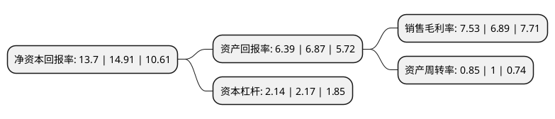

> 本页面由自动化程序生成于 2022年5月20日 01:35
> 内容可能存在错误，如有bug请提交issue至：https://github.com/Eroleice/doc-pi/issues
{.is-warning}

# 上市公司基本情况

## 基本资料

苏州春秋电子科技股份有限公司（以下简称“春秋电子”）成立于2011年08月23日，苏州市。于2017年12月12日在上交所主板上市。

春秋电子注册资本43,906.882万元，消费电子产品结构件模组及相关精密模具的研发，设计，生产和销售。以下是详细信息：

- 公司名称: 苏州春秋电子科技股份有限公司
- 股票代码: 603890.SH
- 所在地: 江苏 - 苏州市
- 成立日期: 2011年08月23日
- 注册资本: 43,906.882万元
- 法定代表人: 薛革文
- 主营业务: 消费电子产品结构件模组及相关精密模具的研发，设计，生产和销售
- 公司官网: www.szchunqiu.com
- 公司介绍: 公司致力于为客户提供消费电子产品结构件模组及相关精密模具从设计、模具制造到结构件模组生产的一站式服务。公司的主营业务为消费电子产品结构件模组及相关精密模具的研发、设计、生产和销售；公司的主要产品为笔记本电脑及其他电子消费品的结构件模组及相关精密模具。公司是笔记本电脑结构件供应商中较少的拥有自主模具设计生产能力的生产企业。春秋电子依托模具制备经验，其模具开发精度可达0.01-0.02mm，子公司上海崴泓是中国模具工业协会第七届理事会理事单位，同时被授予“中国大型注塑模具重点骨干企业”称号，并被国内领先的家电及汽车厂商授予产品品质认证。

## 股东及高管情况

上市公司第一大股东为薛革文，持股144,380,880股，占比32.88%，为上市公司实际控制人。

截至2022年03月31日，上市公司的前十大股东中，共有5名自然人股东，2名机构股东，3个产品账户，其中5%以上大股东共有1名。上市公司前十大股东明细如下：

> 截至2022年03月31日，上市公司前十大股东信息如下：

| 股东名称 | 持股数量（股） | 持股比例 |
| --- | --- | --- |
| 薛革文 | 144,380,880 | 32.88% |
| 薛赛琴 | 20,854,400 | 4.75% |
| 成都交子东方投资发展合伙企业(有限合伙) | 15,206,610 | 3.46% |
| 共青城卓璞投资合伙企业(有限合伙) | 9,638,554 | 2.2% |
| 孙海士 | 5,004,633 | 1.14% |
| 上海子午投资管理有限公司-子午德桥一号私募证券投资基金 | 4,482,633 | 1.02% |
| 张振杰 | 3,403,986 | 0.78% |
| 上海鑫绰投资管理有限公司-鑫绰鑫融7号私募证券投资基金 | 3,376,700 | 0.77% |
| 上海锐天投资管理有限公司-锐天磐石一号私募证券投资基金 | 3,333,300 | 0.76% |
| 钱元君 | 3,215,230 | 0.73% |

## 杜邦分析

> 数据列示周期：2021年 | 2020年 | 2019年
{.is-info}

上市公司的净资产收益率在近一年有所下降，下降幅度为-8.12%，其变化情况分解如下：
- 上市公司的销售毛利率在近一年上升了9.29%，可能是生产效率的提升、商品原材料价格下跌或商品价格的上涨所致。
- 上市公司的资产周转率在近一年下降了-15%，可能是源自于更慢的销售回款或库存管理效果下降。
- 上市公司的财务杠杆比率在近一年下降了-1.38%，可能是减少负债降低财务费用。

