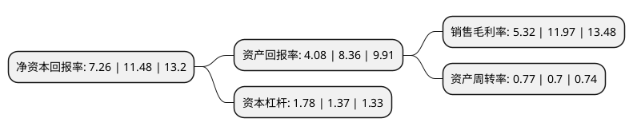

> 本页面由自动化程序生成于 2022年5月20日 01:36
> 内容可能存在错误，如有bug请提交issue至：https://github.com/Eroleice/doc-pi/issues
{.is-warning}

# 上市公司基本情况

## 基本资料

广东世运电路科技股份有限公司（以下简称“世运电路”）成立于2005年05月11日，江门市。于2017年04月26日在上交所主板上市。

世运电路注册资本53,224.75万元，公司主营业务为各类印制电路板(PCB)的研发，生产与销售。目前公司主导产品包括单面板，双面板，多层板，HDI板等，广泛应用于计算机及周边设备，消费电子，汽车电子，工业控制，医疗设备等领域。以下是详细信息：

- 公司名称: 广东世运电路科技股份有限公司
- 股票代码: 603920.SH
- 所在地: 广东 - 江门市
- 成立日期: 2005年05月11日
- 注册资本: 53,224.75万元
- 法定代表人: 佘英杰
- 主营业务: 公司主营业务为各类印制电路板(PCB)的研发，生产与销售目前公司主导产品包括单面板，双面板，多层板，HDI板等，广泛应用于计算机及周边设备，消费电子，汽车电子，工业控制，医疗设备等领域
- 公司官网: www.olympicpcb.cn
- 公司介绍: 公司主营业务为各类印制电路板(PCB)的研发、生产与销售。目前公司主导产品包括单面板、双面板、多层板、HDI板等，广泛应用于计算机及周边设备、消费电子、汽车电子、工业控制、医疗设备等领域。

## 股东及高管情况

上市公司第一大股东为新豪國際集團有限公司，持股331,503,354股，占比62.28%，为上市公司实际控制人。

截至2022年03月31日，上市公司的前十大股东中，共有3名机构股东，6个产品账户，1个海外主体，其中5%以上大股东共有1名。上市公司前十大股东明细如下：

> 截至2022年03月31日，上市公司前十大股东信息如下：

| 股东名称 | 持股数量（股） | 持股比例 |
| --- | --- | --- |
| 新豪國際集團有限公司 | 331,503,354 | 62.28% |
| 深圳市沃泽科技开发有限公司 | 11,912,123 | 2.24% |
| 鹤山市联智投资有限公司 | 11,205,020 | 2.11% |
| 交通银行股份有限公司-汇丰晋信低碳先锋股票型证券投资基金 | 10,147,597 | 1.91% |
| 香港中央结算有限公司(陆股通) | 7,431,165 | 1.4% |
| 中国工商银行股份有限公司-富国创新科技混合型证券投资基金 | 6,632,941 | 1.25% |
| 中国农业银行股份有限公司-富国互联科技股票型证券投资基金 | 6,056,866 | 1.14% |
| 中国工商银行股份有限公司-富国成长策略混合型证券投资基金 | 4,831,262 | 0.91% |
| 全国社保基金一一四组合 | 4,417,370 | 0.83% |
| 交通银行-汇丰晋信动态策略混合型证券投资基金 | 3,851,775 | 0.72% |

## 杜邦分析

> 数据列示周期：2021年 | 2020年 | 2019年
{.is-info}

上市公司的净资产收益率在近一年有所下降，下降幅度为-36.76%，其变化情况分解如下：
- 上市公司的销售毛利率在近一年下降了-55.56%，可能是生产效率的下降、商品原材料价格上涨或商品价格的下跌所致。
- 上市公司的资产周转率在近一年上升了10%，可能是源自于更快的销售回款或库存管理效果提升。
- 上市公司的财务杠杆比率在近一年上升了29.93%，可能是增加负债扩大生产规模。

