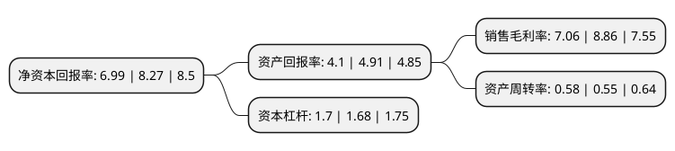

> 本页面由自动化程序生成于 2022年5月20日 01:36
> 内容可能存在错误，如有bug请提交issue至：https://github.com/Eroleice/doc-pi/issues
{.is-warning}

# 上市公司基本情况

## 基本资料

博敏电子股份有限公司（以下简称“博敏电子”）成立于2005年03月25日，梅州市。于2015年12月09日在上交所主板上市。

博敏电子注册资本51,101.21万元，主营业务:印制电路板的研发，生产和销售，主要产品为多层(含HDI)和单/双面印制电路板。以下是详细信息：

- 公司名称: 博敏电子股份有限公司
- 股票代码: 603936.SH
- 所在地: 广东 - 梅州市
- 成立日期: 2005年03月25日
- 注册资本: 51,101.21万元
- 法定代表人: 徐缓
- 主营业务: 主营业务:印制电路板的研发，生产和销售，主要产品为多层(含HDI)和单/双面印制电路板
- 公司官网: www.bominelec.com
- 公司介绍: 公司以高端印制电路板生产为主，集设计、加工、销售、外贸为一体，拥有分布在美国、英国、德国、巴西、中国香港等国家和地区多处经销商，是中国目前最具实力的民营电路板制造商之一。特色产品包括：HDI(高密度互连)板、普通双面、多层、微波高频、厚铜、金属基/芯及软板、软硬结合板等，产品广泛应用于通讯设备、医疗器械、军工高科技产品、检测系统、航空航天、家用电子产品等高科技领域。博敏电子自成立以来，坚持印制电路板生产和销售，不断提升公司研发和经营管理的综合实力。公司创建了一支以高级工程师为核心，由技师、工程师、技术员和中高层管理人员组成的经验丰富、技术扎实的专业创新研发团队。在企业规模不断扩大的基础上，公司紧紧围绕“成为最值得信赖的电子电路供应商”的企业愿景打造全球知名品牌。

## 股东及高管情况

上市公司第一大股东为徐缓，持股70,661,419股，占比13.83%，**疑似为**上市公司实际控制人。

截至2022年03月31日，上市公司的前十大股东中，共有6名自然人股东，2名机构股东，2个产品账户，其中5%以上大股东共有2名。上市公司前十大股东明细如下：

> 未能通过持股比例判定出上市公司实际控制人（持股30%以上）
> 可能存在通过间接持股、联合持股、协议控制等方式拥有实际控制权的主体，具体请参考上市公司定期公告！
{.is-warning}

> 截至2022年03月31日，上市公司前十大股东信息如下：

| 股东名称 | 持股数量（股） | 持股比例 |
| --- | --- | --- |
| 徐缓 | 70,661,419 | 13.83% |
| 谢小梅 | 39,035,380 | 7.64% |
| 刘燕平 | 22,613,660 | 4.43% |
| 谢建中 | 17,002,860 | 3.33% |
| 刘长羽 | 14,966,600 | 2.93% |
| 中信证券股份有限公司 | 10,607,413 | 2.08% |
| 中国工商银行股份有限公司企业年金计划-中国建设银行股份有限公司 | 5,780,000 | 1.13% |
| 中信建投证券股份有限公司 | 4,563,621 | 0.89% |
| 上海方圆达创投资合伙企业(有限合伙)-方圆-东方32号私募投资基金 | 4,550,000 | 0.89% |
| 朱明华 | 3,510,000 | 0.69% |

## 利润表分析

上市公司2021年总收入为35.2亿元，净利润为2.48亿元，实现盈利。

## 杜邦分析

> 数据列示周期：2021年 | 2020年 | 2019年
{.is-info}

上市公司的净资产收益率在近一年有所下降，下降幅度为-15.48%，其变化情况分解如下：
- 上市公司的销售毛利率在近一年下降了-20.32%，可能是生产效率的下降、商品原材料价格上涨或商品价格的下跌所致。
- 上市公司的资产周转率在近一年上升了5.45%，可能是源自于更快的销售回款或库存管理效果提升。
- 上市公司的财务杠杆比率在近一年上升了1.19%，可能是增加负债扩大生产规模。

