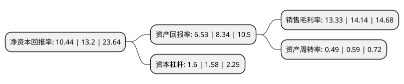

> 本页面由自动化程序生成于 2022年5月20日 01:36
> 内容可能存在错误，如有bug请提交issue至：https://github.com/Eroleice/doc-pi/issues
{.is-warning}

# 上市公司基本情况

## 基本资料

常州澳弘电子股份有限公司（以下简称“澳弘电子”）成立于2005年06月22日，常州市。于2020年10月21日在上交所主板上市。

澳弘电子注册资本14,292.395万元，主要从事印制电路板研发，生产和销售。公司生产的印制电路板包括单面板，双面板，多层板等，主要应用于家电，电源，能源，工业控制，通信和汽车电子等领域。以下是详细信息：

- 公司名称: 常州澳弘电子股份有限公司
- 股票代码: 605058.SH
- 所在地: 江苏 - 常州市
- 成立日期: 2005年06月22日
- 注册资本: 14,292.395万元
- 法定代表人: 陈定红
- 主营业务: 主要从事印制电路板研发，生产和销售公司生产的印制电路板包括单面板，双面板，多层板等，主要应用于家电，电源，能源，工业控制，通信和汽车电子等领域
- 公司官网: www.czaohong.com
- 公司介绍: 公司是一家专业从事印制电路板(Printed Circuit Board，简称PCB)研发、生产和销售的高新技术企业。公司生产的PCB产品包括单面板、双面板和多层板等，主要应用于家电、电源、能源、工业控制、通信和汽车电子等领域。公司凭借安全可靠的产品和优质专业的服务通过了国内外多家大型知名企业的严格供应商考核，并成为多家大型知名企业的“优秀供应商”或“战略供应商”。公司在PCB制造领域拥有超过十年的行业经验，在发展过程中储备了一批优秀的行业人才，主要管理人员和技术人员行业经验丰富。公司的主要客户包括海尔、海信、美的、奥克斯、台湾光宝、LG(乐金)、Whirlpool(惠而浦)、EATON(伊顿)等国内外大型知名企业及其下属企业，并与阳光电源、台湾台达、BSH(博西华)、EMERSON(艾默生)、Melecs(美乐科斯)、NPE S.r.l、Diehl(代傲)、Katek、MIL-Solar等知名企业保持良好的合作关系，已成为国内外家电行业用PCB领域的一流供应商。公司的工程中心被江苏省科学技术厅评定为“江苏省高密度多层印制线路板工程技术研究中心”，技术中心被江苏省经济贸易委员会评定为“江苏省企业技术中心”。

## 股东及高管情况

上市公司第一大股东为杨九红，持股63,000,000股，占比44.08%，为上市公司实际控制人。

截至2022年03月31日，上市公司的前十大股东中，共有3名自然人股东，7名机构股东，其中5%以上大股东共有2名。上市公司前十大股东明细如下：

> 截至2022年03月31日，上市公司前十大股东信息如下：

| 股东名称 | 持股数量（股） | 持股比例 |
| --- | --- | --- |
| 杨九红 | 63,000,000 | 44.08% |
| 陈定红 | 27,000,000 | 18.89% |
| 常州途阳投资合伙企业(有限合伙) | 5,000,000 | 3.5% |
| 常州途朗投资合伙企业(有限合伙) | 5,000,000 | 3.5% |
| 上海斐君投资管理中心(有限合伙)-宁波斐君元浩股权投资合伙企业(有限合伙) | 2,157,885 | 1.51% |
| 上海斐君投资管理中心(有限合伙)-常州斐君股权投资合伙企业(有限合伙) | 1,438,590 | 1.01% |
| 常州睿泰捌号创业投资中心(有限合伙) | 1,438,590 | 1.01% |
| 常州和诺资本管理有限公司-常州嘉和达创业投资中心(有限合伙) | 1,438,590 | 1.01% |
| 陈小平 | 700,000 | 0.49% |
| 常州中鼎天盛创业投资合伙企业(有限合伙) | 637,795 | 0.45% |

## 利润表分析

上市公司2021年总收入为10.7亿元，净利润为1.42亿元，实现盈利。

## 杜邦分析

> 数据列示周期：2021年 | 2020年 | 2019年
{.is-info}

上市公司的净资产收益率在近一年有所下降，下降幅度为-20.91%，其变化情况分解如下：
- 上市公司的销售毛利率在近一年下降了-5.73%，可能是生产效率的下降、商品原材料价格上涨或商品价格的下跌所致。
- 上市公司的资产周转率在近一年下降了-16.95%，可能是源自于更慢的销售回款或库存管理效果下降。
- 上市公司的财务杠杆比率在近一年上升了1.27%，可能是增加负债扩大生产规模。

