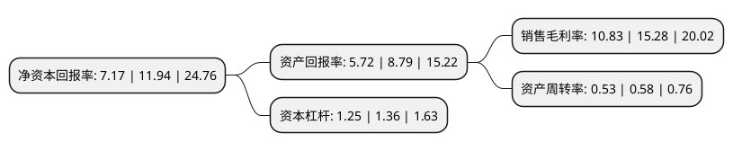

> 本页面由自动化程序生成于 2022年5月20日 01:37
> 内容可能存在错误，如有bug请提交issue至：https://github.com/Eroleice/doc-pi/issues
{.is-warning}

# 上市公司基本情况

## 基本资料

江苏协和电子股份有限公司（以下简称“协和电子”）成立于2000年02月17日，常州市。于2020年12月03日在上交所主板上市。

协和电子注册资本8,800万元，主要从事刚性，挠性印制电路板的研发，生产，销售以及印制电路板的表面贴装业务(SMT)，产品主要应用于汽车电子，高频通讯等中高端领域。以下是详细信息：

- 公司名称: 江苏协和电子股份有限公司
- 股票代码: 605258.SH
- 所在地: 江苏 - 常州市
- 成立日期: 2000年02月17日
- 注册资本: 8,800万元
- 法定代表人: 张南国
- 主营业务: 主要从事刚性，挠性印制电路板的研发，生产，销售以及印制电路板的表面贴装业务(SMT)，产品主要应用于汽车电子，高频通讯等中高端领域
- 公司官网: www.xiehepcb.com
- 公司介绍: 公司是集研发、生产刚性、挠性和刚挠结合的单、双面及多层印制电路板的专业制造公司。主要从事刚性、挠性印制电路板的研发、生产、销售以及印制电路板的表面贴装业务(SMT)，产品主要应用于汽车电子、高频通讯等中高端领域。公司已与东风科技、星宇股份、康普通讯、伟时电子、罗森伯格、东科克诺尔、晨阑光电、安弗施、艾迪康等国内外知名汽车、通讯企业建立了长期稳定的合作关系。公司专注于汽车电子、高频通讯等中高端领域，在高频通讯领域，公司产品主要应用于基站天线、基站无源功分器、基站滤波器、基站合路器等移动通信领域，高频通讯板生产对生产技术、工艺控制、物料选择、技术参数等要求较高，进入技术壁垒较高，公司是国内为数不多的专业生产高频通讯板厂家之一，具有较强竞争优势。公司产品具有“中小批量、多品种、短交期”的特点，公司订单品种数较多，平均订单面积较小、交期短，生产管理复杂性和难度较高。目前，公司已积累了一批优质客户，包括东风科技、星宇股份、东科克诺尔、伟时电子、晨阑光电等多家国内外知名汽车电子企业，以及康普通讯、罗森伯格、安弗施、艾迪康等国际知名通讯设备商。

## 股东及高管情况

上市公司第一大股东为张南国，持股15,750,000股，占比17.9%，**疑似为**上市公司实际控制人。

截至2022年03月31日，上市公司的前十大股东中，共有6名自然人股东，3名机构股东，1个产品账户，其中5%以上大股东共有6名。上市公司前十大股东明细如下：

> 未能通过持股比例判定出上市公司实际控制人（持股30%以上）
> 可能存在通过间接持股、联合持股、协议控制等方式拥有实际控制权的主体，具体请参考上市公司定期公告！
{.is-warning}

> 截至2022年03月31日，上市公司前十大股东信息如下：

| 股东名称 | 持股数量（股） | 持股比例 |
| --- | --- | --- |
| 张南国 | 15,750,000 | 17.9% |
| 张敏金 | 11,160,000 | 12.68% |
| 张建荣 | 9,850,000 | 11.19% |
| 张南星 | 9,850,000 | 11.19% |
| 王桥彬 | 5,270,000 | 5.99% |
| 曹良良 | 4,520,000 | 5.14% |
| 常州清源创新投资管理合伙企业(有限合伙)-常州清源创新创业投资合伙企业(有限合伙) | 2,000,000 | 2.27% |
| 常州东禾投资管理中心(有限合伙) | 1,800,000 | 2.05% |
| 常州协诚投资管理中心(有限合伙) | 1,800,000 | 2.05% |
| 渤海人寿保险股份有限公司-传统型保险产品2 | 715,600 | 0.81% |

## 利润表分析

上市公司2021年总收入为7.34亿元，净利润为0.79亿元，实现盈利。

## 杜邦分析

> 数据列示周期：2021年 | 2020年 | 2019年
{.is-info}

上市公司的净资产收益率在近一年有所下降，下降幅度为-39.95%，其变化情况分解如下：
- 上市公司的销售毛利率在近一年下降了-29.12%，可能是生产效率的下降、商品原材料价格上涨或商品价格的下跌所致。
- 上市公司的资产周转率在近一年下降了-8.62%，可能是源自于更慢的销售回款或库存管理效果下降。
- 上市公司的财务杠杆比率在近一年下降了-8.09%，可能是减少负债降低财务费用。

