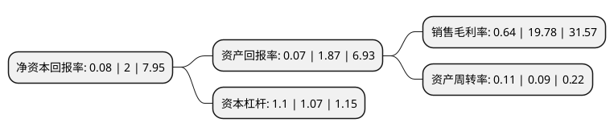

> 本页面由自动化程序生成于 2022年5月20日 01:37
> 内容可能存在错误，如有bug请提交issue至：https://github.com/Eroleice/doc-pi/issues
{.is-warning}

# 上市公司基本情况

## 基本资料

哈尔滨新光光电科技股份有限公司（以下简称“新光光电”）成立于2007年11月30日，哈尔滨市。于2019年07月22日在上交所科创板上市。

新光光电注册资本10,000万元，主营业务:公司依托核心技术，致力于服务国防科技工业先进武器系统研制等领域，专注于提供光学目标与场景仿真，光学制导，光电专用测试和激光对抗等方向的高精尖组件，装置，系统和解决方案，并衍生出多类先进的民用智能光电产品。以下是详细信息：

- 公司名称: 哈尔滨新光光电科技股份有限公司
- 股票代码: 688011.SH
- 所在地: 黑龙江 - 哈尔滨市
- 成立日期: 2007年11月30日
- 注册资本: 10,000万元
- 法定代表人: 康为民
- 主营业务: 主营业务:公司依托核心技术，致力于服务国防科技工业先进武器系统研制等领域，专注于提供光学目标与场景仿真，光学制导，光电专用测试和激光对抗等方向的高精尖组件，装置，系统和解决方案，并衍生出多类先进的民用智能光电产品
- 公司官网: www.xggdkj.com
- 公司介绍: 哈尔滨新光光电科技股份有限公司成立于2007年11月。公司管理总部位于哈尔滨，在北京、深圳、西安设置了分子公司和研发机构，初步形成覆盖全国重点区域的科研、业务架构，涵盖军工产品及民品的科研、生产服务能力的产业布局体系。公司是一家将像方扫描成像制导技术、多光学波段合成技术等先进光电技术应用于光学制导类武器研制的企业，致力于服务国防科技工业先进武器系统研制等领域，专注于为武器系统研制提供光学制导、光学目标与场景仿真、光电专用测试、和激光对抗等方向的高精尖组件、装置、系统和解决方案。多年来，公司实际控制人康为民先生带领技术团队，继承哈工大“规格严格，功夫到家”的精神，在其父亲、中国著名光学专家康松高教授提出的光学相差理论研究成果基础上，在国内首次提出基于像方扫描原理的光学成像制导新技术等多项核心技术，并实现了工程化应用。此外，公司技术团队还在多数字微镜阵列并联合束技术、短积分时间内红外动态景象生成技术、薄膜式波束合成技术和激光空间合束技术等关键技术方面完成重大突破，并获得相应知识产权，在多个细分产品领域填补了国内空白。公司自成立以来，始终秉承“为客户提供最具竞争力的技术、产品和服务，持续为客户创造价值”的企业使命，不忘“实业报国，科技强军”的初心，未来将在原有技术方向上不断创新，实现“成为中国光电行业最具创新能力的企业，成就百年新光”的企业愿景。

## 股东及高管情况

上市公司第一大股东为康为民，持股50,474,000股，占比50.47%，为上市公司实际控制人。

截至2022年04月15日，上市公司的前十大股东中，共有4名自然人股东，3名机构股东，3个产品账户，其中5%以上大股东共有2名。上市公司前十大股东明细如下：

> 截至2022年04月15日，上市公司前十大股东信息如下：

| 股东名称 | 持股数量（股） | 持股比例 |
| --- | --- | --- |
| 康为民 | 50,474,000 | 50.47% |
| 康立新 | 5,677,093 | 5.68% |
| 哈尔滨科力创业投资管理有限公司-黑龙江科力北方投资企业(有限合伙) | 3,525,000 | 3.53% |
| 王桂波 | 2,339,533 | 2.34% |
| 林磊 | 2,017,364 | 2.02% |
| 曲水县哈新企业管理合伙企业(有限合伙) | 995,085 | 1% |
| 上海高毅资产管理合伙企业(有限合伙)-高毅晓峰2号致信基金 | 969,950 | 0.97% |
| 中国对外经济贸易信托有限公司-外贸信托-高毅晓峰鸿远集合资金信托计划 | 969,815 | 0.97% |
| 福建大田县盈新龙飞商贸合伙企业(有限合伙) | 910,789 | 0.91% |
| 黑龙江龙财盘实高新技术创业股权投资基金管理有限公司-黑龙江龙财盘实高新技术创业股权投资基金企业(有限合伙) | 641,514 | 0.64% |

## 利润表分析

上市公司2021年总收入为1.43亿元，净利润为0亿元，实现盈利。

## 杜邦分析

> 数据列示周期：2021年 | 2020年 | 2019年
{.is-info}

上市公司的净资产收益率在近一年有所下降，下降幅度为-96%，其变化情况分解如下：
- 上市公司的销售毛利率在近一年下降了-96.76%，可能是生产效率的下降、商品原材料价格上涨或商品价格的下跌所致。
- 上市公司的资产周转率在近一年上升了22.22%，可能是源自于更快的销售回款或库存管理效果提升。
- 上市公司的财务杠杆比率在近一年上升了2.8%，可能是增加负债扩大生产规模。

