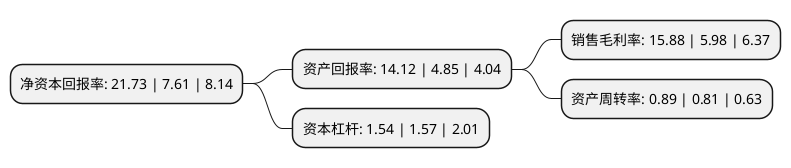

> 本页面由自动化程序生成于 2022年5月20日 01:37
> 内容可能存在错误，如有bug请提交issue至：https://github.com/Eroleice/doc-pi/issues
{.is-warning}

# 上市公司基本情况

## 基本资料

昆山龙腾光电股份有限公司（以下简称“龙腾光电”）成立于2005年07月12日，苏州市。于2020年08月17日在上交所科创板上市。

龙腾光电注册资本333,333.34万元，主要从事薄膜晶体管液晶显示器(TFT-LCD)的研发，生产与销售，公司产品主要应用于笔记本电脑，手机，车载和工控显示系统等显示终端产品。以下是详细信息：

- 公司名称: 昆山龙腾光电股份有限公司
- 股票代码: 688055.SH
- 所在地: 江苏 - 苏州市
- 成立日期: 2005年07月12日
- 注册资本: 333,333.34万元
- 法定代表人: 陶园
- 主营业务: 主要从事薄膜晶体管液晶显示器(TFT-LCD)的研发，生产与销售，公司产品主要应用于笔记本电脑，手机，车载和工控显示系统等显示终端产品
- 公司官网: www.ivo.com.cn
- 公司介绍: 公司是国内知名的液晶显示面板制造商，是国内第一批投建TFT-LCD生产线的企业之一，主要从事薄膜晶体管液晶显示器(TFT-LCD)的研发、生产与销售，公司产品主要应用于笔记本电脑、手机、车载和工控显示系统等显示终端产品，公司建立了国家企业技术中心、国家博士后科研工作站、江苏省(龙腾)平板显示技术研究院、江苏省薄膜晶体管液晶显示器工程技术研究中心和苏州市先进技术研究院等多个科研技术平台。，公司始终以客户需求为中心，依托覆盖多地的营销网络为客户提供全方位的客制化显示解决方案和快速服务支持，公司已与惠普(HP)、联想(Lenovo)、戴尔(Dell)、松下(Panasonic)、传音(TECNO、itel、Infinix)等知名企业形成了良好的合作关系。

## 股东及高管情况

上市公司第一大股东为昆山国创投资集团有限公司，持股1,530,000,000股，占比45.9%，为上市公司实际控制人。

截至2022年03月31日，上市公司的前十大股东中，共有6名自然人股东，2名机构股东，1个产品账户，1个海外主体，其中5%以上大股东共有2名。上市公司前十大股东明细如下：

> 截至2022年03月31日，上市公司前十大股东信息如下：

| 股东名称 | 持股数量（股） | 持股比例 |
| --- | --- | --- |
| 昆山国创投资集团有限公司 | 1,530,000,000 | 45.9% |
| InfoVision Optoelectronics Holdings Limited | 1,470,000,000 | 44.1% |
| 东吴创新资本管理有限责任公司 | 15,522,770 | 0.47% |
| 东吴证券-浦发银行-东吴证券龙腾光电员工参与科创板战略配售集合资产管理计划 | 12,937,636 | 0.39% |
| 胡启民 | 2,730,780 | 0.08% |
| 曹栋 | 2,043,654 | 0.06% |
| 张兰兰 | 1,640,000 | 0.05% |
| 陈全军 | 1,543,579 | 0.05% |
| 许鑫磊 | 1,372,345 | 0.04% |
| 张建宇 | 900,000 | 0.03% |

## 利润表分析

上市公司2021年总收入为57.32亿元，净利润为9.1亿元，实现盈利。

## 杜邦分析

> 数据列示周期：2021年 | 2020年 | 2019年
{.is-info}

上市公司的净资产收益率在近一年有所上升，上升幅度为185.55%，其变化情况分解如下：
- 上市公司的销售毛利率在近一年上升了165.55%，可能是生产效率的提升、商品原材料价格下跌或商品价格的上涨所致。
- 上市公司的资产周转率在近一年上升了9.88%，可能是源自于更快的销售回款或库存管理效果提升。
- 上市公司的财务杠杆比率在近一年下降了-1.91%，可能是减少负债降低财务费用。

