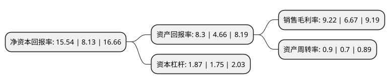

> 本页面由自动化程序生成于 2022年5月20日 01:37
> 内容可能存在错误，如有bug请提交issue至：https://github.com/Eroleice/doc-pi/issues
{.is-warning}

# 上市公司基本情况

## 基本资料

安徽大地熊新材料股份有限公司（以下简称“大地熊”）成立于2003年11月04日，合肥市。于2020年07月22日在上交所科创板上市。

大地熊注册资本8,000万元，高性能烧结钕铁硼永磁材料的研发，生产和销售，公司生产的产品具有磁性能高，服役特性好等特点，主要应用于汽车工业，工业电机和高端消费类电子等重要工业产品领域。以下是详细信息：

- 公司名称: 安徽大地熊新材料股份有限公司
- 股票代码: 688077.SH
- 所在地: 安徽 - 合肥市
- 成立日期: 2003年11月04日
- 注册资本: 8,000万元
- 法定代表人: 熊永飞
- 主营业务: 高性能烧结钕铁硼永磁材料的研发，生产和销售，公司生产的产品具有磁性能高，服役特性好等特点，主要应用于汽车工业，工业电机和高端消费类电子等重要工业产品领域
- 公司官网: www.earth-panda.com
- 公司介绍: 公司致力于高性能烧结钕铁硼永磁材料的研发、生产和销售，目前已发展成为业内知名企业之一，公司自主开发和掌握了涵盖烧结钕铁硼永磁材料磁体制备、机械加工、表面防护和再生制造等领域的多项核心技术，是国内少数几家拥有全过程核心专利技术的企业之一，公司生产的产品具有磁性能高、服役特性好等特点，主要应用于汽车工业、工业电机和高端消费类电子等重要工业产品领域。公司通过了德国标立、德国舍弗勒、德国大陆、德国采埃孚、美国耐世特、美国百得、英国邦迪、日本松下、日本电装、日本电产、日本牧田等全球知名企业严格的资质认证并与其建立了长期稳定的供应链关系，产品已出口至欧美、亚太等逾二十个国家和地区。公司正在建设行业唯一的“稀土永磁材料国家重点实验室”，设立了“国家博士后科研工作站”、“高性能稀土永磁材料开发与应用国家地方联合工程研究中心”和“安徽省稀土永磁材料工程技术研究中心”，通过了“国家企业技术中心”认定。

## 股东及高管情况

上市公司第一大股东为熊永飞，持股30,327,000股，占比37.91%，为上市公司实际控制人。

截至2022年04月27日，上市公司的前十大股东中，共有8名自然人股东，2个产品账户，其中5%以上大股东共有4名。上市公司前十大股东明细如下：

> 截至2022年04月27日，上市公司前十大股东信息如下：

| 股东名称 | 持股数量（股） | 持股比例 |
| --- | --- | --- |
| 熊永飞 | 30,327,000 | 37.91% |
| 曹庆香 | 5,400,000 | 6.75% |
| 曹庆香 | 5,400,000 | 6.75% |
| 安徽高新金通安益股权投资基金(有限合伙) | 4,344,029 | 5.43% |
| 谭新博 | 4,000,000 | 5% |
| 谭新博 | 4,000,000 | 5% |
| 中国银行股份有限公司-国泰江源优势精选灵活配置混合型证券投资基金 | 1,929,017 | 2.41% |
| 陈春生 | 1,800,000 | 2.25% |
| 衣晓飞 | 1,450,000 | 1.81% |
| 陈静武 | 1,080,000 | 1.35% |

## 利润表分析

上市公司2021年总收入为16.54亿元，净利润为1.52亿元，实现盈利。

## 杜邦分析

> 数据列示周期：2021年 | 2020年 | 2019年
{.is-info}

上市公司的净资产收益率在近一年有所上升，上升幅度为91.14%，其变化情况分解如下：
- 上市公司的销售毛利率在近一年上升了38.23%，可能是生产效率的提升、商品原材料价格下跌或商品价格的上涨所致。
- 上市公司的资产周转率在近一年上升了28.57%，可能是源自于更快的销售回款或库存管理效果提升。
- 上市公司的财务杠杆比率在近一年上升了6.86%，可能是增加负债扩大生产规模。

