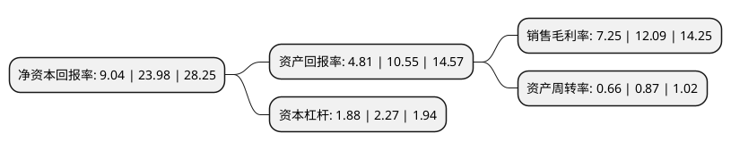

> 本页面由自动化程序生成于 2022年5月20日 01:38
> 内容可能存在错误，如有bug请提交issue至：https://github.com/Eroleice/doc-pi/issues
{.is-warning}

# 上市公司基本情况

## 基本资料

生益电子股份有限公司（以下简称“生益电子”）成立于1985年08月02日，东莞市。于2021年02月25日在上交所科创板上市。

生益电子注册资本83,182.118万元，专注于各类印制电路板的研发，生产与销售业务。以下是详细信息：

- 公司名称: 生益电子股份有限公司
- 股票代码: 688183.SH
- 所在地: 广东 - 东莞市
- 成立日期: 1985年08月02日
- 注册资本: 83,182.118万元
- 法定代表人: 邓春华
- 主营业务: 专注于各类印制电路板的研发，生产与销售业务
- 公司官网: www.sye.com.cn
- 公司介绍: 公司是国家高新技术企业，自成立以来始终专注于各类印制电路板的研发、生产与销售业务。公司主要通过核心技术为客户提供定制化PCB产品来获取合理利润，即采购覆铜板、半固化片、金盐、铜球、铜箔、干膜和油墨等原材料和相关辅料，经过不同的生产流程及工艺设计，利用公司的核心技术生产出符合客户要求的PCB产品，销售给境内外客户。主要产品按照应用领域划分包括通信设备板、网络设备板、计算机/服务器板、消费电子板、工控医疗板和其他板。公司在技术研发领域具有竞争力，拥有国际先进、国内领先的技术实力，同时积累了一批优质的客户资源，公司的主要客户包括华为、中兴康讯、三星电子、IBM、浪潮信息、烽火通信、诺基亚等，该等客户均为通信设备、网络设备、计算机/服务器领域的国内外知名企业，公司与其建立并保持了良好稳定的合作关系，并获得“广东省名牌产品”等荣誉称号。

## 股东及高管情况

上市公司第一大股东为广东生益科技股份有限公司，持股523,482,175股，占比62.93%，为上市公司实际控制人。

截至2022年03月31日，上市公司的前十大股东中，共有10名机构股东，其中5%以上大股东共有2名。上市公司前十大股东明细如下：

> 截至2022年03月31日，上市公司前十大股东信息如下：

| 股东名称 | 持股数量（股） | 持股比例 |
| --- | --- | --- |
| 广东生益科技股份有限公司 | 523,482,175 | 62.93% |
| 东莞市国弘投资有限公司 | 64,628,000 | 7.77% |
| 新余腾益投资管理中心(有限合伙) | 20,502,000 | 2.46% |
| 新余超益投资管理中心(有限合伙) | 19,644,000 | 2.36% |
| 新余联益投资管理中心(有限合伙) | 19,209,000 | 2.31% |
| 新余益信投资管理中心(有限合伙) | 17,992,000 | 2.16% |
| 广东省广新控股集团有限公司 | 13,170,860 | 1.58% |
| 伟华电子有限公司-自有资金(R) | 9,343,310 | 1.12% |
| 东莞科技创新金融集团有限公司 | 8,404,110 | 1.01% |
| 东莞市东证宏德投资有限公司 | 4,588,720 | 0.55% |

## 利润表分析

上市公司2021年总收入为36.47亿元，净利润为2.64亿元，实现盈利。

## 杜邦分析

> 数据列示周期：2021年 | 2020年 | 2019年
{.is-info}

上市公司的净资产收益率在近一年有所下降，下降幅度为-62.3%，其变化情况分解如下：
- 上市公司的销售毛利率在近一年下降了-40.03%，可能是生产效率的下降、商品原材料价格上涨或商品价格的下跌所致。
- 上市公司的资产周转率在近一年下降了-24.14%，可能是源自于更慢的销售回款或库存管理效果下降。
- 上市公司的财务杠杆比率在近一年下降了-17.18%，可能是减少负债降低财务费用。

