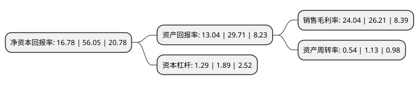

> 本页面由自动化程序生成于 2022年5月20日 01:39
> 内容可能存在错误，如有bug请提交issue至：https://github.com/Eroleice/doc-pi/issues
{.is-warning}

# 上市公司基本情况

## 基本资料

北京富吉瑞光电科技股份有限公司（以下简称“富吉瑞”）成立于2011年01月20日，北京市。于2021年10月18日在上交所科创板上市。

富吉瑞注册资本7,600万元，主要从事红外热成像产品和系统的研发，生产和销售。以下是详细信息：

- 公司名称: 北京富吉瑞光电科技股份有限公司
- 股票代码: 688272.SH
- 所在地: 北京 - 北京市
- 成立日期: 2011年01月20日
- 注册资本: 7,600万元
- 法定代表人: 黄富元
- 主营业务: 主要从事红外热成像产品和系统的研发，生产和销售
- 公司官网: www.fjroe.com
- 公司介绍: 公司是一家主要从事红外热成像产品和系统的研发、生产和销售，并为客户提供解决方案的高新技术企业。公司以红外热成像技术为基础，以图像处理为核心，逐步向固态微光、短波、紫外、可见光等方向拓展。公司的主要产品为机芯、热像仪和光电系统等。因为客户对产品性能、应用场景及效果的要求均有差异，因此，公司需要对产品进行定制化设计开发和持续的技术跟踪。公司从功耗、重量、体积、图像质量、灵敏度、作用距离与范围、成本等多个方面形成符合客户需求的产品整体方案，通过样品研发、测试、生产、检验等业务流程，向客户提供相应产品。公司产品应用于军用和民用领域。在军用领域，主要应用于通用军械、单兵、地面装备、空中装备和水上装备等领域；在民用领域，主要应用于工业测温、气体检测、石油化工、电力检测、安防监控、医疗检疫和消防应急等领域。

## 股东及高管情况

上市公司第一大股东为宁波瑞吉富科技中心(有限合伙)，持股14,672,272股，占比19.31%，**疑似为**上市公司实际控制人。

截至2022年03月31日，上市公司的前十大股东中，共有7名自然人股东，3名机构股东，其中5%以上大股东共有3名。上市公司前十大股东明细如下：

> 未能通过持股比例判定出上市公司实际控制人（持股30%以上）
> 可能存在通过间接持股、联合持股、协议控制等方式拥有实际控制权的主体，具体请参考上市公司定期公告！
{.is-warning}

> 截至2022年03月31日，上市公司前十大股东信息如下：

| 股东名称 | 持股数量（股） | 持股比例 |
| --- | --- | --- |
| 宁波瑞吉富科技中心(有限合伙) | 14,672,272 | 19.31% |
| 上海兆韧投资管理合伙企业(有限合伙)-苏州空空创业投资合伙企业(有限合伙) | 4,882,327 | 6.42% |
| 黄富元 | 4,525,230 | 5.95% |
| 季云松 | 3,162,928 | 4.16% |
| 胡岚 | 3,021,403 | 3.98% |
| 周成 | 2,985,199 | 3.93% |
| 李宜斌 | 2,906,208 | 3.82% |
| 陈德智 | 2,682,400 | 3.53% |
| 上海兆韧投资管理合伙企业(有限合伙)-苏州兆戎空天创业投资合伙企业(有限合伙) | 2,628,810 | 3.46% |
| 詹道教 | 2,386,184 | 3.14% |

## 利润表分析

上市公司2021年总收入为3.17亿元，净利润为0.76亿元，实现盈利。

## 杜邦分析

> 数据列示周期：2021年 | 2020年 | 2019年
{.is-info}

上市公司的净资产收益率在近一年有所下降，下降幅度为-70.06%，其变化情况分解如下：
- 上市公司的销售毛利率在近一年下降了-8.28%，可能是生产效率的下降、商品原材料价格上涨或商品价格的下跌所致。
- 上市公司的资产周转率在近一年下降了-52.21%，可能是源自于更慢的销售回款或库存管理效果下降。
- 上市公司的财务杠杆比率在近一年下降了-31.75%，可能是减少负债降低财务费用。

