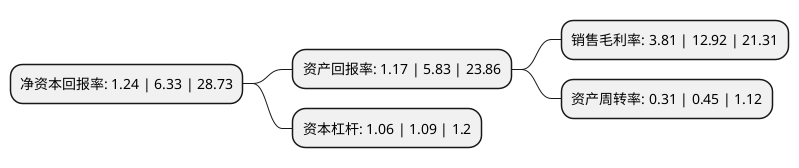

> 本页面由自动化程序生成于 2022年5月20日 01:39
> 内容可能存在错误，如有bug请提交issue至：https://github.com/Eroleice/doc-pi/issues
{.is-warning}

# 上市公司基本情况

## 基本资料

苏州敏芯微电子技术股份有限公司（以下简称“敏芯股份”）成立于2007年09月25日，苏州市。于2020年08月10日在上交所科创板上市。

敏芯股份注册资本5,342.98万元，MEMS传感器的研发，生产和销售。以下是详细信息：

- 公司名称: 苏州敏芯微电子技术股份有限公司
- 股票代码: 688286.SH
- 所在地: 江苏 - 苏州市
- 成立日期: 2007年09月25日
- 注册资本: 5,342.98万元
- 法定代表人: 李刚
- 主营业务: MEMS传感器的研发，生产和销售
- 公司官网: www.memsensing.com
- 公司介绍: 公司是一家以MEMS传感器研发与销售为主的半导体芯片设计公司，目前主要产品线包括MEMS麦克风、MEMS压力传感器和MEMS惯性传感器。经过多年的技术积累和研发投入，公司在上述MEMS传感器芯片设计、晶圆制造、封装和测试等各环节都拥有了自主研发能力和核心技术，同时能够自主设计为MEMS传感器芯片提供信号转化、处理或驱动功能的ASIC芯片，并实现了MEMS传感器全生产环节的国产化。公司先后获得“2013年度十大中国MEMS设计公司品牌”、2016和2017年大中华IC设计成就奖、中国半导体行业协会2016和2018年“中国半导体MEMS十强企业”。公司还在2015年入选全球知名电子产品期刊EE Times发布的“EE Times Silicon60：2015Startups to Watch”(全球60家值得注意的新创科技公司)。

## 股东及高管情况

上市公司第一大股东为李刚，持股10,745,026股，占比20.11%，**疑似为**上市公司实际控制人。

截至2022年03月31日，上市公司的前十大股东中，共有3名自然人股东，5名机构股东，1个产品账户，1名其他股东，其中5%以上大股东共有3名。上市公司前十大股东明细如下：

> 未能通过持股比例判定出上市公司实际控制人（持股30%以上）
> 可能存在通过间接持股、联合持股、协议控制等方式拥有实际控制权的主体，具体请参考上市公司定期公告！
{.is-warning}

> 截至2022年03月31日，上市公司前十大股东信息如下：

| 股东名称 | 持股数量（股） | 持股比例 |
| --- | --- | --- |
| 李刚 | 10,745,026 | 20.11% |
| 上海华芯创业投资企业 | 4,820,349 | 9.02% |
| 中新苏州工业园区创业投资有限公司 | 3,681,023 | 6.89% |
| 苏州昶众企业管理咨询中心(有限合伙) | 1,850,000 | 3.46% |
| 梅嘉欣 | 1,664,680 | 3.12% |
| 胡维 | 1,579,206 | 2.96% |
| 西藏凯风进取创业投资有限公司 | 1,161,086 | 2.17% |
| 上海湖杉投资管理有限公司-湖杉投资(上海)合伙企业(有限合伙) | 1,156,830 | 2.17% |
| 苏州凯风万盛创业投资合伙企业(有限合伙) | 1,106,411 | 2.07% |
| 北京芯动能投资基金(有限合伙) | 984,966 | 1.84% |

## 利润表分析

上市公司2021年总收入为3.51亿元，净利润为0.13亿元，实现盈利。

## 杜邦分析

> 数据列示周期：2021年 | 2020年 | 2019年
{.is-info}

上市公司的净资产收益率在近一年有所下降，下降幅度为-80.41%，其变化情况分解如下：
- 上市公司的销售毛利率在近一年下降了-70.51%，可能是生产效率的下降、商品原材料价格上涨或商品价格的下跌所致。
- 上市公司的资产周转率在近一年下降了-31.11%，可能是源自于更慢的销售回款或库存管理效果下降。
- 上市公司的财务杠杆比率在近一年下降了-2.75%，可能是减少负债降低财务费用。

