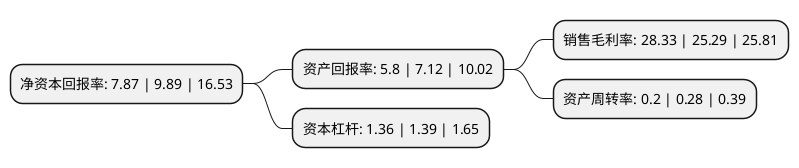

> 本页面由自动化程序生成于 2022年5月20日 01:39
> 内容可能存在错误，如有bug请提交issue至：https://github.com/Eroleice/doc-pi/issues
{.is-warning}

# 上市公司基本情况

## 基本资料

成都盟升电子技术股份有限公司（以下简称“盟升电子”）成立于2013年09月06日，成都市。于2020年07月31日在上交所科创板上市。

盟升电子注册资本11,467万元，主要产品包括卫星导航，卫星通信等系列产品。持续专注于卫星应用技术领域相关产品的研发及制造。以下是详细信息：

- 公司名称: 成都盟升电子技术股份有限公司
- 股票代码: 688311.SH
- 所在地: 四川 - 成都市
- 成立日期: 2013年09月06日
- 注册资本: 11,467万元
- 法定代表人: 刘荣
- 主营业务: 主要产品包括卫星导航，卫星通信等系列产品持续专注于卫星应用技术领域相关产品的研发及制造
- 公司官网: www.microwave-signal.com
- 公司介绍: 公司自成立以来，持续专注于卫星应用技术领域相关产品的研发及制造，是一家卫星导航和卫星通信终端设备研发、制造、销售和技术服务的高新技术企业，主要产品包括卫星导航、卫星通信等系列产品。公司卫星导航产品主要为基于北斗卫星导航系统的导航终端设备以及核心部件产品，如卫星导航接收机、组件、专用测试设备等，目前主要应用于国防军事领域；卫星通信产品主要为卫星通信天线及组件，包括动中通天线、信标机和跟踪接收机等产品，目前主要应用于海事、民航市场及国防军事领域。公司始终坚持走军品民品并重的发展路线，以技术自主创新为根基，以持续研发投入为保障，建立了完善的研发体系和强大的科研团队，通过多年的发展，已完全掌握了卫星导航和卫星通信终端设备的核心技术，积累了丰富的项目经验和质量管理经验，产品质量和服务水平赢得了客户的广泛认可。公司业务范围涵盖军品业务和民品业务，为国防、民航、海洋渔业等多个领域客户提供终端产品和技术服务。

## 股东及高管情况

上市公司第一大股东为成都荣投创新投资有限公司，持股33,213,100股，占比28.96%，**疑似为**上市公司实际控制人。

截至2022年03月31日，上市公司的前十大股东中，共有2名自然人股东，6名机构股东，2个产品账户，其中5%以上大股东共有2名。上市公司前十大股东明细如下：

> 未能通过持股比例判定出上市公司实际控制人（持股30%以上）
> 可能存在通过间接持股、联合持股、协议控制等方式拥有实际控制权的主体，具体请参考上市公司定期公告！
{.is-warning}

> 截至2022年03月31日，上市公司前十大股东信息如下：

| 股东名称 | 持股数量（股） | 持股比例 |
| --- | --- | --- |
| 成都荣投创新投资有限公司 | 33,213,100 | 28.96% |
| 宁波盟升志合企业管理合伙企业(有限合伙) | 8,370,000 | 7.3% |
| 中国建设银行股份有限公司-易方达国防军工混合型证券投资基金 | 3,931,319 | 3.43% |
| 向荣 | 3,171,420 | 2.77% |
| 宜宾市智溢酒业有限公司 | 2,965,600 | 2.59% |
| 成都金控弘合股权投资管理有限公司-汝州市弘升衡达互强企业管理合伙企业(有限合伙) | 2,843,700 | 2.48% |
| 宁波盟升创合企业管理合伙企业(有限合伙) | 2,790,000 | 2.43% |
| 成都金控弘合股权投资管理有限公司-汝州市弘升衡达精诚企业管理合伙企业(有限合伙) | 1,794,100 | 1.56% |
| 深圳蓝海优创基金管理有限公司-汝州市蓝海沣盈企业管理中心(有限合伙) | 1,256,810 | 1.1% |
| 赖晓凤 | 1,209,993 | 1.06% |

## 利润表分析

上市公司2021年总收入为4.75亿元，净利润为1.34亿元，实现盈利。

## 杜邦分析

> 数据列示周期：2021年 | 2020年 | 2019年
{.is-info}

上市公司的净资产收益率在近一年有所下降，下降幅度为-20.42%，其变化情况分解如下：
- 上市公司的销售毛利率在近一年上升了12.02%，可能是生产效率的提升、商品原材料价格下跌或商品价格的上涨所致。
- 上市公司的资产周转率在近一年下降了-28.57%，可能是源自于更慢的销售回款或库存管理效果下降。
- 上市公司的财务杠杆比率在近一年下降了-2.16%，可能是减少负债降低财务费用。

