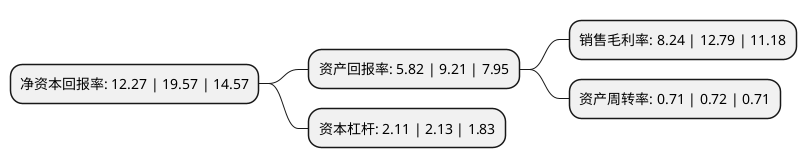

> 本页面由自动化程序生成于 2022年5月20日 01:39
> 内容可能存在错误，如有bug请提交issue至：https://github.com/Eroleice/doc-pi/issues
{.is-warning}

# 上市公司基本情况

## 基本资料

深圳市深科达智能装备股份有限公司（以下简称“深科达”）成立于2004年06月14日，深圳市。于2021年03月09日在上交所科创板上市。

深科达注册资本8,104万元，主要从事平板显示器件生产设备的研发，生产和销售。公司产品广泛应用于平板显示器件中显示模组，触控模组，指纹识别模组等相关组件的自动化组装和智能化检测，并向半导体封测，摄像头微组装和智能装备关键零部件等领域延伸。以下是详细信息：

- 公司名称: 深圳市深科达智能装备股份有限公司
- 股票代码: 688328.SH
- 所在地: 广东 - 深圳市
- 成立日期: 2004年06月14日
- 注册资本: 8,104万元
- 法定代表人: 黄奕宏
- 主营业务: 主要从事平板显示器件生产设备的研发，生产和销售公司产品广泛应用于平板显示器件中显示模组，触控模组，指纹识别模组等相关组件的自动化组装和智能化检测，并向半导体封测，摄像头微组装和智能装备关键零部件等领域延伸
- 公司官网: www.szskd.com
- 公司介绍: 公司是一家国内领先的智能装备与解决方案供应商，公司拥有完整的研发、生产、销售和服务体系，致力于为客户提供专业化、高性能的电子专用设备和系统解决方案。公司主要产品为平板显示器件生产设备，广泛应用于平板显示器件中显示模组、触控模组、指纹识别模组等相关组件的自动化组装和智能化检测，并向半导体封测、摄像头微组装和智能装备关键零部件等领域延伸。公司自成立以来，秉承“成为装备领域更具价值的企业”的企业愿景，深耕于平板显示领域，积累了深厚的技术储备和丰富的项目经验，具备将客户需求快速转化为设计方案和产品的业务能力，树立了良好的市场形象和品牌知名度，是国内为数不多的具备平板显示模组全自动组装设备研发和制造能力的企业之一。目前，公司拥有大量优质龙头客户，如天马微电子、华星光电、业成科技、华为、京东方、维信诺、群创光电、友达光电、伯恩光学、蓝思科技、欧菲光、柔宇科技等。

## 股东及高管情况

上市公司第一大股东为黄奕宏，持股13,359,716股，占比16.49%，**疑似为**上市公司实际控制人。

截至2022年03月31日，上市公司的前十大股东中，共有5名自然人股东，4名机构股东，1个产品账户，其中5%以上大股东共有4名。上市公司前十大股东明细如下：

> 未能通过持股比例判定出上市公司实际控制人（持股30%以上）
> 可能存在通过间接持股、联合持股、协议控制等方式拥有实际控制权的主体，具体请参考上市公司定期公告！
{.is-warning}

> 截至2022年03月31日，上市公司前十大股东信息如下：

| 股东名称 | 持股数量（股） | 持股比例 |
| --- | --- | --- |
| 黄奕宏 | 13,359,716 | 16.49% |
| 肖演加 | 7,239,985 | 8.93% |
| 黄奕奋 | 7,239,984 | 8.93% |
| 深圳市深科达投资有限公司 | 5,092,000 | 6.28% |
| 张新明 | 3,350,900 | 4.13% |
| 深圳市前海菲洋智远控股合伙企业(有限合伙) | 3,350,000 | 4.13% |
| 东证周德(上海)创业投资中心(有限合伙) | 2,515,245 | 3.1% |
| 南京邦盛投资管理有限公司-苏州邦盛赢新创业投资企业(有限合伙) | 2,314,000 | 2.86% |
| 安信证券资管-中国银行-安信资管深科达高管参与科创板战略配售集合资产管理计划 | 2,026,000 | 2.5% |
| 谢文冲 | 1,912,500 | 2.36% |

## 利润表分析

上市公司2021年总收入为9.1亿元，净利润为0.75亿元，实现盈利。

## 杜邦分析

> 数据列示周期：2021年 | 2020年 | 2019年
{.is-info}

上市公司的净资产收益率在近一年有所下降，下降幅度为-37.3%，其变化情况分解如下：
- 上市公司的销售毛利率在近一年下降了-35.57%，可能是生产效率的下降、商品原材料价格上涨或商品价格的下跌所致。
- 上市公司的资产周转率在近一年下降了-1.39%，可能是源自于更慢的销售回款或库存管理效果下降。
- 上市公司的财务杠杆比率在近一年下降了-0.94%，可能是减少负债降低财务费用。

