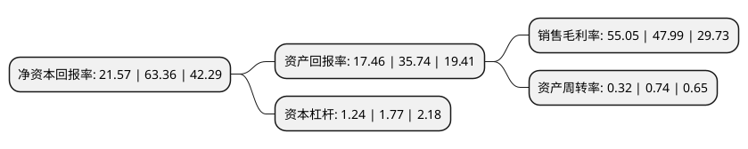

> 本页面由自动化程序生成于 2022年5月20日 01:39
> 内容可能存在错误，如有bug请提交issue至：https://github.com/Eroleice/doc-pi/issues
{.is-warning}

# 上市公司基本情况

## 基本资料

四川天微电子股份有限公司（以下简称“天微电子”）成立于2001年08月27日，成都市。于2021年07月30日在上交所科创板上市。

天微电子注册资本8,000万元，公司主要产品包括灭火抑爆系统，放电管，熔断器等。以下是详细信息：

- 公司名称: 四川天微电子股份有限公司
- 股票代码: 688511.SH
- 所在地: 四川 - 成都市
- 成立日期: 2001年08月27日
- 注册资本: 8,000万元
- 法定代表人: 巨万里
- 主营业务: 公司主要产品包括灭火抑爆系统，放电管，熔断器等
- 公司官网: www.sctwdz.cn
- 公司介绍: 公司是国家高新技术企业，是一家主要从事高速自动灭火抑爆系统、高能航空点火放电器件、高精度熔断器件等产品研发、生产、销售为一体的军工科研生产企业。公司依托多年积累的核心技术、丰富的军工科研生产经验和严格的生产管理，以综合防护领域的核心器件及系统集成为主要发展方向，长期致力于为高危领域提供电子防护产品。公司产品广泛应用于兵器、航空、航天、船舶、电子等领域，多项军工产品已完成设计、定型并在重点型号装备中批量使用，同时也可应用于煤矿、能源、电力、粉尘工业、公共交通等民用领域。公司是四川省级工程技术研究中心企业、成都市高端装备制造企业和成都市企业技术中心，建有天微—电子科大联合试验室。公司军工资质齐全，具有多条贯国军标生产线。公司拥有先进的科研生产设备、试验检测设备以及配套设施，建立了完整的军工科研生产平台，具有满足科研生产的良好环境和保障条件，目前已成为军工整机/总体单位的一级配套商，受到军方用户单位的高度认可。

## 股东及高管情况

上市公司第一大股东为巨万里，持股33,832,590股，占比42.29%，为上市公司实际控制人。

截至2022年03月31日，上市公司的前十大股东中，共有4名自然人股东，4名机构股东，2个产品账户，其中5%以上大股东共有4名。上市公司前十大股东明细如下：

> 截至2022年03月31日，上市公司前十大股东信息如下：

| 股东名称 | 持股数量（股） | 持股比例 |
| --- | --- | --- |
| 巨万里 | 33,832,590 | 42.29% |
| 张超 | 4,849,110 | 6.06% |
| 吴兆方 | 4,411,615 | 5.51% |
| 巨万珍 | 4,375,151 | 5.47% |
| 成都盈创德弘股权投资基金管理有限公司-成都盈创德弘航空创业投资合伙企业(有限合伙) | 2,352,941 | 2.94% |
| 中金公司-招商银行-中金公司天微电子1号员工参与科创板战略配售集合资产管理计划 | 1,981,400 | 2.48% |
| 成都市顺业投资有限责任公司 | 1,764,706 | 2.21% |
| 四川威比特投资有限公司 | 1,323,544 | 1.65% |
| 汝州市浩瀚悦诚信息技术咨询中心(有限合伙) | 1,176,472 | 1.47% |
| 国金创新投资有限公司 | 900,600 | 1.13% |

## 利润表分析

上市公司2021年总收入为2.08亿元，净利润为1.14亿元，实现盈利。

## 杜邦分析

> 数据列示周期：2021年 | 2020年 | 2019年
{.is-info}

上市公司的净资产收益率在近一年有所下降，下降幅度为-65.96%，其变化情况分解如下：
- 上市公司的销售毛利率在近一年上升了14.71%，可能是生产效率的提升、商品原材料价格下跌或商品价格的上涨所致。
- 上市公司的资产周转率在近一年下降了-56.76%，可能是源自于更慢的销售回款或库存管理效果下降。
- 上市公司的财务杠杆比率在近一年下降了-29.94%，可能是减少负债降低财务费用。

