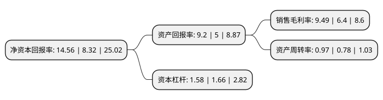

> 本页面由自动化程序生成于 2022年5月20日 01:39
> 内容可能存在错误，如有bug请提交issue至：https://github.com/Eroleice/doc-pi/issues
{.is-warning}

# 上市公司基本情况

## 基本资料

南亚新材料科技股份有限公司（以下简称“南亚新材”）成立于2000年06月27日，上海市。于2020年08月18日在上交所科创板上市。

南亚新材注册资本23,440万元，覆铜板和粘结片等复合材料及其制品的设计，研发，生产及销售以下是详细信息：

- 公司名称: 南亚新材料科技股份有限公司
- 股票代码: 688519.SH
- 所在地: 上海 - 上海市
- 成立日期: 2000年06月27日
- 注册资本: 23,440万元
- 法定代表人: 包秀银
- 主营业务: 覆铜板和粘结片等复合材料及其制品的设计，研发，生产及销售
- 公司官网: www.ccl-china.com
- 公司介绍: 公司是一家专业从事覆铜箔板设计、制造和销售的沪港合资企业，公司是我国覆铜板协会(CCLA)理事长单位，长期致力于覆铜板产品的自主创新。在二十年的发展历程中，公司陆续实现了材料无铅无卤化、超薄化、高频高速等技术的重大突破。公司的无卤覆铜板销售已跻身全球前十、内资厂第二，超薄工艺及可靠性处于国内领先水平并得到全球PCB多层板龙头企业之一健鼎集团的高度认可，高速板技术国内领先并已获得华为、中兴等通信设备龙头企业的认证，有望在超低损耗等尖端领域打破外资垄断,随着技术研发的突破、产品体系的完善以及市场开拓的深入，公司的产品和品牌获得了下游知名客户的广泛认可。公司已与健鼎集团、奥士康、景旺电子、广东骏亚、五株集团、瀚宇博德、深南电路等知名PCB厂商建立了长期良好的合作关系，连续多年被健鼎集团评为“优秀供应厂商”。

## 股东及高管情况

上市公司第一大股东为上海南亚科技集团有限公司，持股126,048,600股，占比53.78%，为上市公司实际控制人。

截至2022年05月13日，上市公司的前十大股东中，共有4名自然人股东，1名机构股东，5个产品账户，其中5%以上大股东共有2名。上市公司前十大股东明细如下：

> 截至2022年05月13日，上市公司前十大股东信息如下：

| 股东名称 | 持股数量（股） | 持股比例 |
| --- | --- | --- |
| 上海南亚科技集团有限公司 | 126,048,600 | 53.78% |
| 深圳市前海恒邦兆丰资产管理有限公司-恒邦企成1号私募证券投资基金 | 12,430,279 | 5.3% |
| 包秀银 | 8,755,543 | 3.74% |
| 中国工商银行股份有限公司-华安媒体互联网混合型证券投资基金 | 3,599,672 | 1.54% |
| 中国建设银行股份有限公司-华安沪港深外延增长灵活配置混合型证券投资基金 | 2,854,900 | 1.22% |
| 包秀春 | 2,597,621 | 1.11% |
| 南亚新材料科技股份有限公司回购专用证券账户 | 2,457,950 | 1.05% |
| 郑晓远 | 2,413,910 | 1.03% |
| 中国农业银行股份有限公司-华安智能生活混合型证券投资基金 | 2,224,709 | 0.95% |
| 张东 | 1,940,129 | 0.83% |

## 利润表分析

上市公司2021年总收入为42.07亿元，净利润为3.99亿元，实现盈利。

## 杜邦分析

> 数据列示周期：2021年 | 2020年 | 2019年
{.is-info}

上市公司的净资产收益率在近一年有所上升，上升幅度为75%，其变化情况分解如下：
- 上市公司的销售毛利率在近一年上升了48.28%，可能是生产效率的提升、商品原材料价格下跌或商品价格的上涨所致。
- 上市公司的资产周转率在近一年上升了24.36%，可能是源自于更快的销售回款或库存管理效果提升。
- 上市公司的财务杠杆比率在近一年下降了-4.82%，可能是减少负债降低财务费用。

