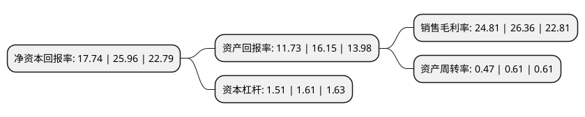

> 本页面由自动化程序生成于 2022年5月20日 01:40
> 内容可能存在错误，如有bug请提交issue至：https://github.com/Eroleice/doc-pi/issues
{.is-warning}

# 上市公司基本情况

## 基本资料

成都智明达电子股份有限公司（以下简称“智明达”）成立于2002年03月28日，成都市。于2021年04月08日在上交所科创板上市。

智明达注册资本5,033.56万元，主要面向军工领域客户，提供军用嵌入式计算机相关产品和解决方案。以下是详细信息：

- 公司名称: 成都智明达电子股份有限公司
- 股票代码: 688636.SH
- 所在地: 四川 - 成都市
- 成立日期: 2002年03月28日
- 注册资本: 5,033.56万元
- 法定代表人: 王勇
- 主营业务: 主要面向军工领域客户，提供军用嵌入式计算机相关产品和解决方案
- 公司官网: www.zmdde.com
- 公司介绍: 公司是一家嵌入式计算机领域的技术型企业，主要面向军工领域客户，提供军用嵌入式计算机相关产品和解决方案。通过多年的积淀，公司按终端产品应用场景分类已经构建起五大产品系列，分别为机载嵌入式计算机、弹载嵌入式计算机、舰载嵌入式计算机、车载嵌入式计算机及其他嵌入式计算机，主要涉及数据采集、信号处理、数据处理、通信交换、接口控制、高可靠性电源、大容量存储以及图形图像处理等多种功能，服务于航空、航天、船舶及地面等领域军工客户,公司已获得了“四川省企业技术中心”“成都市企业技术中心”“2019年度成都市新经济百家重点培育企业”等多项由四川省、成都市政府部门及相关单位颁发的荣誉及资质。公司强大的研发能力对过往业绩的开拓起到了决定性的支撑作用，同时公司将持续响应行业和客户需求趋势，巩固已取得的市场地位和优势，突破现有竞争格局，实现与国际国内一流企业的同台竞技。

## 股东及高管情况

上市公司第一大股东为王勇，持股14,883,750股，占比29.57%，**疑似为**上市公司实际控制人。

截至2022年04月19日，上市公司的前十大股东中，共有6名自然人股东，3名机构股东，1个产品账户，其中5%以上大股东共有6名。上市公司前十大股东明细如下：

> 未能通过持股比例判定出上市公司实际控制人（持股30%以上）
> 可能存在通过间接持股、联合持股、协议控制等方式拥有实际控制权的主体，具体请参考上市公司定期公告！
{.is-warning}

> 截至2022年04月19日，上市公司前十大股东信息如下：

| 股东名称 | 持股数量（股） | 持股比例 |
| --- | --- | --- |
| 王勇 | 14,883,750 | 29.57% |
| 杜柯呈 | 9,112,500 | 18.1% |
| 杜柯呈 | 9,112,500 | 18.1% |
| 成都智为企业管理合伙企业(有限合伙) | 3,375,000 | 6.7% |
| 成都智为企业管理合伙企业(有限合伙) | 3,375,000 | 6.7% |
| 深圳市达晨创联股权投资基金合伙企业(有限合伙) | 2,678,571 | 5.32% |
| 张跃 | 2,126,250 | 4.22% |
| 和子丹 | 1,822,500 | 3.62% |
| 仪晓辉 | 1,071,429 | 2.13% |
| 深圳市达晨财智创业投资管理有限公司-深圳市达晨睿泽一号股权投资企业(有限合伙) | 823,500 | 1.64% |

## 利润表分析

上市公司2021年总收入为4.49亿元，净利润为1.11亿元，实现盈利。

## 杜邦分析

> 数据列示周期：2021年 | 2020年 | 2019年
{.is-info}

上市公司的净资产收益率在近一年有所下降，下降幅度为-31.66%，其变化情况分解如下：
- 上市公司的销售毛利率在近一年下降了-5.88%，可能是生产效率的下降、商品原材料价格上涨或商品价格的下跌所致。
- 上市公司的资产周转率在近一年下降了-22.95%，可能是源自于更慢的销售回款或库存管理效果下降。
- 上市公司的财务杠杆比率在近一年下降了-6.21%，可能是减少负债降低财务费用。

