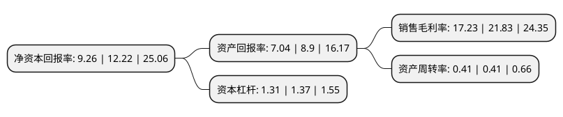

> 本页面由自动化程序生成于 2022年5月20日 01:40
> 内容可能存在错误，如有bug请提交issue至：https://github.com/Eroleice/doc-pi/issues
{.is-warning}

# 上市公司基本情况

## 基本资料

福立旺精密机电(中国)股份有限公司（以下简称“福立旺”）成立于2006年05月18日，苏州市。于2020年12月23日在上交所科创板上市。

福立旺注册资本17,335万元，精密金属零部件的研发，制造和销售，主要为3C，汽车，电动工具等下游应用行业的客户提供精密金属零部件产品。以下是详细信息：

- 公司名称: 福立旺精密机电(中国)股份有限公司
- 股票代码: 688678.SH
- 所在地: 江苏 - 苏州市
- 成立日期: 2006年05月18日
- 注册资本: 17,335万元
- 法定代表人: 许惠钧
- 主营业务: 精密金属零部件的研发，制造和销售，主要为3C，汽车，电动工具等下游应用行业的客户提供精密金属零部件产品
- 公司官网: www.freewon.com.cn
- 公司介绍: 公司长期深耕精密金属零部件制造行业，积累了全面、高效、精益化的精密金属零部件制造技术及经验，在提升技术、工艺和产品开发能力的基础上，不断优化客户和产品结构。近年来，公司不断加大技术创新力度，持续地进行工艺改进，从设计、工艺、品质、服务等方面为品牌发展注入新动力，公司知名度在业内显著提高。公司产品具备高精密度、高稳定性、高良品率等优势，凭借优质的产品和快速的市场响应能力，公司获得了下游客户的广泛认可，进入了行业一流企业的供应链体系，与之形成了长期稳定的合作关系。公司将不断加大自主创新，顺应下游消费电子、5G通信、物联网、新能源汽车等新兴行业发展趋势，紧抓新产品及新应用场景为精密金属零部件行业带来的市场机遇，不断研发及制造精密度高、稳定性强和良品率高的专业化产品，增加产品附加值，进一步拓展业务领域、完善产品体系，提高公司竞争能力。

## 股东及高管情况

上市公司第一大股东为WINWIN OVERSEAS GROUP LIMITED，持股83,378,862股，占比48.1%，为上市公司实际控制人。

截至2022年04月29日，上市公司的前十大股东中，共有5名机构股东，4个产品账户，1个海外主体，其中5%以上大股东共有2名。上市公司前十大股东明细如下：

> 截至2022年04月29日，上市公司前十大股东信息如下：

| 股东名称 | 持股数量（股） | 持股比例 |
| --- | --- | --- |
| WINWIN OVERSEAS GROUP LIMITED | 83,378,862 | 48.1% |
| 昆山零分母投资企业(有限合伙) | 9,257,400 | 5.34% |
| 湖州和元今达股权投资合伙企业(有限合伙) | 5,454,076 | 3.15% |
| 南京秉芯创业投资合伙企业(有限合伙) | 5,361,138 | 3.09% |
| 中国银行股份有限公司-华夏行业景气混合型证券投资基金 | 4,662,338 | 2.69% |
| 上海祥禾涌原股权投资合伙企业(有限合伙) | 3,760,000 | 2.17% |
| 上海祥禾涌安股权投资合伙企业(有限合伙) | 3,760,000 | 2.17% |
| 中国银行股份有限公司-景顺长城优选混合型证券投资基金 | 3,015,025 | 1.74% |
| 中国建设银行股份有限公司-景顺长城环保优势股票型证券投资基金 | 2,837,131 | 1.64% |
| 中国工商银行股份有限公司-景顺长城创新成长混合型证券投资基金 | 2,364,872 | 1.36% |

## 利润表分析

上市公司2021年总收入为7.26亿元，净利润为1.25亿元，实现盈利。

## 杜邦分析

> 数据列示周期：2021年 | 2020年 | 2019年
{.is-info}

上市公司的净资产收益率在近一年有所下降，下降幅度为-24.22%，其变化情况分解如下：
- 上市公司的销售毛利率在近一年下降了-21.07%，可能是生产效率的下降、商品原材料价格上涨或商品价格的下跌所致。
- 上市公司的资产周转率在近一年下降了0%，可能是源自于更慢的销售回款或库存管理效果下降。
- 上市公司的财务杠杆比率在近一年下降了-4.38%，可能是减少负债降低财务费用。

