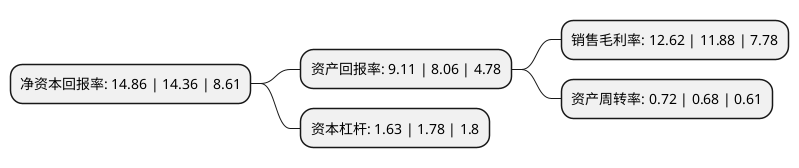

> 本页面由自动化程序生成于 2022年5月20日 01:40
> 内容可能存在错误，如有bug请提交issue至：https://github.com/Eroleice/doc-pi/issues
{.is-warning}

# 上市公司基本情况

## 基本资料

苏州瑞可达连接系统股份有限公司（以下简称“瑞可达”）成立于2006年01月11日，苏州市。于2021年07月22日在上交所科创板上市。

瑞可达注册资本10,800万元，公司是从事连接系统产品的研发，生产，销售和售后服务的综合解决方案提供商，主要产品包括电子元件，光电连接器，传感器，线束，充电设备等，主要应用于无线通信，新能源汽车和工业等领域。经过十余年发展，公司已成为可同时提供电连接器，微波连接器，光器件连接系统产品的企业之一，能为客户提供产品协同设计，零部件模具开发，生产制造，售后服务等全流程服务。以下是详细信息：

- 公司名称: 苏州瑞可达连接系统股份有限公司
- 股票代码: 688800.SH
- 所在地: 江苏 - 苏州市
- 成立日期: 2006年01月11日
- 注册资本: 10,800万元
- 法定代表人: 吴世均
- 主营业务: 公司是从事连接系统产品的研发，生产，销售和售后服务的综合解决方案提供商，主要产品包括电子元件，光电连接器，传感器，线束，充电设备等，主要应用于无线通信，新能源汽车和工业等领域经过十余年发展，公司已成为可同时提供电连接器，微波连接器，光器件连接系统产品的企业之一，能为客户提供产品协同设计，零部件模具开发，生产制造，售后服务等全流程服务
- 公司官网: www.recodeal.com
- 公司介绍: 公司是专业从事连接系统产品的研发、生产、销售和服务的高新技术企业。自设立伊始，公司始终以连接系统产品为核心，持续开发迭代，坚持客户需求导向，现已具备包含连接器件、组件和模块的完整产品链供应能力。经过十余年发展，公司已成为同时具备光、电、微波连接系统产品研发和生产能力的领先企业之一。公司是中国电子元件协会电接插元件分会理事单位、国际天线标准化组织AISG协会成员单位、中国电子元件协会企业信用AAA级企业。公司也是国家火炬计划项目承担单位、国家级专精特新“小巨人”企业，江苏省民营科技企业、苏州市瞪羚计划企业、苏州市信用管理示范单位、苏州市专精特新示范单位和苏州市质量奖企业。

## 股东及高管情况

上市公司第一大股东为吴世均，持股32,250,000股，占比29.86%，**疑似为**上市公司实际控制人。

截至2022年03月31日，上市公司的前十大股东中，共有4名自然人股东，3名机构股东，3个产品账户，其中5%以上大股东共有3名。上市公司前十大股东明细如下：

> 未能通过持股比例判定出上市公司实际控制人（持股30%以上）
> 可能存在通过间接持股、联合持股、协议控制等方式拥有实际控制权的主体，具体请参考上市公司定期公告！
{.is-warning}

> 截至2022年03月31日，上市公司前十大股东信息如下：

| 股东名称 | 持股数量（股） | 持股比例 |
| --- | --- | --- |
| 吴世均 | 32,250,000 | 29.86% |
| 北京国科瑞华战略性新兴产业投资基金(有限合伙) | 8,136,000 | 7.53% |
| 黄博 | 7,140,000 | 6.61% |
| 苏州工业园区元禾重元股权投资基金管理有限公司-苏州工业园区元禾重元贰号股权投资基金合伙企业(有限合伙) | 4,709,000 | 4.36% |
| 苏州联瑞投资管理中心(有限合伙) | 4,000,000 | 3.7% |
| 东吴证券-民生银行-东吴证券瑞可达员工参与科创板战略配售集合资产管理计划 | 2,700,000 | 2.5% |
| 南京邦盛投资管理有限公司-苏州邦盛赢新创业投资企业(有限合伙) | 2,170,000 | 2.01% |
| 马剑 | 1,980,000 | 1.83% |
| 寿祖刚 | 1,940,000 | 1.8% |
| 南京俱成股权投资管理有限公司-南京俱成秋实股权投资合伙企业(有限合伙) | 1,884,000 | 1.74% |

## 利润表分析

上市公司2021年总收入为9.01亿元，净利润为1.13亿元，实现盈利。

## 杜邦分析

> 数据列示周期：2021年 | 2020年 | 2019年
{.is-info}

上市公司的净资产收益率在近一年有所上升，上升幅度为3.48%，其变化情况分解如下：
- 上市公司的销售毛利率在近一年上升了6.23%，可能是生产效率的提升、商品原材料价格下跌或商品价格的上涨所致。
- 上市公司的资产周转率在近一年上升了5.88%，可能是源自于更快的销售回款或库存管理效果提升。
- 上市公司的财务杠杆比率在近一年下降了-8.43%，可能是减少负债降低财务费用。

