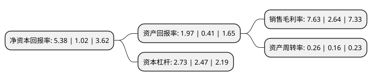

> 本页面由自动化程序生成于 2022年5月20日 01:01
> 内容可能存在错误，如有bug请提交issue至：https://github.com/Eroleice/doc-pi/issues
{.is-warning}

# 上市公司基本情况

## 基本资料

沙河实业股份有限公司（以下简称“沙河股份”）成立于1987年07月27日，深圳市。于1992年06月02日在深交所主板上市。

沙河股份注册资本20,170.519万元，主要业务:房地产开发。以下是详细信息：

- 公司名称: 沙河实业股份有限公司
- 股票代码: 000014.SZ
- 所在地: 广东 - 深圳市
- 成立日期: 1987年07月27日
- 注册资本: 20,170.519万元
- 法定代表人: 陈勇
- 主营业务: 房地产开发
- 公司官网: www.shahe.cn
- 公司介绍: 公司主要从事房地产开发以及配套工程开发建设、新型建材的生产与建设、物业租赁与管理、物资供销、国内外商业、及投资兴办实业等。公司已成功开发出荔园新村、祥祺花园、鹿鸣园、宝瑞轩、世纪村、世纪假日广场等多个住宅、商务项目。其中，世纪村通过国家建设部“3A”性能住宅认定，荣获“全国人居优秀推荐楼盘”称号。公司以深圳为依托，积极寻求对外扩张，并在湖南长沙、河南新乡等地开发新项目。公司拥有丰富的土地储备，曾在全国率先实行住宅质量保证书和住宅使用说明制度。连续多年被深圳权威资信机构评为“AAA”级信誉企业和深圳市守法纳税大户，曾获深圳市“文明企业”等多种殊荣。公司着力实施名牌精品战略，致力于全方位开拓和多元化发展，企业资产质量和盈利水平得以迅速提升，进而为社会提供更多优质产品服务和高额投资回报，确保了公司的可持续发展。

## 股东及高管情况

上市公司第一大股东为深业沙河(集团)有限公司，持股68,613,391股，占比34.02%，为上市公司实际控制人。

截至2022年03月31日，上市公司的前十大股东中，共有9名自然人股东，1名机构股东，其中5%以上大股东共有1名。上市公司前十大股东明细如下：

> 截至2022年03月31日，上市公司前十大股东信息如下：

| 股东名称 | 持股数量（股） | 持股比例 |
| --- | --- | --- |
| 深业沙河(集团)有限公司 | 68,613,391 | 34.02% |
| 贺洁 | 3,730,544 | 1.85% |
| 张沐城 | 3,060,000 | 1.52% |
| 王爱霞 | 2,227,400 | 1.1% |
| 彭凌云 | 2,000,000 | 0.99% |
| 查一丁 | 1,910,168 | 0.95% |
| 张丽萍 | 1,440,000 | 0.71% |
| 谢德兴 | 1,109,900 | 0.55% |
| 林汉腾 | 1,008,100 | 0.5% |
| 李颖 | 982,800 | 0.49% |

## 利润表分析

上市公司2021年总收入为6.41亿元，净利润为0.48亿元，实现盈利。

## 杜邦分析

> 数据列示周期：2021年 | 2020年 | 2019年
{.is-info}

上市公司的净资产收益率在近一年有所上升，上升幅度为427.45%，其变化情况分解如下：
- 上市公司的销售毛利率在近一年上升了189.02%，可能是生产效率的提升、商品原材料价格下跌或商品价格的上涨所致。
- 上市公司的资产周转率在近一年上升了62.5%，可能是源自于更快的销售回款或库存管理效果提升。
- 上市公司的财务杠杆比率在近一年上升了10.53%，可能是增加负债扩大生产规模。

