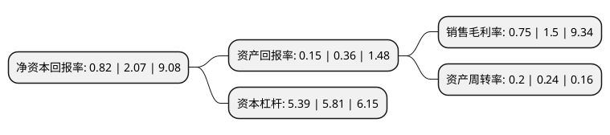

> 本页面由自动化程序生成于 2022年5月20日 01:01
> 内容可能存在错误，如有bug请提交issue至：https://github.com/Eroleice/doc-pi/issues
{.is-warning}

# 上市公司基本情况

## 基本资料

深圳市中洲投资控股股份有限公司（以下简称“中洲控股”）成立于1984年09月17日，深圳市。于1994年09月21日在深交所主板上市。

中洲控股注册资本66,483.114万元，主营业务:房地产开发以下是详细信息：

- 公司名称: 深圳市中洲投资控股股份有限公司
- 股票代码: 000042.SZ
- 所在地: 广东 - 深圳市
- 成立日期: 1984年09月17日
- 注册资本: 66,483.114万元
- 法定代表人: 贾帅
- 主营业务: 主营业务:房地产开发
- 公司官网: www.zztzkg.com
- 公司介绍: 公司前身是深圳市长城投资控股股份有限公司，创立于1984年，1994年经股份制改造成为公众上市公司，为首批获得国家房地产开发一级资质企业。公司以房地产开发业务为主，范围涉及酒店经营、资产管理、物业管理、商业管理、投资等多个领域。近年来，公司继续扎根于主流的经济区域，多渠道、多方式取地，扩大区域影响范围，逐渐实现“专注区域、深耕城市、多盘联动”的战略布局。

## 股东及高管情况

上市公司第一大股东为深圳中洲集团有限公司，持股349,874,513股，占比52.63%，为上市公司实际控制人。

截至2022年03月31日，上市公司的前十大股东中，共有6名机构股东，4个产品账户，其中5%以上大股东共有3名。上市公司前十大股东明细如下：

> 截至2022年03月31日，上市公司前十大股东信息如下：

| 股东名称 | 持股数量（股） | 持股比例 |
| --- | --- | --- |
| 深圳中洲集团有限公司 | 349,874,513 | 52.63% |
| 南昌联泰投资有限公司 | 55,188,952 | 8.3% |
| 深圳市资本运营集团有限公司 | 45,046,186 | 6.78% |
| 深圳市景汇投资咨询有限公司 | 28,425,746 | 4.28% |
| 深圳市联泰房地产开发有限公司 | 10,743,792 | 1.62% |
| 上海凯纳璞淳资产管理有限公司-凯纳尊享22号私募证券投资基金 | 7,392,030 | 1.11% |
| 上海磐耀资产管理有限公司-磐耀风神定制1号私募证券投资基金 | 6,846,100 | 1.03% |
| 格林基金-广州风神汽车租赁有限公司-格林基金战略1号单一资产管理计划 | 6,668,728 | 1% |
| 华润深国投信托有限公司-优瑞1期集合资金信托计划 | 5,973,073 | 0.9% |
| 深圳市前海君至投资有限公司 | 4,600,000 | 0.69% |

## 利润表分析

上市公司2021年总收入为86.76亿元，净利润为0.65亿元，实现盈利。

## 杜邦分析

> 数据列示周期：2021年 | 2020年 | 2019年
{.is-info}

上市公司的净资产收益率在近一年有所下降，下降幅度为-60.39%，其变化情况分解如下：
- 上市公司的销售毛利率在近一年下降了-50%，可能是生产效率的下降、商品原材料价格上涨或商品价格的下跌所致。
- 上市公司的资产周转率在近一年下降了-16.67%，可能是源自于更慢的销售回款或库存管理效果下降。
- 上市公司的财务杠杆比率在近一年下降了-7.23%，可能是减少负债降低财务费用。

