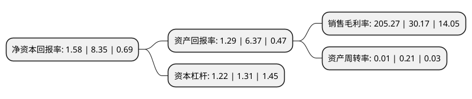

> 本页面由自动化程序生成于 2022年5月20日 01:02
> 内容可能存在错误，如有bug请提交issue至：https://github.com/Eroleice/doc-pi/issues
{.is-warning}

# 上市公司基本情况

## 基本资料

海航投资集团股份有限公司（以下简称“ST海投”）成立于1993年05月27日，大连市。于1996年11月08日在深交所主板上市。

ST海投注册资本143,023.443万元，房地产开发，餐饮旅游及教育服务以下是详细信息：

- 公司名称: 海航投资集团股份有限公司
- 股票代码: 000616.SZ
- 所在地: 辽宁 - 大连市
- 成立日期: 1993年05月27日
- 注册资本: 143,023.443万元
- 法定代表人: 朱卫军
- 主营业务: 房地产开发，餐饮旅游及教育服务
- 公司官网: www.hnainvestment.com
- 公司介绍: 公司是一家以不动产金融、医疗、大健康、养老、教育为主要业务发展方向并于深圳证券交易所主板上市的企业。海航投资将围绕构筑大健康服务生态链的既定方向，充分利用和发挥海航投资多年发展形成的基础和优势，把握国家经济持续发展和深化医疗改革带来的市场机会，积极布局大健康产业，通过投资、合作等方式快速捕获大健康行业优质机遇，开拓医疗、养老、教育等分支领域，形成多业并举、互为支撑、联动发展的新业务格局，使多元化产业投资切实成为公司主业及利润增长点，稳步开拓公司发展空间，为股东创造更好的回报。

## 股东及高管情况

上市公司第一大股东为海航资本集团有限公司，持股285,776,423股，占比19.98%，**疑似为**上市公司实际控制人。

截至2022年03月31日，上市公司的前十大股东中，共有9名自然人股东，1名机构股东，其中5%以上大股东共有1名。上市公司前十大股东明细如下：

> 未能通过持股比例判定出上市公司实际控制人（持股30%以上）
> 可能存在通过间接持股、联合持股、协议控制等方式拥有实际控制权的主体，具体请参考上市公司定期公告！
{.is-warning}

> 截至2022年03月31日，上市公司前十大股东信息如下：

| 股东名称 | 持股数量（股） | 持股比例 |
| --- | --- | --- |
| 海航资本集团有限公司 | 285,776,423 | 19.98% |
| 朱盛兰 | 25,600,000 | 1.79% |
| 方跃伦 | 17,886,600 | 1.25% |
| 王河 | 11,130,000 | 0.78% |
| 张琴华 | 10,485,892 | 0.73% |
| 汪锡新 | 9,978,000 | 0.7% |
| 夏承悦 | 8,540,100 | 0.6% |
| 赵睿 | 7,002,199 | 0.49% |
| 洪群 | 6,261,453 | 0.44% |
| 万洪涛 | 6,226,000 | 0.44% |

## 利润表分析

上市公司2021年总收入为0.35亿元，净利润为0.72亿元，实现盈利。

## 杜邦分析

> 数据列示周期：2021年 | 2020年 | 2019年
{.is-info}

上市公司的净资产收益率在近一年有所下降，下降幅度为-81.08%，其变化情况分解如下：
- 上市公司的销售毛利率在近一年上升了580.38%，可能是生产效率的提升、商品原材料价格下跌或商品价格的上涨所致。
- 上市公司的资产周转率在近一年下降了-95.24%，可能是源自于更慢的销售回款或库存管理效果下降。
- 上市公司的财务杠杆比率在近一年下降了-6.87%，可能是减少负债降低财务费用。

