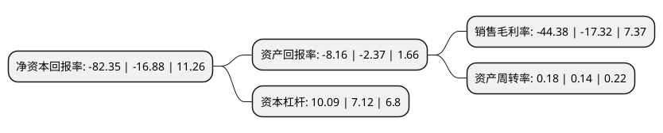

> 本页面由自动化程序生成于 2022年5月20日 01:02
> 内容可能存在错误，如有bug请提交issue至：https://github.com/Eroleice/doc-pi/issues
{.is-warning}

# 上市公司基本情况

## 基本资料

新华联文化旅游发展股份有限公司（以下简称“新华联”）成立于1993年06月25日，北京市。于1996年10月29日在深交所主板上市。

新华联注册资本189,669.042万元，主营业务:房地产开发与经营业以下是详细信息：

- 公司名称: 新华联文化旅游发展股份有限公司
- 股票代码: 000620.SZ
- 所在地: 北京 - 北京市
- 成立日期: 1993年06月25日
- 注册资本: 189,669.042万元
- 法定代表人: 马晨山
- 主营业务: 主营业务:房地产开发与经营业
- 公司官网: www.xhlwl.com.cn
- 公司介绍: 公司原为新华联不动产股份有限公司，2016年更名为新华联文化旅游发展股份有限公司。自上市以来，公司发展加速了战略转型升级的步伐，确立了“文旅+金融+地产”的发展定位，致力将文旅产业打造成战略支柱型产业。依托新华联集团雄厚的资金实力和强大的品牌影响力，公司发展得到了迅速发展，旗下开发项目已遍及全国20多个省、市、自治区，并拓展至韩国、马来西亚、澳大利亚等国家，控股中国香港上市公司新丝路文旅，形成了文化旅游业、金融业、房地产开发业、商业、酒店业、建筑业、物业、娱乐业、园林等多产业布局。自上市以来，新华联文旅发展加速了战略转型升级的步伐，确立了“文旅+金融+地产”的发展定位，致力将文旅产业打造成战略支柱型产业。承载着强烈的责任感和使命感，新华联文旅发展投身树立中华民族文化品牌的大事业，已在华东、华南、华北、西北地区以及韩国济州岛布局大型文旅项目。

## 股东及高管情况

上市公司第一大股东为新华联控股有限公司，持股1,160,272,587股，占比61.17%，为上市公司实际控制人。

截至2022年03月31日，上市公司的前十大股东中，共有3名自然人股东，5名机构股东，1个产品账户，1个海外主体，其中5%以上大股东共有1名。上市公司前十大股东明细如下：

> 截至2022年03月31日，上市公司前十大股东信息如下：

| 股东名称 | 持股数量（股） | 持股比例 |
| --- | --- | --- |
| 新华联控股有限公司 | 1,160,272,587 | 61.17% |
| 北京赣商投资股份有限公司 | 78,491,397 | 4.14% |
| 北京恒天永晟科贸有限公司 | 35,875,000 | 1.89% |
| 西藏雪峰科技投资咨询有限公司 | 30,967,718 | 1.63% |
| 吴伟 | 30,000,000 | 1.58% |
| 新华联文化旅游发展股份有限公司-第一期员工持股计划 | 13,566,347 | 0.72% |
| 吴梦玲 | 9,241,282 | 0.49% |
| UBS AG | 5,705,938 | 0.3% |
| 黄山海慧科技投资有限公司 | 5,562,362 | 0.29% |
| 李朝杰 | 5,009,977 | 0.26% |

## 杜邦分析

> 数据列示周期：2021年 | 2020年 | 2019年
{.is-info}

上市公司的净资产收益率在近一年有所上升，上升幅度为387.86%，其变化情况分解如下：
- 上市公司的销售毛利率在近一年上升了156.24%，可能是生产效率的提升、商品原材料价格下跌或商品价格的上涨所致。
- 上市公司的资产周转率在近一年上升了28.57%，可能是源自于更快的销售回款或库存管理效果提升。
- 上市公司的财务杠杆比率在近一年上升了41.71%，可能是增加负债扩大生产规模。

