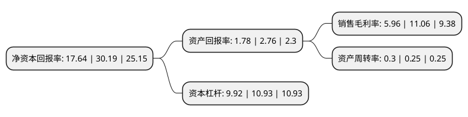

> 本页面由自动化程序生成于 2022年5月20日 01:02
> 内容可能存在错误，如有bug请提交issue至：https://github.com/Eroleice/doc-pi/issues
{.is-warning}

# 上市公司基本情况

## 基本资料

金科地产集团股份有限公司（以下简称“金科股份”）成立于1994年03月29日，重庆市。于1996年11月28日在深交所主板上市。

金科股份注册资本533,971.582万元，房地产开发为主，社区生活服务，酒店经营管理，园林，装饰和新能源发电等相关多元化产业经营为辅以下是详细信息：

- 公司名称: 金科地产集团股份有限公司
- 股票代码: 000656.SZ
- 所在地: 重庆 - 重庆市
- 成立日期: 1994年03月29日
- 注册资本: 533,971.582万元
- 法定代表人: 周达
- 主营业务: 房地产开发为主，社区生活服务，酒店经营管理，园林，装饰和新能源发电等相关多元化产业经营为辅
- 公司官网: www.jinke.com
- 公司介绍: 公司经过多年持续、稳健的发展，形成了以民生地产开发、科技产业运营、社区综合服务、文化旅游康养等相关多元化产业四位一体协同发展的大型企业集团，具备强大的综合竞争力，是城市发展进程中领先的“美好生活服务商”。公司以国家城市群发展战略为导向，紧密围绕“三圈一带”，即京津冀经济圈、长三角经济圈、珠三角经济圈和长江经济带，进行区域战略布局，事业遍布全国23个省、直辖市、自治区，规模快速增长，效益持续提升。公司在坚持做好民生地产开发、社区综合服务的同时，强力推进科技产业投资运营，致力于成为国内领先的以科技创新、人工智能、互联网、大数据等为特色的科技产业园区投资、建设、孵化、运营平台；积极布局文旅康养产业，紧扣国家乡村振兴战略及文化、健康产业发展战略，持续加大对旅游、健康、养生、教育等相关产业的投入力度。

## 股东及高管情况

上市公司第一大股东为广东弘敏企业管理咨询有限公司，持股590,134,714股，占比11.05%，**疑似为**上市公司实际控制人。

截至2022年04月15日，上市公司的前十大股东中，共有2名自然人股东，4名机构股东，3个产品账户，1个海外主体，其中5%以上大股东共有6名。上市公司前十大股东明细如下：

> 未能通过持股比例判定出上市公司实际控制人（持股30%以上）
> 可能存在通过间接持股、联合持股、协议控制等方式拥有实际控制权的主体，具体请参考上市公司定期公告！
{.is-warning}

> 截至2022年04月15日，上市公司前十大股东信息如下：

| 股东名称 | 持股数量（股） | 持股比例 |
| --- | --- | --- |
| 广东弘敏企业管理咨询有限公司 | 590,134,714 | 11.05% |
| 黄红云 | 586,487,279 | 10.98% |
| 黄红云 | 586,487,279 | 10.98% |
| 重庆市金科投资控股(集团)有限责任公司 | 386,836,065 | 7.24% |
| 重庆市金科投资控股(集团)有限责任公司 | 386,836,065 | 7.24% |
| 重庆虹淘文化传媒有限公司 | 267,985,700 | 5.02% |
| 金科地产集团股份有限公司-第一期员工持股计划 | 221,131,214 | 4.14% |
| 香港中央结算有限公司(陆股通) | 166,127,726 | 3.11% |
| 阳光人寿保险股份有限公司-分红保险产品 | 137,500,000 | 2.58% |
| 和谐健康保险股份有限公司-万能产品 | 81,528,105 | 1.53% |

## 利润表分析

上市公司2021年总收入为1,123.09亿元，净利润为66.88亿元，实现盈利。

## 杜邦分析

> 数据列示周期：2021年 | 2020年 | 2019年
{.is-info}

上市公司的净资产收益率在近一年有所下降，下降幅度为-41.57%，其变化情况分解如下：
- 上市公司的销售毛利率在近一年下降了-46.11%，可能是生产效率的下降、商品原材料价格上涨或商品价格的下跌所致。
- 上市公司的资产周转率在近一年上升了20%，可能是源自于更快的销售回款或库存管理效果提升。
- 上市公司的财务杠杆比率在近一年下降了-9.24%，可能是减少负债降低财务费用。

